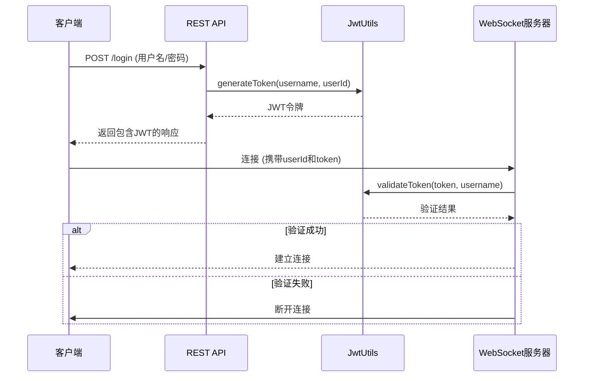
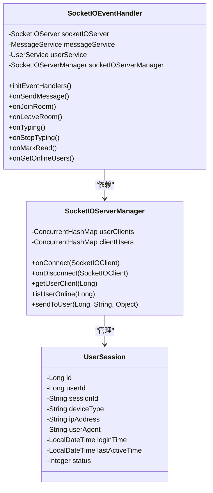
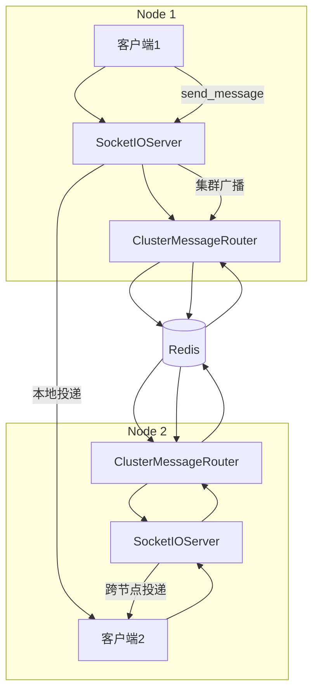

# WebSocket事件

<cite>
**本文档引用的文件**
- [SocketIOEventHandler.java](file://src/main/java/com/example/nettyim/websocket/SocketIOEventHandler.java)
- [JwtUtils.java](file://src/main/java/com/example/nettyim/utils/JwtUtils.java)
- [SocketIOServerManager.java](file://src/main/java/com/example/nettyim/websocket/SocketIOServerManager.java)
- [UserSession.java](file://src/main/java/com/example/nettyim/entity/UserSession.java)
- [SocketIOConfig.java](file://src/main/java/com/example/nettyim/config/SocketIOConfig.java)
</cite>

## 目录
1. [引言](#引言)
2. [支持的WebSocket事件](#支持的websocket事件)
3. [事件处理机制详解](#事件处理机制详解)
4. [连接建立与JWT验证流程](#连接建立与jwt验证流程)
5. [用户会话管理](#用户会话管理)
6. [事件驱动模型与实时通信](#事件驱动模型与实时通信)
7. [客户端最佳实践](#客户端最佳实践)
8. [总结](#总结)

## 引言
本项目基于Netty-SocketIO实现了一个实时消息通信系统，通过WebSocket协议提供低延迟的双向通信能力。系统支持多种实时事件，包括消息发送、房间管理、输入状态通知等，所有事件均通过Socket.IO协议进行传输。本文档深入分析了`SocketIOEventHandler.java`中定义的WebSocket事件处理机制，详细说明每个事件的触发条件、数据格式、处理逻辑和广播策略，并解释了JWT令牌验证和用户会话管理的核心流程。

## 支持的WebSocket事件
根据`SocketIOEventHandler.java`中的事件注册逻辑，系统支持以下WebSocket事件：

| 事件名称 | 说明 |
|---------|------|
| `connect` | 客户端连接建立时触发（由Socket.IO框架自动处理） |
| `disconnect` | 客户端断开连接时触发（由Socket.IO框架自动处理） |
| `send_message` | 发送消息事件 |
| `join_room` | 加入房间事件 |
| `leave_room` | 离开房间事件 |
| `typing` | 正在输入状态通知 |
| `stop_typing` | 停止输入状态通知 |
| `mark_read` | 消息已读标记 |
| `get_online_users` | 获取在线用户列表 |

**Section sources**
- [SocketIOEventHandler.java](file://src/main/java/com/example/nettyim/websocket/SocketIOEventHandler.java#L46-L52)

## 事件处理机制详解

### send_message 事件
**触发条件**：用户发送消息时触发。

**客户端发送数据格式**：
```json
{
  "toUserId": 123,
  "groupId": 456,
  "messageType": 1,
  "content": "Hello World",
  "fileUrl": "https://example.com/file.pdf",
  "fileSize": 1024,
  "fileName": "document.pdf",
  "replyToMessageId": "msg_123"
}
```

**必须字段**：`toUserId`或`groupId`（至少一个），`messageType`，`content`

**服务器端处理逻辑**：
1. 从握手参数中获取发送者`userId`
2. 构造`SendMessageDTO`对象
3. 调用`MessageService.sendMessage()`处理消息
4. 持久化消息到数据库
5. 通过`SocketIOServerManager`进行消息广播

**广播/单播策略**：
- 私聊消息：单播到目标用户
- 群聊消息：广播到群组所有成员

**错误响应**：
```json
{
  "success": false,
  "message": "错误信息"
}
```

**成功响应**：
```json
{
  "success": true,
  "message": "消息发送成功",
  "data": {
    "messageId": "msg_456",
    "fromUserId": 123,
    "toUserId": 456,
    "content": "Hello World",
    "timestamp": "2024-01-01T12:00:00"
  }
}
```

**Section sources**
- [SocketIOEventHandler.java](file://src/main/java/com/example/nettyim/websocket/SocketIOEventHandler.java#L54-L104)
- [SendMessageDTO.java](file://src/main/java/com/example/nettyim/dto/SendMessageDTO.java)

### join_room 事件
**触发条件**：用户加入聊天房间时触发。

**客户端发送数据格式**：
```json
{
  "targetId": 123,
  "roomType": 1
}
```

**必须字段**：`targetId`，`roomType`（1=私聊，2=群聊）

**服务器端处理逻辑**：
1. 根据`roomType`和`targetId`生成房间名称
   - 私聊：`private_123`
   - 群聊：`group_123`
2. 调用`client.joinRoom()`加入指定房间

**广播/单播策略**：无广播，仅本地会话管理。

**成功响应**：
```json
{
  "success": true,
  "message": "加入房间成功"
}
```

**Section sources**
- [SocketIOEventHandler.java](file://src/main/java/com/example/nettyim/websocket/SocketIOEventHandler.java#L106-L144)

### leave_room 事件
**触发条件**：用户离开聊天房间时触发。

**客户端发送数据格式**：
```json
{
  "targetId": 123,
  "roomType": 1
}
```

**必须字段**：`targetId`，`roomType`

**服务器端处理逻辑**：
1. 根据`roomType`和`targetId`生成房间名称
2. 调用`client.leaveRoom()`离开指定房间

**成功响应**：
```json
{
  "success": true,
  "message": "离开房间成功"
}
```

**Section sources**
- [SocketIOEventHandler.java](file://src/main/java/com/example/nettyim/websocket/SocketIOEventHandler.java#L146-L177)

### typing 事件
**触发条件**：用户在聊天输入框中开始输入时触发。

**客户端发送数据格式**：
```json
{
  "targetId": 123,
  "targetType": 1
}
```

**必须字段**：`targetId`，`targetType`（1=私聊，2=群聊）

**服务器端处理逻辑**：
1. 从握手参数中获取发送者`userId`
2. 根据`targetType`决定通知方式
   - 私聊：调用`sendToUser()`单播到目标用户
   - 群聊：调用`getRoomOperations().sendEvent()`广播到群组

**广播/单播策略**：
- 私聊：单播到目标用户，事件名为`user_typing`
- 群聊：广播到群组所有成员，事件名为`user_typing`

**通知数据格式**：
```json
{
  "userId": 123,
  "targetId": 456,
  "isTyping": true
}
```

**Section sources**
- [SocketIOEventHandler.java](file://src/main/java/com/example/nettyim/websocket/SocketIOEventHandler.java#L179-L212)

### stop_typing 事件
**触发条件**：用户停止输入（如输入框失去焦点或一段时间无输入）时触发。

**客户端发送数据格式**：
```json
{
  "targetId": 123,
  "targetType": 1
}
```

**必须字段**：`targetId`，`targetType`

**服务器端处理逻辑**：
1. 从握手参数中获取发送者`userId`
2. 根据`targetType`决定通知方式
   - 私聊：单播到目标用户
   - 群聊：广播到群组所有成员

**通知数据格式**：
```json
{
  "userId": 123,
  "targetId": 456,
  "isTyping": false
}
```

**Section sources**
- [SocketIOEventHandler.java](file://src/main/java/com/example/nettyim/websocket/SocketIOEventHandler.java#L214-L247)

### mark_read 事件
**触发条件**：用户阅读消息后标记为已读时触发。

**客户端发送数据格式**：
```json
{
  "messageIds": [123, 456, 789]
}
```

**必须字段**：`messageIds`（消息ID列表）

**服务器端处理逻辑**：
1. 从握手参数中获取用户`userId`
2. 调用`MessageService.markMessagesAsRead()`更新消息状态
3. 更新数据库中的消息已读状态

**成功响应**：
```json
{
  "success": true,
  "message": "消息已标记为已读"
}
```

**Section sources**
- [SocketIOEventHandler.java](file://src/main/java/com/example/nettyim/websocket/SocketIOEventHandler.java#L249-L280)

### get_online_users 事件
**触发条件**：客户端请求获取当前在线用户列表时触发。

**客户端发送数据格式**：
```json
{}
```

**服务器端处理逻辑**：
1. 调用`SocketIOServerManager.getOnlineUserIds()`获取在线用户ID集合
2. 返回所有在线用户ID

**成功响应**：
```json
{
  "success": true,
  "message": "获取成功",
  "data": [123, 456, 789]
}
```

**Section sources**
- [SocketIOEventHandler.java](file://src/main/java/com/example/nettyim/websocket/SocketIOEventHandler.java#L282-L307)

## 连接建立与JWT验证流程
系统在客户端连接建立时通过URL参数传递用户身份信息，而非直接在WebSocket握手阶段进行JWT验证。具体流程如下：

1. **客户端连接**：
   ```javascript
   const socket = io('http://localhost:8081', {
     query: {
       userId: 123,
       token: 'jwt-token-here'
     }
   });
   ```

2. **服务器端处理**：
   - 在`SocketIOServerManager`的`ConnectListener`中获取`userId`参数
   - 通过`client.getHandshakeData().getSingleUrlParam("userId")`提取用户ID
   - 验证用户ID有效性（格式检查）
   - 建立用户与客户端的映射关系

3. **JWT验证时机**：
   - 实际的JWT验证应在HTTP层面的认证阶段完成
   - WebSocket连接建立前，客户端应通过REST API获取有效JWT令牌
   - 服务端在HTTP认证阶段调用`JwtUtils.validateToken()`验证令牌

4. **JwtUtils核心方法**：
   - `validateToken(token, username)`：验证令牌有效性
   - `getUserIdFromToken(token)`：从令牌中提取用户ID
   - `generateToken(username, userId)`：生成JWT令牌



**Diagram sources**
- [JwtUtils.java](file://src/main/java/com/example/nettyim/utils/JwtUtils.java)
- [SocketIOServerManager.java](file://src/main/java/com/example/nettyim/websocket/SocketIOServerManager.java#L86-L116)

**Section sources**
- [JwtUtils.java](file://src/main/java/com/example/nettyim/utils/JwtUtils.java)
- [SocketIOServerManager.java](file://src/main/java/com/example/nettyim/websocket/SocketIOServerManager.java)

## 用户会话管理
系统通过`SocketIOServerManager`和`UserSession`实体类实现用户会话管理。

### 会话数据结构
```java
public class UserSession extends BaseEntity {
    private Long id;
    private Long userId;
    private String sessionId;
    private String deviceType;
    private String ipAddress;
    private String userAgent;
    private LocalDateTime loginTime;
    private LocalDateTime lastActiveTime;
    private Integer status; // 0-离线，1-在线
}
```

### 会话管理机制
1. **内存映射**：
   - `userClients`：用户ID → SocketIOClient 映射
   - `clientUsers`：会话ID → 用户ID 映射

2. **连接处理**：
   - 新连接时检查是否存在旧连接，如有则断开
   - 更新用户在线状态
   - 存储新的会话映射

3. **集群支持**：
   - 启用集群模式时，通过Redisson实现分布式会话存储
   - 用户上线/下线事件通过`ClusterEvent`广播到所有节点



**Diagram sources**
- [SocketIOServerManager.java](file://src/main/java/com/example/nettyim/websocket/SocketIOServerManager.java)
- [UserSession.java](file://src/main/java/com/example/nettyim/entity/UserSession.java)

**Section sources**
- [SocketIOServerManager.java](file://src/main/java/com/example/nettyim/websocket/SocketIOServerManager.java)
- [UserSession.java](file://src/main/java/com/example/nettyim/entity/UserSession.java)

## 事件驱动模型与实时通信
系统的事件驱动模型实现了低延迟的实时消息传递，与REST API形成互补架构。

### 通信模式对比
| 特性 | WebSocket事件 | REST API |
|------|---------------|---------|
| 通信模式 | 双向实时通信 | 单向请求响应 |
| 延迟 | 毫秒级 | 百毫秒级 |
| 连接状态 | 长连接 | 短连接 |
| 适用场景 | 实时消息、状态通知 | 数据查询、状态变更 |

### 事件驱动优势
1. **低延迟**：消息直接推送到客户端，无需轮询
2. **高并发**：基于Netty的异步非阻塞I/O模型
3. **状态同步**：实时通知用户在线状态、输入状态等
4. **资源节约**：避免频繁的HTTP请求开销

### 集群部署支持
系统通过`ClusterMessageRouter`实现多节点部署：
- 使用Redis作为消息中间件
- 节点间通过`ClusterEvent`同步用户上下线状态
- 跨节点消息通过`ClusterMessage`路由



**Diagram sources**
- [SocketIOServerManager.java](file://src/main/java/com/example/nettyim/websocket/SocketIOServerManager.java)
- [ClusterMessageRouter.java](file://src/main/java/com/example/nettyim/cluster/ClusterMessageRouter.java)

**Section sources**
- [SocketIOServerManager.java](file://src/main/java/com/example/nettyim/websocket/SocketIOServerManager.java)
- [SocketIOConfig.java](file://src/main/java/com/example/nettyim/config/SocketIOConfig.java)

## 客户端最佳实践

### 事件监听
```javascript
// 连接成功
socket.on('connect', () => {
    console.log('已连接到服务器');
});

// 接收消息
socket.on('new_message', (data) => {
    displayMessage(data);
});

// 输入状态通知
socket.on('user_typing', (data) => {
    if (data.isTyping) {
        showTypingIndicator(data.userId);
    } else {
        hideTypingIndicator(data.userId);
    }
});

// 在线用户更新
socket.on('online_users_update', (userIds) => {
    updateOnlineUsers(userIds);
});
```

### 错误处理
```javascript
// 全局错误处理
socket.on('connect_error', (error) => {
    console.error('连接错误:', error);
    retryConnection();
});

socket.on('error', (error) => {
    console.error('Socket错误:', error);
});

// 事件确认处理
socket.emit('send_message', messageData, (ack) => {
    if (ack.success) {
        markMessageAsSent(ack.data.messageId);
    } else {
        showError(ack.message);
    }
});
```

### 连接管理
```javascript
// 断线重连
socket.on('disconnect', (reason) => {
    console.log('断开连接:', reason);
    if (reason === 'io server disconnect') {
        // 服务器主动断开，需要手动重连
        socket.connect();
    }
    // 其他情况会自动重连
});
```

### 性能优化
1. **节流输入事件**：避免频繁发送`typing`事件
2. **批量标记已读**：收集多个消息ID后一次性发送`mark_read`
3. **合理使用房间**：通过`join_room`/`leave_room`管理订阅关系
4. **连接参数验证**：确保`userId`和`token`有效后再建立连接

## 总结
本系统基于Netty-SocketIO构建了一个功能完整的实时通信机制，通过精心设计的事件处理体系实现了低延迟的消息传递。核心特点包括：
- **丰富的事件支持**：涵盖消息、状态、通知等多种实时交互场景
- **安全的认证机制**：结合JWT令牌实现安全的身份验证
- **高效的会话管理**：通过内存映射和集群同步实现快速用户状态查询
- **可扩展的架构**：支持单机和集群部署，满足不同规模需求
- **完善的错误处理**：提供详细的错误响应和客户端重连机制

该实时通信机制与REST API形成完美互补，REST API负责数据的CRUD操作，WebSocket事件负责实时状态同步和消息推送，共同构建了一个高性能、高可用的即时通讯系统。