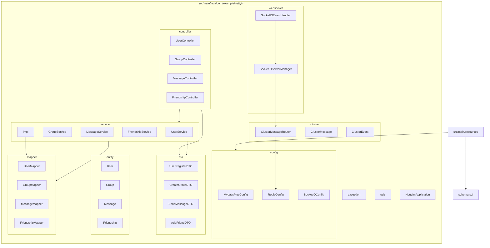
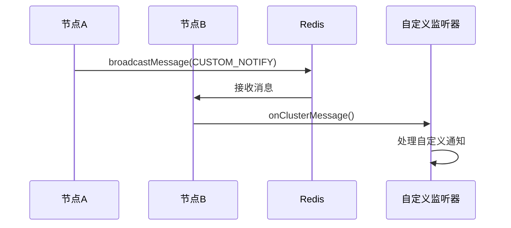
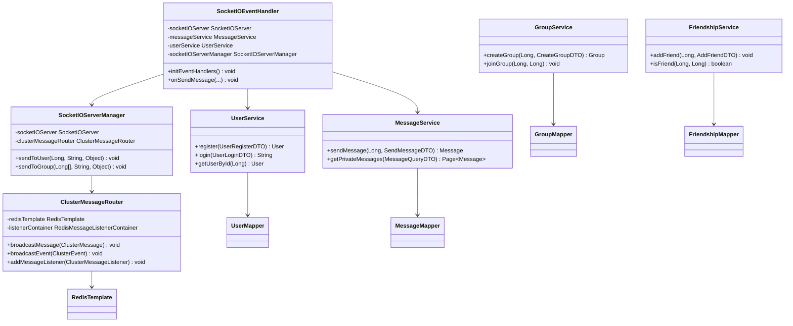

# 开发指南

<cite>
**本文档引用的文件**  
- [UserServiceImpl.java](file://src/main/java/com/example/nettyim/service/impl/UserServiceImpl.java)
- [MessageServiceImpl.java](file://src/main/java/com/example/nettyim/service/impl/MessageServiceImpl.java)
- [GroupServiceImpl.java](file://src/main/java/com/example/nettyim/service/impl/GroupServiceImpl.java)
- [FriendshipServiceImpl.java](file://src/main/java/com/example/nettyim/service/impl/FriendshipServiceImpl.java)
- [GroupController.java](file://src/main/java/com/example/nettyim/controller/GroupController.java)
- [SocketIOEventHandler.java](file://src/main/java/com/example/nettyim/websocket/SocketIOEventHandler.java)
- [SocketIOServerManager.java](file://src/main/java/com/example/nettyim/websocket/SocketIOServerManager.java)
- [ClusterMessageRouter.java](file://src/main/java/com/example/nettyim/cluster/ClusterMessageRouter.java)
- [ClusterMessage.java](file://src/main/java/com/example/nettyim/cluster/ClusterMessage.java)
- [ClusterEvent.java](file://src/main/java/com/example/nettyim/cluster/ClusterEvent.java)
- [AddFriendDTO.java](file://src/main/java/com/example/nettyim/dto/AddFriendDTO.java)
- [CreateGroupDTO.java](file://src/main/java/com/example/nettyim/dto/CreateGroupDTO.java)
- [SendMessageDTO.java](file://src/main/java/com/example/nettyim/dto/SendMessageDTO.java)
- [UserRegisterDTO.java](file://src/main/java/com/example/nettyim/dto/UserRegisterDTO.java)
- [User.java](file://src/main/java/com/example/nettyim/entity/User.java)
- [Group.java](file://src/main/java/com/example/nettyim/entity/Group.java)
- [Message.java](file://src/main/java/com/example/nettyim/entity/Message.java)
- [Friendship.java](file://src/main/java/com/example/nettyim/entity/Friendship.java)
- [UserMapper.java](file://src/main/java/com/example/nettyim/mapper/UserMapper.java)
- [GroupMapper.java](file://src/main/java/com/example/nettyim/mapper/GroupMapper.java)
- [MessageMapper.java](file://src/main/java/com/example/nettyim/mapper/MessageMapper.java)
- [FriendshipMapper.java](file://src/main/java/com/example/nettyim/mapper/FriendshipMapper.java)
- [UserService.java](file://src/main/java/com/example/nettyim/service/UserService.java)
- [GroupService.java](file://src/main/java/com/example/nettyim/service/GroupService.java)
- [MessageService.java](file://src/main/java/com/example/nettyim/service/MessageService.java)
- [FriendshipService.java](file://src/main/java/com/example/nettyim/service/FriendshipService.java)
- [BusinessException.java](file://src/main/java/com/example/nettyim/exception/BusinessException.java)
</cite>

## 目录
1. [简介](#简介)
2. [项目结构](#项目结构)
3. [核心组件](#核心组件)
4. [架构概览](#架构概览)
5. [详细组件分析](#详细组件分析)
6. [依赖分析](#依赖分析)
7. [性能考虑](#性能考虑)
8. [故障排除指南](#故障排除指南)
9. [结论](#结论)

## 简介
本开发指南旨在为二次开发和功能扩展提供实用指导。涵盖添加新业务功能的完整流程，包括创建数据传输对象（DTO）、实体（Entity）、映射器（Mapper）、服务（Service）和控制器（Controller）。重点说明如何扩展WebSocket事件处理机制、实现集群消息路由扩展点、编写测试用例以及遵循代码贡献规范。

## 项目结构



**图示来源**  
- [项目结构](file://src/main/java/com/example/nettyim/)

**本节来源**  
- [项目结构](file://src/main/java/com/example/nettyim/)

## 核心组件

本项目采用典型的分层架构模式，包含DTO、Entity、Mapper、Service和Controller五类核心组件。各组件职责分明，通过依赖注入实现松耦合。

**DTO（数据传输对象）**：位于`dto`包下，用于封装API请求和响应数据。如`UserRegisterDTO`封装用户注册信息，`SendMessageDTO`封装消息发送参数。

**Entity（实体）**：位于`entity`包下，映射数据库表结构。继承`BaseEntity`提供基础字段，如`User`、`Group`、`Message`等。

**Mapper（持久层接口）**：位于`mapper`包下，基于MyBatis-Plus实现数据库操作。每个实体对应一个Mapper接口，如`UserMapper`提供用户数据访问方法。

**Service（业务逻辑层）**：位于`service`包下，定义业务接口及其实现。接口定义在顶层，实现类位于`impl`子包中，如`UserService`与`UserServiceImpl`。

**Controller（控制层）**：位于`controller`包下，处理HTTP请求。通过`@RestController`注解暴露REST API，调用Service层完成业务处理。

**本节来源**  
- [UserServiceImpl.java](file://src/main/java/com/example/nettyim/service/impl/UserServiceImpl.java#L19-L58)
- [MessageServiceImpl.java](file://src/main/java/com/example/nettyim/service/impl/MessageServiceImpl.java#L21-L53)
- [GroupServiceImpl.java](file://src/main/java/com/example/nettyim/service/impl/GroupServiceImpl.java#L20-L58)
- [FriendshipServiceImpl.java](file://src/main/java/com/example/nettyim/service/impl/FriendshipServiceImpl.java#L17-L56)
- [GroupController.java](file://src/main/java/com/example/nettyim/controller/GroupController.java#L13-L60)

## 架构概览

```mermaid
graph TD
Client[客户端] --> |HTTP请求| Controller
Controller --> |调用| Service
Service --> |调用| Mapper
Mapper --> |SQL执行| Database[(数据库)]
Client --> |WebSocket连接| SocketIO
SocketIO --> |事件处理| SocketIOEventHandler
SocketIOEventHandler --> |调用| Service
SocketIOEventHandler --> |推送| SocketIOServerManager
SocketIOServerManager --> |集群通信| ClusterMessageRouter
ClusterMessageRouter --> |Redis发布/订阅| Redis[(Redis)]
subgraph "集群节点1"
SocketIO
SocketIOEventHandler
Service
Mapper
Database
ClusterMessageRouter
end
subgraph "集群节点N"
SocketIO2[SocketIO]
SocketIOEventHandler2[SocketIOEventHandler]
Service2[Service]
Mapper2[Mapper]
Database2[Database]
ClusterMessageRouter2[ClusterMessageRouter]
end
ClusterMessageRouter < --> |消息同步| ClusterMessageRouter2
```

**图示来源**  
- [SocketIOEventHandler.java](file://src/main/java/com/example/nettyim/websocket/SocketIOEventHandler.java#L18-L46)
- [SocketIOServerManager.java](file://src/main/java/com/example/nettyim/websocket/SocketIOServerManager.java#L24-L63)
- [ClusterMessageRouter.java](file://src/main/java/com/example/nettyim/cluster/ClusterMessageRouter.java#L18-L48)

## 详细组件分析

### 添加新业务功能流程

#### 1. 创建DTO
在`dto`包下创建新的数据传输对象。例如添加“创建论坛”功能时，创建`CreateForumDTO`类，包含论坛名称、描述、封面等字段，并使用JSR-303注解进行参数校验。

```java
public class CreateForumDTO {
    @NotBlank(message = "论坛名称不能为空")
    private String name;
    private String description;
    private String avatar;
    // getters and setters
}
```

#### 2. 创建Entity
在`entity`包下创建实体类，映射数据库表。继承`BaseEntity`以复用创建时间、更新时间等公共字段。

```java
@TableName("forum")
public class Forum extends BaseEntity {
    private String name;
    private String description;
    private String avatar;
    private Long ownerId;
    // getters and setters
}
```

#### 3. 创建Mapper
在`mapper`包下创建MyBatis-Plus Mapper接口，继承`BaseMapper<T>`。

```java
public interface ForumMapper extends BaseMapper<Forum> {
}
```

#### 4. 创建Service
在`service`包下定义业务接口，在`service/impl`下实现。接口方法应抛出`BusinessException`以统一异常处理。

```java
public interface ForumService {
    Forum createForum(Long ownerId, CreateForumDTO dto);
}

@Service
@Transactional
public class ForumServiceImpl implements ForumService {
    private final ForumMapper forumMapper;
    
    public ForumServiceImpl(ForumMapper forumMapper) {
        this.forumMapper = forumMapper;
    }
    
    @Override
    public Forum createForum(Long ownerId, CreateForumDTO dto) {
        if (existsByName(dto.getName())) {
            throw new BusinessException("论坛名称已存在");
        }
        // 创建论坛逻辑
    }
}
```

#### 5. 创建Controller
在`controller`包下创建控制器，注入Service并暴露REST API。

```java
@RestController
@RequestMapping("/forum")
public class ForumController {
    private final ForumService forumService;
    
    public ForumController(ForumService forumService) {
        this.forumService = forumService;
    }
    
    @PostMapping("/create")
    public Result<Forum> create(@RequestParam Long ownerId, @Valid @RequestBody CreateForumDTO dto) {
        Forum forum = forumService.createForum(ownerId, dto);
        return Result.success("创建成功", forum);
    }
}
```

**本节来源**  
- [UserRegisterDTO.java](file://src/main/java/com/example/nettyim/dto/UserRegisterDTO.java)
- [User.java](file://src/main/java/com/example/nettyim/entity/User.java)
- [UserMapper.java](file://src/main/java/com/example/nettyim/mapper/UserMapper.java)
- [UserService.java](file://src/main/java/com/example/nettyim/service/UserService.java)
- [UserServiceImpl.java](file://src/main/java/com/example/nettyim/service/impl/UserServiceImpl.java)
- [UserController.java](file://src/main/java/com/example/nettyim/controller/UserController.java)

### WebSocket事件扩展

#### 1. 注册新事件监听器
在`SocketIOEventHandler`的`initEventHandlers`方法中注册新事件。需定义事件数据结构类，并关联处理方法。

```java
@PostConstruct
public void initEventHandlers() {
    socketIOServer.addEventListener("send_message", SendMessageData.class, this::onSendMessage);
    socketIOServer.addEventListener("join_room", JoinRoomData.class, this::onJoinRoom);
    // 添加新事件监听器
    socketIOServer.addEventListener("custom_event", CustomEventData.class, this::onCustomEvent);
}
```

#### 2. 定义事件数据结构
在`SocketIOEventHandler`内部定义静态内部类作为事件数据结构，使用标准getter/setter。

```java
public static class CustomEventData {
    private Long targetId;
    private String content;
    // getters and setters
}
```

#### 3. 编写业务处理逻辑
实现事件处理方法，从客户端获取用户ID，调用Service层处理业务，并通过AckRequest返回响应。

```java
private void onCustomEvent(SocketIOClient client, CustomEventData data, AckRequest ackRequest) {
    try {
        String userIdStr = client.getHandshakeData().getSingleUrlParam("userId");
        if (userIdStr == null) return;
        
        Long userId = Long.parseLong(userIdStr);
        
        // 调用业务逻辑
        customService.process(userId, data);
        
        if (ackRequest.isAckRequested()) {
            ackRequest.sendAckData(new BaseResponse(true, "处理成功"));
        }
    } catch (Exception e) {
        log.error("处理自定义事件失败", e);
        if (ackRequest.isAckRequested()) {
            ackRequest.sendAckData(new BaseResponse(false, e.getMessage()));
        }
    }
}
```

**本节来源**  
- [SocketIOEventHandler.java](file://src/main/java/com/example/nettyim/websocket/SocketIOEventHandler.java#L18-L46)

### 集群消息路由扩展

#### 1. 添加自定义集群消息类型
`ClusterMessage`类支持多种消息类型，可通过`setType`方法设置自定义类型。

```java
public class ClusterMessageType {
    public static final String CUSTOM_NOTIFY = "CUSTOM_NOTIFY";
}
```

#### 2. 注册集群消息监听器
`ClusterMessageRouter`支持`ClusterMessageListener`接口，可实现自定义监听器。

```java
@Component
public class CustomClusterListener implements ClusterMessageRouter.ClusterMessageListener {
    
    @Override
    public void onClusterMessage(ClusterMessage message) {
        if ("CUSTOM_NOTIFY".equals(message.getType())) {
            // 处理自定义通知
            handleCustomNotification(message);
        }
    }
    
    @Override
    public void onClusterEvent(ClusterEvent event) {
        // 可选实现
    }
}
```

#### 3. 发送集群消息
通过`ClusterMessageRouter`的`broadcastMessage`方法发送消息到所有节点。

```java
ClusterMessage message = new ClusterMessage("CUSTOM_NOTIFY", "custom_event", payload);
clusterMessageRouter.broadcastMessage(message);
```

#### 4. 在SocketIOServerManager中注册监听器
确保在启动时注册监听器。

```java
@PostConstruct
public void startServer() {
    if (clusterEnabled) {
        clusterMessageRouter.addMessageListener(this);
        // 添加自定义监听器
        clusterMessageRouter.addMessageListener(customClusterListener);
    }
}
```



**图示来源**  
- [ClusterMessageRouter.java](file://src/main/java/com/example/nettyim/cluster/ClusterMessageRouter.java#L47-L81)
- [SocketIOServerManager.java](file://src/main/java/com/example/nettyim/websocket/SocketIOServerManager.java#L86-L116)

**本节来源**  
- [ClusterMessageRouter.java](file://src/main/java/com/example/nettyim/cluster/ClusterMessageRouter.java#L117-L150)
- [ClusterMessage.java](file://src/main/java/com/example/nettyim/cluster/ClusterMessage.java#L61-L110)
- [SocketIOServerManager.java](file://src/main/java/com/example/nettyim/websocket/SocketIOServerManager.java#L24-L63)

## 依赖分析



**图示来源**  
- [UserServiceImpl.java](file://src/main/java/com/example/nettyim/service/impl/UserServiceImpl.java#L19-L58)
- [MessageServiceImpl.java](file://src/main/java/com/example/nettyim/service/impl/MessageServiceImpl.java#L21-L53)
- [GroupServiceImpl.java](file://src/main/java/com/example/nettyim/service/impl/GroupServiceImpl.java#L20-L58)
- [FriendshipServiceImpl.java](file://src/main/java/com/example/nettyim/service/impl/FriendshipServiceImpl.java#L17-L56)
- [SocketIOEventHandler.java](file://src/main/java/com/example/nettyim/websocket/SocketIOEventHandler.java#L18-L46)
- [SocketIOServerManager.java](file://src/main/java/com/example/nettyim/websocket/SocketIOServerManager.java#L24-L63)
- [ClusterMessageRouter.java](file://src/main/java/com/example/nettyim/cluster/ClusterMessageRouter.java#L18-L48)

**本节来源**  
- [UserServiceImpl.java](file://src/main/java/com/example/nettyim/service/impl/UserServiceImpl.java)
- [MessageServiceImpl.java](file://src/main/java/com/example/nettyim/service/impl/MessageServiceImpl.java)
- [GroupServiceImpl.java](file://src/main/java/com/example/nettyim/service/impl/GroupServiceImpl.java)
- [FriendshipServiceImpl.java](file://src/main/java/com/example/nettyim/service/impl/FriendshipServiceImpl.java)
- [SocketIOEventHandler.java](file://src/main/java/com/example/nettyim/websocket/SocketIOEventHandler.java)
- [SocketIOServerManager.java](file://src/main/java/com/example/nettyim/websocket/SocketIOServerManager.java)
- [ClusterMessageRouter.java](file://src/main/java/com/example/nettyim/cluster/ClusterMessageRouter.java)

## 性能考虑
系统通过Redis实现集群消息广播，确保多节点间状态同步。WebSocket连接由`SocketIOServerManager`统一管理，使用`ConcurrentHashMap`存储用户与客户端的映射关系，保证高并发下的线程安全。数据库操作基于MyBatis-Plus，支持分页查询和条件构造，避免全表扫描。建议对高频查询字段（如用户ID、群组ID）建立索引以提升查询性能。

## 故障排除指南
- **WebSocket连接失败**：检查客户端是否正确传递`userId`参数，服务端日志是否显示“未提供用户ID”。
- **集群消息未接收**：确认`clusterEnabled`配置为`true`，Redis连接正常，监听器已正确注册。
- **消息发送失败**：检查发送者与接收者关系（好友或群成员），消息内容是否为空。
- **用户状态不同步**：确保`ClusterMessageRouter`正常广播`USER_ONLINE`/`USER_OFFLINE`事件，各节点能正确处理集群事件。

**本节来源**  
- [SocketIOServerManager.java](file://src/main/java/com/example/nettyim/websocket/SocketIOServerManager.java#L86-L116)
- [ClusterMessageRouter.java](file://src/main/java/com/example/nettyim/cluster/ClusterMessageRouter.java#L80-L122)
- [MessageServiceImpl.java](file://src/main/java/com/example/nettyim/service/impl/MessageServiceImpl.java#L21-L53)
- [SocketIOEventHandler.java](file://src/main/java/com/example/nettyim/websocket/SocketIOEventHandler.java#L74-L108)

## 结论
本系统提供了完整的二次开发框架，支持通过标准流程添加新业务功能。WebSocket事件处理机制灵活可扩展，集群消息路由支持跨节点通信。遵循统一的异常处理（`BusinessException`）、日志记录和命名规范，确保代码质量和可维护性。建议在扩展功能时保持分层架构清晰，合理使用事务管理，并充分覆盖单元测试和集成测试。