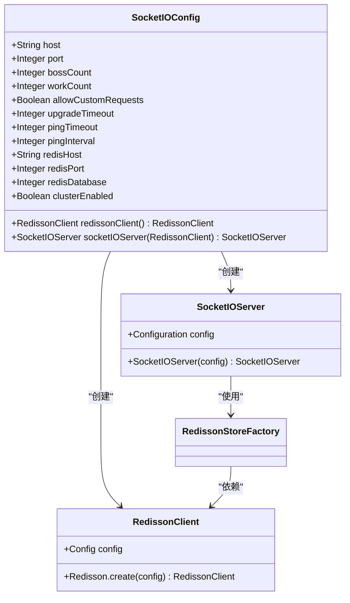
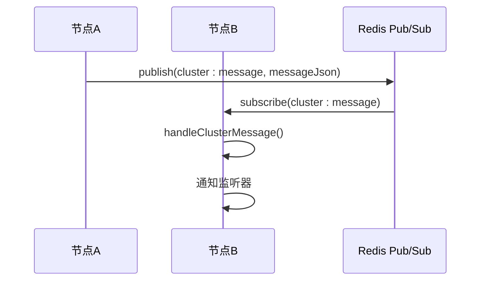
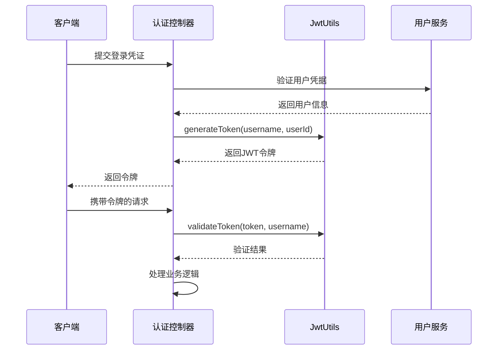

# 技术栈与依赖

<cite>
**本文档引用的文件**
- [pom.xml](file://pom.xml)
- [SocketIOConfig.java](file://src/main/java/com/example/nettyim/config/SocketIOConfig.java)
- [RedisConfig.java](file://src/main/java/com/example/nettyim/config/RedisConfig.java)
- [JwtUtils.java](file://src/main/java/com/example/nettyim/utils/JwtUtils.java)
- [ClusterMessageRouter.java](file://src/main/java/com/example/nettyim/cluster/ClusterMessageRouter.java)
</cite>

## 目录
1. [技术栈概览](#技术栈概览)
2. [核心依赖与版本](#核心依赖与版本)
3. [Spring Boot 基础框架](#spring-boot-基础框架)
4. [Netty-SocketIO 实时通信](#netty-socketio-实时通信)
5. [MyBatis-Plus 数据访问](#mybatis-plus-数据访问)
6. [Redis 分布式支持](#redis-分布式支持)
7. [JWT 用户认证](#jwt-用户认证)
8. [辅助工具库](#辅助工具库)

## 技术栈概览

本项目构建于现代化Java技术栈之上，采用Spring Boot作为基础框架，整合Netty-SocketIO实现高性能实时通信，通过MyBatis-Plus简化数据库操作，利用Redis实现分布式会话管理与跨节点消息广播。系统采用JWT进行无状态用户认证，结合Lombok和Jackson等工具库提升开发效率与数据处理能力。

**Section sources**
- [pom.xml](file://pom.xml#L1-L147)

## 核心依赖与版本

项目通过Maven管理依赖，关键依赖及其版本如下表所示：

| 依赖名称 | Group ID | Artifact ID | 版本 |
|--------|--------|-----------|-----|
| Spring Boot | org.springframework.boot | spring-boot-starter-parent | 3.1.5 |
| Java | - | - | 21 |
| MySQL Connector | com.mysql | mysql-connector-j | 8.0.33 |
| MyBatis-Plus | com.baomidou | mybatis-plus-boot-starter | 3.5.5 |
| Netty-SocketIO | com.corundumstudio.socketio | netty-socketio | 2.0.9 |
| JWT | io.jsonwebtoken | jjwt-api | 0.12.3 |
| Redisson | org.redisson | redisson | 3.27.2 |
| Lombok | org.projectlombok | lombok | 1.18.30 |
| Jackson Databind | com.fasterxml.jackson.core | jackson-databind | (继承自Spring Boot) |

**Section sources**
- [pom.xml](file://pom.xml#L1-L147)

## Spring Boot 基础框架

Spring Boot作为项目的基础框架，提供了自动配置、起步依赖和嵌入式服务器等核心特性。项目通过继承`spring-boot-starter-parent`实现依赖管理，整合了Web、Security、Validation、Data Redis等模块，构建了一个功能完整的企业级应用基础。

**Section sources**
- [pom.xml](file://pom.xml#L10-L15)

## Netty-SocketIO 实时通信

Netty-SocketIO替代了标准WebSocket，提供了更灵活的实时通信能力。通过`SocketIOConfig.java`配置类，系统实现了Socket.IO服务器的定制化配置，支持跨域、心跳机制和集群模式。

在集群模式下，系统通过RedissonStoreFactory将Socket.IO的会话状态存储于Redis中，确保多个节点间的状态一致性。配置参数包括主机地址、端口、线程池大小、超时设置等，均可通过配置文件灵活调整。

**Diagram sources**
- [SocketIOConfig.java](file://src/main/java/com/example/nettyim/config/SocketIOConfig.java#L15-L92)

**Section sources**
- [SocketIOConfig.java](file://src/main/java/com/example/nettyim/config/SocketIOConfig.java#L15-L92)

## MyBatis-Plus 数据访问

MyBatis-Plus作为MyBatis的增强工具，在项目中显著简化了数据库CRUD操作。通过`MybatisPlusConfig.java`（未在上下文中提供，但由pom.xml推断存在），系统配置了分页插件等增强功能，提升了开发效率。

MyBatis-Plus提供了通用Mapper和Service层封装，使开发者无需编写大量XML映射文件即可完成常见数据库操作，同时支持Lambda表达式进行类型安全的查询构建。

**Section sources**
- [pom.xml](file://pom.xml#L60-L65)

## Redis 分布式支持

Redis在项目中扮演双重角色：一是通过Redisson实现分布式会话管理，二是作为Pub/Sub消息中间件实现跨节点事件广播。

### 分布式会话管理

当`socketio.cluster.enabled`配置为`true`时，系统启用集群模式，Socket.IO的会话状态通过RedissonStoreFactory存储于Redis中，确保集群环境下用户状态的一致性。

### Pub/Sub 消息广播

`ClusterMessageRouter`组件利用Redis的发布/订阅功能，实现了跨节点的消息和事件广播。系统定义了两个专用频道：
- `socketio:cluster:message`：用于广播集群消息
- `socketio:cluster:event`：用于广播集群事件

**Diagram sources**
- [ClusterMessageRouter.java](file://src/main/java/com/example/nettyim/cluster/ClusterMessageRouter.java#L22-L150)

**Section sources**
- [SocketIOConfig.java](file://src/main/java/com/example/nettyim/config/SocketIOConfig.java#L75-L85)
- [RedisConfig.java](file://src/main/java/com/example/nettyim/config/RedisConfig.java#L15-L65)
- [ClusterMessageRouter.java](file://src/main/java/com/example/nettyim/cluster/ClusterMessageRouter.java#L22-L150)

## JWT 用户认证

JWT（JSON Web Token）用于实现无状态的用户认证机制。`JwtUtils.java`工具类封装了令牌的生成、验证和刷新功能。

认证流程如下：
1. 用户登录成功后，系统调用`generateToken()`生成JWT令牌
2. 令牌包含用户ID等声明（claims）并使用密钥签名
3. 客户端在后续请求中携带该令牌
4. 服务端通过`validateToken()`验证令牌的有效性和用户身份

系统通过`@Value`注解注入密钥和过期时间，支持配置化管理，增强了安全性。

**Diagram sources**
- [JwtUtils.java](file://src/main/java/com/example/nettyim/utils/JwtUtils.java#L15-L122)

**Section sources**
- [JwtUtils.java](file://src/main/java/com/example/nettyim/utils/JwtUtils.java#L15-L122)

## 辅助工具库

### Lombok

Lombok通过