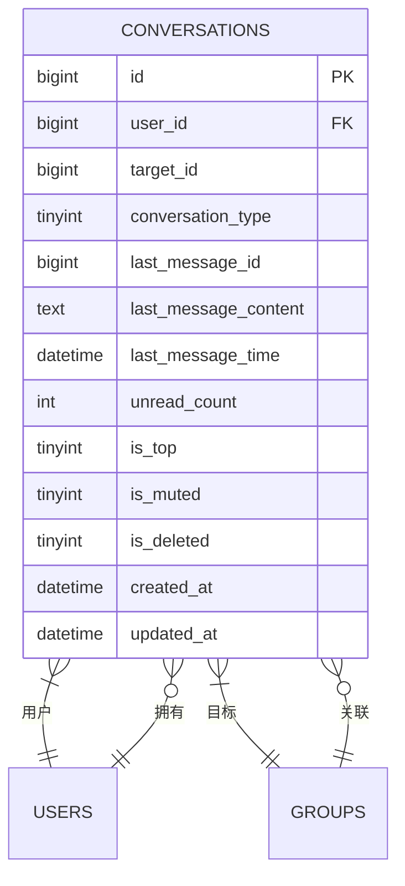
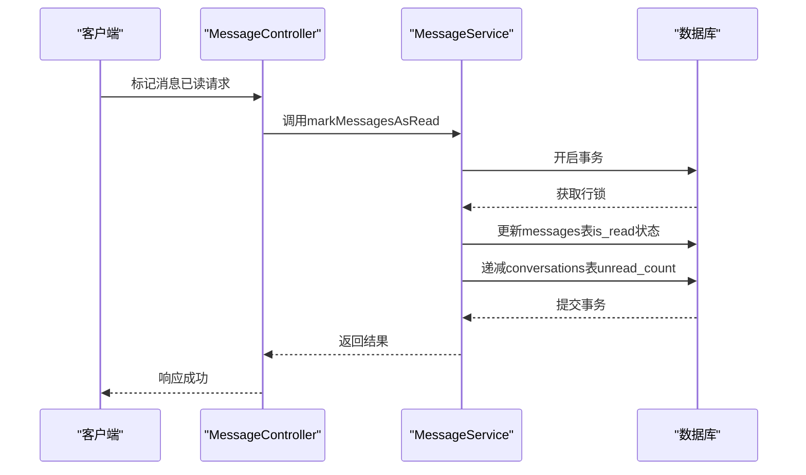
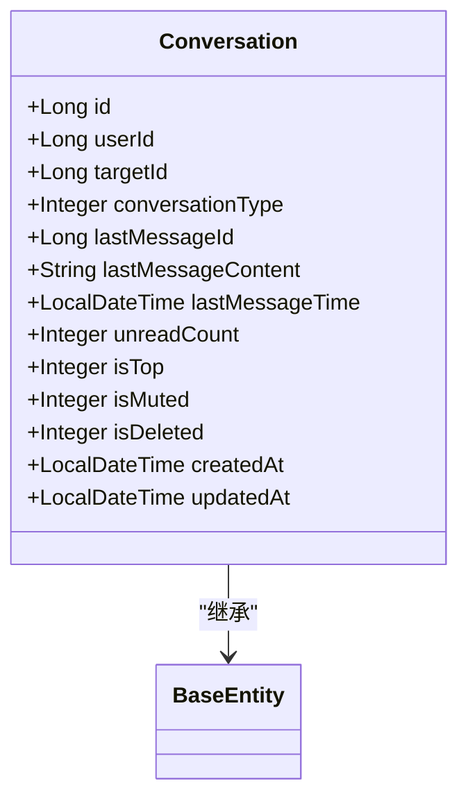

# 会话表设计

<cite>
**本文档引用文件**  
- [Conversation.java](file://src/main/java/com/example/nettyim/entity/Conversation.java)
- [schema.sql](file://src/main/resources/schema.sql)
- [MessageService.java](file://src/main/java/com/example/nettyim/service/MessageService.java)
- [MessageServiceImpl.java](file://src/main/java/com/example/nettyim/service/impl/MessageServiceImpl.java)
- [MessageController.java](file://src/main/java/com/example/nettyim/controller/MessageController.java)
- [SocketIOEventHandler.java](file://src/main/java/com/example/nettyim/websocket/SocketIOEventHandler.java)
</cite>

## 目录
1. [引言](#引言)
2. [会话元数据管理功能](#会话元数据管理功能)
3. [会话唯一标识与类型设计](#会话唯一标识与类型设计)
4. [最新消息字段的性能优化价值](#最新消息字段的性能优化价值)
5. [未读计数的原子更新机制](#未读计数的原子更新机制)
6. [用户个性化设置字段应用](#用户个性化设置字段应用)
7. [实体映射实现](#实体映射实现)
8. [核心业务逻辑代码示例](#核心业务逻辑代码示例)
9. [协同查询优化策略](#协同查询优化策略)
10. [大规模数据缓存方案](#大规模数据缓存方案)

## 引言
`conversations` 表是即时通讯系统中的核心元数据表，用于存储用户的会话状态信息。通过预计算和缓存关键会话属性，该表显著提升了会话列表的加载性能，避免了频繁的实时消息查询。本文档将深入分析其设计原理与实现机制。

## 会话元数据管理功能
`conversations` 表作为会话元数据的管理中心，承担着维护用户会话状态的核心职责。其主要功能包括：会话状态持久化、最新消息摘要存储、未读消息统计、用户个性化设置管理等。通过将这些高频访问的元数据集中管理，系统能够快速响应客户端对会话列表的查询请求。

**Section sources**
- [schema.sql](file://src/main/resources/schema.sql#L118-L140)

## 会话唯一标识与类型设计
### 组合唯一键设计
`user_id` 与 `target_id` 结合 `conversation_type` 字段构成联合唯一索引 `uk_user_target_type`，确保每个用户与目标（好友或群组）之间的会话关系唯一。该设计支持私聊和群聊两种场景，避免了会话重复创建。

### 会话类型枚举
`conversation_type` 字段采用枚举设计，值为 1 表示私聊，2 表示群聊。该字段不仅用于区分会话类型，还作为联合唯一键的一部分，确保同一用户与同一目标之间不会同时存在私聊和群聊会话。

**Diagram sources**
- [schema.sql](file://src/main/resources/schema.sql#L118-L140)

**Section sources**
- [schema.sql](file://src/main/resources/schema.sql#L118-L140)

## 最新消息字段的性能优化价值
### 字段组成
`last_message_id`、`last_message_content` 和 `last_message_time` 三个字段共同构成会话的最新消息摘要。这些字段在每次新消息产生时由服务端异步更新，确保会话列表展示时无需实时查询 `messages` 表。

### 性能优势
通过预存最新消息内容，会话列表查询可直接从 `conversations` 表获取所需数据，避免了与 `messages` 表的复杂关联查询。结合 `idx_last_message_time` 索引，系统可高效实现按时间排序的会话列表展示，显著降低数据库负载。

**Section sources**
- [schema.sql](file://src/main/resources/schema.sql#L118-L140)

## 未读计数的原子更新机制
### 原子性保障
`unread_count` 字段的更新通过数据库事务和行级锁保证原子性。当用户接收到新消息时，系统在插入消息记录的同时递增对应会话的未读计数；当用户标记消息已读时，系统递减未读计数。

### 更新流程
未读计数的更新由 `MessageService.markMessagesAsRead` 方法触发，该方法接收用户ID和消息ID列表，批量更新消息状态并同步递减 `conversations` 表中的 `unread_count` 字段，确保数据一致性。

**Diagram sources**
- [MessageServiceImpl.java](file://src/main/java/com/example/nettyim/service/impl/MessageServiceImpl.java#L175-L185)
- [MessageController.java](file://src/main/java/com/example/nettyim/controller/MessageController.java#L69-L71)

**Section sources**
- [MessageServiceImpl.java](file://src/main/java/com/example/nettyim/service/impl/MessageServiceImpl.java#L175-L185)
- [MessageController.java](file://src/main/java/com/example/nettyim/controller/MessageController.java#L69-L71)

## 用户个性化设置字段应用
### 置顶功能
`is_top` 字段用于标识会话是否置顶，值为 1 表示置顶。在会话排序时，系统优先展示置顶会话，提升重要会话的可见性。

### 免打扰模式
`is_muted` 字段表示是否开启免打扰，值为 1 时屏蔽通知提醒。该设置允许用户根据场景灵活控制消息提醒，改善用户体验。

**Section sources**
- [schema.sql](file://src/main/resources/schema.sql#L118-L140)

## 实体映射实现
### Conversation实体类
`Conversation` 实体类通过 Lombok 注解简化代码，使用 `@TableName("conversations")` 映射数据库表。各字段与表结构一一对应，`lastMessageTime` 使用 `LocalDateTime` 类型精确表示时间。

### 字段映射
实体类中的字段命名采用驼峰命名法，通过 MyBatis Plus 自动映射为下划线命名的数据库字段。`@TableId` 注解指定 `id` 字段为主键并启用自动增长。

**Diagram sources**
- [Conversation.java](file://src/main/java/com/example/nettyim/entity/Conversation.java#L0-L73)

**Section sources**
- [Conversation.java](file://src/main/java/com/example/nettyim/entity/Conversation.java#L0-L73)

## 核心业务逻辑代码示例
### 会话创建逻辑
当用户首次发送消息时，系统检查 `conversations` 表是否存在对应会话记录，若不存在则创建新会话并初始化元数据字段。

### 未读数更新逻辑
`markMessagesAsRead` 方法接收消息ID列表，在事务中批量更新消息状态并同步递减 `unread_count`，确保数据一致性。

### 会话排序逻辑
查询会话列表时，使用 `ORDER BY is_top DESC, last_message_time DESC` 实现置顶优先、按时间倒序的排序策略。

**Section sources**
- [MessageServiceImpl.java](file://src/main/java/com/example/nettyim/service/impl/MessageServiceImpl.java#L175-L185)
- [MessageController.java](file://src/main/java/com/example/nettyim/controller/MessageController.java#L69-L71)
- [schema.sql](file://src/main/resources/schema.sql#L118-L140)

## 协同查询优化策略
### 索引优化
`conversations` 表在 `user_id`、`last_message_time`、`is_top` 等字段上建立索引，支持高效查询。联合查询时，通过 `user_id` 快速定位用户会话，再按时间排序。

### 分页查询
会话列表采用分页查询，结合 `LIMIT` 和 `OFFSET` 避免全表扫描。对于活跃用户，可结合缓存减少数据库压力。

**Section sources**
- [schema.sql](file://src/main/resources/schema.sql#L118-L140)

## 大规模数据缓存方案
### Redis缓存策略
使用 Redis 缓存热点会话数据，以 `user:conversations:{userId}` 为键存储用户会话列表的序列化数据。设置合理过期时间，平衡数据一致性与性能。

### 缓存更新机制
当会话元数据变更时（如未读数更新、置顶状态变更），同步更新 Redis 缓存。通过发布-订阅模式通知集群节点刷新本地缓存，确保数据一致性。

**Section sources**
- [SocketIOEventHandler.java](file://src/main/java/com/example/nettyim/websocket/SocketIOEventHandler.java#L174-L208)