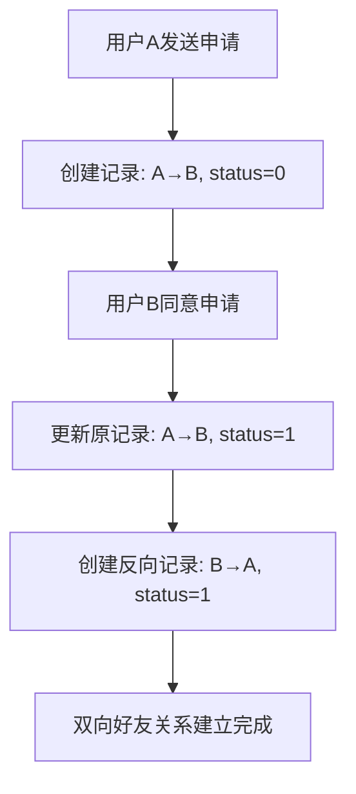
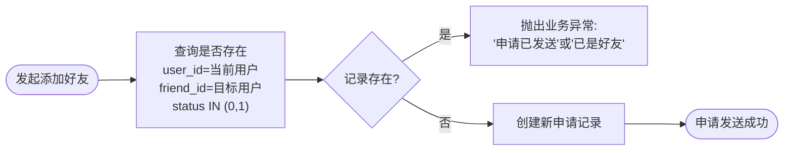
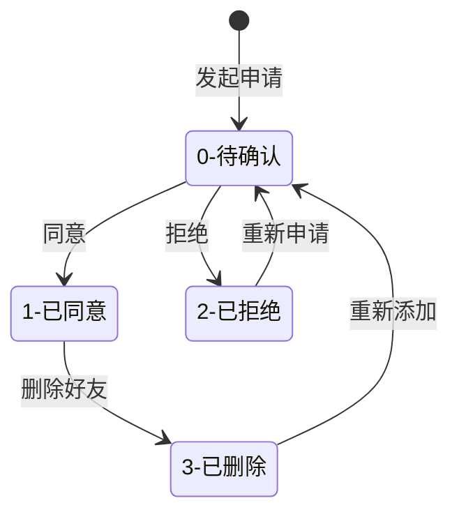
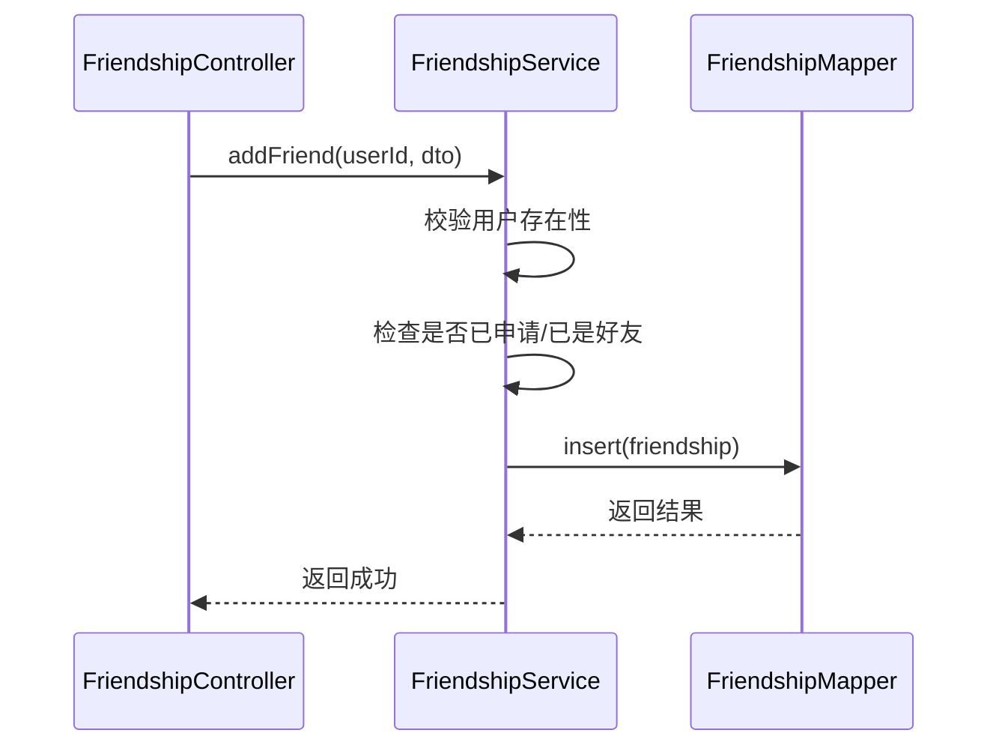

# 好友关系表设计

<cite>
**本文档引用的文件**  
- [schema.sql](file://src/main/resources/schema.sql)
- [Friendship.java](file://src/main/java/com/example/nettyim/entity/Friendship.java)
- [FriendshipService.java](file://src/main/java/com/example/nettyim/service/FriendshipService.java)
- [FriendshipServiceImpl.java](file://src/main/java/com/example/nettyim/service/impl/FriendshipServiceImpl.java)
- [FriendshipController.java](file://src/main/java/com/example/nettyim/controller/FriendshipController.java)
</cite>

## 目录
1. [引言](#引言)
2. [表结构与核心字段](#表结构与核心字段)
3. [双向关系实现机制](#双向关系实现机制)
4. [联合唯一索引与重复申请防止](#联合唯一索引与重复申请防止)
5. [外键级联删除与数据一致性](#外键级联删除与数据一致性)
6. [状态流转逻辑详解](#状态流转逻辑详解)
7. [实体类注解分析](#实体类注解分析)
8. [核心操作流程解析](#核心操作流程解析)
9. [缓存失效策略与查询优化](#缓存失效策略与查询优化)
10. [总结](#总结)

## 引言
本文档深入解析即时通讯系统中`friendships`表的设计与实现机制，重点阐述其在好友关系管理中的关键作用。通过分析数据库结构、Java实体类、服务层逻辑及控制器接口，全面揭示双向好友关系的建立、维护与查询机制。文档涵盖从数据库约束到业务逻辑的完整链路，为开发者提供清晰的技术实现蓝图。

## 表结构与核心字段

`friendships`表是实现用户间好友关系的核心数据结构，其字段设计兼顾功能性与性能需求：

| 字段名 | 类型 | 默认值 | 说明 |
|--------|------|--------|------|
| `id` | BIGINT | - | 主键，自增 |
| `user_id` | BIGINT | - | 发起方用户ID |
| `friend_id` | BIGINT | - | 接收方用户ID |
| `status` | TINYINT | 0 | 状态：0-待确认，1-已同意，2-已拒绝，3-已删除 |
| `remark` | VARCHAR(50) | NULL | 好友备注名 |
| `created_at` | DATETIME | CURRENT_TIMESTAMP | 创建时间 |
| `updated_at` | DATETIME | CURRENT_TIMESTAMP ON UPDATE CURRENT_TIMESTAMP | 更新时间 |

此外，表定义包含多个索引和约束以保障数据完整性与查询效率。

**Section sources**
- [schema.sql](file://src/main/resources/schema.sql#L15-L35)

## 双向关系实现机制

系统采用**非对称双向存储**模式实现好友关系。当用户A添加用户B为好友并被同意后，系统将插入两条独立记录：

1. `(user_id=A, friend_id=B, status=1)`
2. `(user_id=B, friend_id=A, status=1)`

这种设计确保任意用户均可独立查询其好友列表，无需复杂连接操作。例如，用户A查询好友时仅需筛选`user_id = A`且`status = 1`的记录。

该机制在`FriendshipServiceImpl`的`handleFriendRequest`方法中实现：当申请被同意时，除更新原申请状态外，还会创建反向关系记录。



**Diagram sources**
- [schema.sql](file://src/main/resources/schema.sql#L15-L35)
- [FriendshipServiceImpl.java](file://src/main/java/com/example/nettyim/service/impl/FriendshipServiceImpl.java#L85-L105)

## 联合唯一索引与重复申请防止

`friendships`表定义了联合唯一索引`uk_user_friend`，约束为：

```sql
UNIQUE KEY `uk_user_friend` (`user_id`, `friend_id`)
```

此索引确保同一用户对特定好友最多只能存在一条记录，从根本上防止重复申请。结合服务层逻辑，系统实现多层防护：

1. **数据库层**：唯一索引阻止物理重复插入
2. **服务层**：`addFriend`方法通过查询`status IN (0,1)`判断是否已存在有效关系

当用户尝试重复添加好友时，系统优先检查是否存在待确认或已同意的关系，并抛出相应业务异常，提升用户体验。



**Diagram sources**
- [schema.sql](file://src/main/resources/schema.sql#L28)
- [FriendshipServiceImpl.java](file://src/main/java/com/example/nettyim/service/impl/FriendshipServiceImpl.java#L45-L60)

## 外键级联删除与数据一致性

`friendships`表通过外键约束保障数据一致性：

```sql
FOREIGN KEY (`user_id`) REFERENCES `users` (`id`) ON DELETE CASCADE,
FOREIGN KEY (`friend_id`) REFERENCES `users` (`id`) ON DELETE CASCADE
```

`ON DELETE CASCADE`策略确保当用户被删除时，其所有好友关系自动清除，避免产生孤儿记录。该机制由数据库层面强制执行，无需应用层干预，极大简化了用户注销逻辑。

同时，`deleteFriend`操作在服务层显式删除双向记录，确保即使数据库级联配置失效，应用逻辑仍能维持一致性。

**Section sources**
- [schema.sql](file://src/main/resources/schema.sql#L32-L34)
- [FriendshipServiceImpl.java](file://src/main/java/com/example/nettyim/service/impl/FriendshipServiceImpl.java#L150-L160)

## 状态流转逻辑详解

`status`字段定义四种状态，构成完整的好友申请生命周期：

| 状态值 | 名称 | 触发条件 | 后续可操作 |
|--------|------|----------|------------|
| 0 | 待确认 | 发起好友申请 | 同意、拒绝 |
| 1 | 已同意 | 对方同意申请 | 删除好友、修改备注 |
| 2 | 已拒绝 | 对方拒绝申请 | 可重新发起申请 |
| 3 | 已删除 | 主动删除好友 | 可重新添加 |

状态流转图如下：



服务层在处理状态变更时进行严格校验，如`handleFriendRequest`会检查当前状态是否为0，防止重复处理。

**Diagram sources**
- [schema.sql](file://src/main/resources/schema.sql#L22)
- [FriendshipServiceImpl.java](file://src/main/java/com/example/nettyim/service/impl/FriendshipServiceImpl.java#L75-L85)

## 实体类注解分析

`Friendship.java`实体类使用MyBatis-Plus注解实现ORM映射：

```java
@TableName("friendships")
public class Friendship extends BaseEntity {
    
    @TableId(type = IdType.AUTO)
    private Long id;
    
    private Long userId;
    private Long friendId;
    private Integer status;
    private String remark;
}
```

- `@TableName("friendships")`：指定映射的数据库表名
- `@TableId(type = IdType.AUTO)`：声明主键自增策略，与数据库`AUTO_INCREMENT`对应

这些注解使实体类与数据库表无缝对接，简化了CRUD操作。`@Data`注解由Lombok提供，自动生成getter/setter方法，减少样板代码。

**Section sources**
- [Friendship.java](file://src/main/java/com/example/nettyim/entity/Friendship.java#L1-L83)

## 核心操作流程解析

### 添加好友
**SQL执行路径**：
```sql
INSERT INTO friendships (user_id, friend_id, status, remark) VALUES (?, ?, 0, ?)
```

**Java调用链**：


### 处理申请
**SQL执行路径**：
```sql
UPDATE friendships SET status = ? WHERE id = ?
INSERT INTO friendships (user_id, friend_id, status, remark) VALUES (?, ?, 1, ?)
```

### 查询好友列表
**SQL执行路径**：
```sql
SELECT * FROM friendships WHERE user_id = ? AND status = 1
SELECT * FROM users WHERE id IN (?)
```

**Section sources**
- [FriendshipController.java](file://src/main/java/com/example/nettyim/controller/FriendshipController.java#L25-L95)
- [FriendshipServiceImpl.java](file://src/main/java/com/example/nettyim/service/impl/FriendshipServiceImpl.java#L40-L190)

## 缓存失效策略与查询优化

### 好友备注更新缓存失效
虽然当前代码未显式集成缓存，但`updateFriendRemark`方法提供了清晰的缓存失效点。建议在实际部署中：

1. 使用Redis缓存好友关系（如`hash`结构存储`user_id:friend_id→remark`）
2. 在`updateFriendRemark`成功后，删除或更新对应缓存项
3. 可引入消息队列异步清理缓存，降低主流程延迟

### 大规模查询分页优化
当前`getFriendList`方法存在性能隐患，建议优化：

1. **分页支持**：在`FriendshipService`接口中增加分页参数
2. **索引优化**：确保`(user_id, status, created_at)`复合索引存在
3. **延迟关联**：先查询ID再关联用户信息，减少回表次数

优化后的SQL示例：
```sql
SELECT f.friend_id FROM friendships f 
WHERE f.user_id = ? AND f.status = 1 
ORDER BY f.created_at DESC 
LIMIT ? OFFSET ?
```

**Section sources**
- [FriendshipServiceImpl.java](file://src/main/java/com/example/nettyim/service/impl/FriendshipServiceImpl.java#L140-L150)

## 总结
`friendships`表通过精心设计的索引、外键和状态机制，实现了高效可靠的好友关系管理。联合唯一索引防止重复申请，外键级联保障数据一致性，状态字段驱动完整生命周期。服务层逻辑与数据库约束协同工作，构建了健壮的双向好友系统。未来可通过引入缓存和分页优化进一步提升大规模场景下的性能表现。