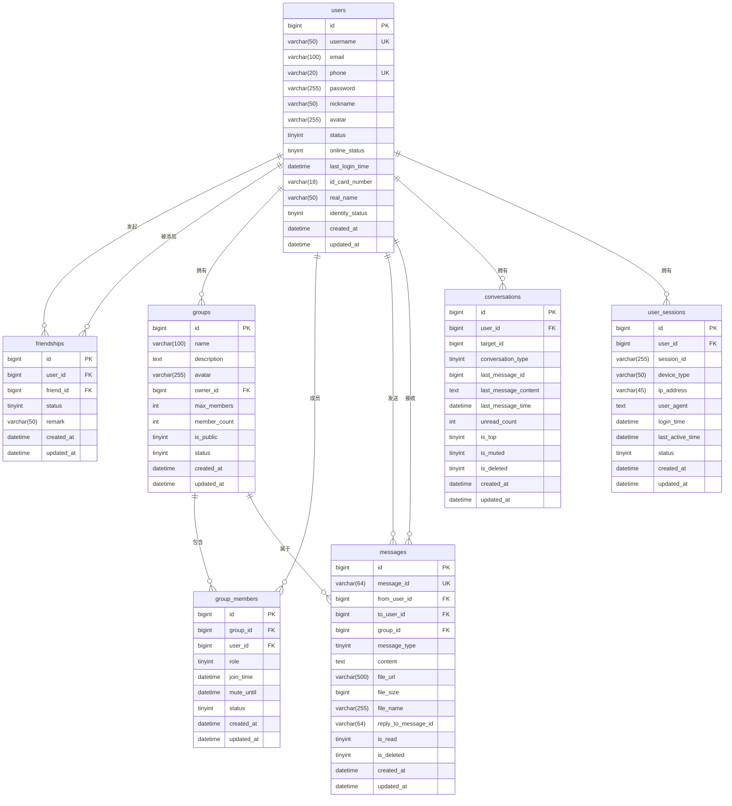

# 数据库设计

<cite>
**本文档引用的文件**
- [schema.sql](file://src/main/resources/schema.sql)
- [User.java](file://src/main/java/com/example/nettyim/entity/User.java)
- [Message.java](file://src/main/java/com/example/nettyim/entity/Message.java)
- [Friendship.java](file://src/main/java/com/example/nettyim/entity/Friendship.java)
- [Group.java](file://src/main/java/com/example/nettyim/entity/Group.java)
- [GroupMember.java](file://src/main/java/com/example/nettyim/entity/GroupMember.java)
- [Conversation.java](file://src/main/java/com/example/nettyim/entity/Conversation.java)
- [UserSession.java](file://src/main/java/com/example/nettyim/entity/UserSession.java)
- [MybatisPlusConfig.java](file://src/main/java/com/example/nettyim/config/MybatisPlusConfig.java)
</cite>

## 目录
1. [引言](#引言)
2. [核心数据模型详解](#核心数据模型详解)
3. [实体关系图（ER图）](#实体关系图er图)
4. [ORM映射与MyBatis-Plus配置](#orm映射与mybatis-plus配置)
5. [数据访问模式分析](#数据访问模式分析)
6. [数据库性能优化建议](#数据库性能优化建议)
7. [结论](#结论)

## 引言
本文件旨在全面描述即时通讯系统的核心数据模型设计。基于`schema.sql`脚本和Java实体类，详细阐述了用户、好友、群组、消息、会话等核心实体的结构、约束、索引设计及业务逻辑。重点分析了关键表之间的关系和数据访问模式，为系统的开发、维护和优化提供权威参考。

## 核心数据模型详解

### 用户表 (users)
用户表是整个系统的核心，存储所有用户的基本信息和状态。

**字段说明：**
- `id`: BIGINT，主键，自增，唯一标识用户。
- `username`: VARCHAR(50)，唯一索引，用户的登录名。
- `email`: VARCHAR(100)，可选字段，用于邮箱登录或找回密码。
- `phone`: VARCHAR(20)，唯一索引，用户的手机号，作为主要联系方式。
- `password`: VARCHAR(255)，存储经过加密（如BCrypt）的密码。
- `nickname`: VARCHAR(50)，用户对外显示的昵称。
- `avatar`: VARCHAR(255)，头像图片的URL地址。
- `status`: TINYINT，用户账户状态（0-禁用，1-启用）。
- `online_status`: TINYINT，用户在线状态（0-离线，1-在线，2-忙碌，3-离开）。
- `last_login_time`: DATETIME，记录用户最后一次成功登录的时间。
- `id_card_number`, `real_name`: 支持实名认证功能。
- `identity_status`: TINYINT，实名认证状态（0-未认证，1-已认证，2-认证失败）。
- `created_at`, `updated_at`: 记录数据的创建和更新时间，由MyBatis-Plus自动填充。

**索引设计：**
为`username`, `email`, `phone`, `status`, `id_card_number`等常用查询字段建立了索引，以加速登录、查找和状态过滤等操作。

**Section sources**
- [schema.sql](file://src/main/resources/schema.sql#L14-L54)
- [User.java](file://src/main/java/com/example/nettyim/entity/User.java)

### 好友关系表 (friendships)
该表实现了双向好友关系的管理。

**字段说明：**
- `user_id`, `friend_id`: BIGINT，分别表示发起请求的用户和被请求的用户。
- `status`: TINYINT，关系状态（0-待确认，1-已同意，2-已拒绝，3-已删除）。通过状态机管理好友关系的生命周期。
- `remark`: VARCHAR(50)，允许用户为好友设置备注名。
- `uk_user_friend`: 唯一索引，确保一个用户对另一个用户只能存在一条关系记录，防止重复添加。

**实现双向关系：**
该设计通过两条记录来实现逻辑上的双向关系。例如，用户A和用户B成为好友后，数据库中会存在两条记录：
1.  `(user_id=A, friend_id=B, status=1)`
2.  `(user_id=B, friend_id=A, status=1)`
这种设计简化了查询，当查询用户A的好友列表时，只需 `SELECT * FROM friendships WHERE user_id = A AND status = 1`。

**Section sources**
- [schema.sql](file://src/main/resources/schema.sql#L56-L78)
- [Friendship.java](file://src/main/java/com/example/nettyim/entity/Friendship.java)

### 群组与群组成员表 (groups & group_members)
这两张表通过多对多关联模式管理群组。

**群组表 (groups) 字段说明：**
- `id`: 群组唯一标识。
- `name`, `description`, `avatar`: 群组的基本信息。
- `owner_id`: BIGINT，外键关联`users.id`，指定群主。
- `max_members`, `member_count`: 控制和记录群组成员数量。
- `is_public`: TINYINT，标识群组是否公开，影响加入方式。
- `status`: 群组状态。

**群组成员表 (group_members) 字段说明：**
- `group_id`, `user_id`: 外键，分别关联`groups.id`和`users.id`，构成多对多关系。
- `role`: TINYINT，成员角色（0-普通成员，1-管理员，2-群主），用于权限控制。
- `mute_until`: DATETIME，记录禁言到期时间，实现定时禁言功能。
- `status`: 成员状态（0-已退出，1-正常）。
- `uk_group_user`: 唯一索引，确保一个用户在同一个群组中只能有一条记录。

**Section sources**
- [schema.sql](file://src/main/resources/schema.sql#L80-L128)
- [schema.sql](file://src/main/resources/schema.sql#L130-L169)
- [Group.java](file://src/main/java/com/example/nettyim/entity/Group.java)
- [GroupMember.java](file://src/main/java/com/example/nettyim/entity/GroupMember.java)

### 消息表 (messages)
消息表是系统中数据量最大的表，存储所有私聊和群聊消息。

**字段说明：**
- `id`: BIGINT，主键，自增。
- `message_id`: VARCHAR(64)，唯一索引，消息的全局唯一标识，用于幂等性处理和消息追踪。
- `from_user_id`: BIGINT，外键，发送者ID。
- `to_user_id`: BIGINT，外键，接收者ID（私聊时使用）。
- `group_id`: BIGINT，外键，群组ID（群聊时使用）。`to_user_id`和`group_id`互斥。
- `message_type`: TINYINT，消息类型（1-文本，2-图片，3-文件，4-语音，5-视频，6-系统消息），用于客户端解析和渲染。
- `content`: TEXT，存储消息的文本内容或序列化后的结构化数据。
- `file_url`, `file_size`, `file_name`: 存储非文本消息的文件元数据。
- `reply_to_message_id`: VARCHAR(64)，支持消息回复功能，指向被回复消息的`message_id`。
- `is_read`: TINYINT，私聊消息的已读状态（0-未读，1-已读）。
- `is_deleted`: TINYINT，软删除标记（0-正常，1-已删除）。

**索引设计：**
- `idx_from_user_id`, `idx_to_user_id`, `idx_group_id`: 用于按发送者或接收者查询消息。
- `idx_created_at`: 用于按时间范围查询。
- `idx_conversation`, `idx_group_conversation`: 复合索引，优化私聊和群聊会话的消息拉取性能。

**Section sources**
- [schema.sql](file://src/main/resources/schema.sql#L171-L218)
- [Message.java](file://src/main/java/com/example/nettyim/entity/Message.java)

### 会话表 (conversations)
该表是为优化消息列表查询而设计的物化视图。

**字段说明：**
- `user_id`, `target_id`, `conversation_type`: 三者构成唯一索引`uk_user_target_type`，唯一确定一个会话。
- `last_message_id`, `last_message_content`, `last_message_time`: 缓存最后一条消息的关键信息，避免在获取会话列表时进行昂贵的JOIN查询。
- `unread_count`: 实时记录未读消息数，提升用户体验。
- `is_top`, `is_muted`: 存储用户的会话偏好设置。

**业务逻辑：**
每当有新消息产生时，服务端会更新或创建对应的会话记录，同时递增`unread_count`。当用户查看会话时，再将`unread_count`清零。这种设计将“读取消息”和“更新会话”两个操作解耦，保证了高并发下的性能。

**Section sources**
- [schema.sql](file://src/main/resources/schema.sql#L220-L256)
- [Conversation.java](file://src/main/java/com/example/nettyim/entity/Conversation.java)

### 用户会话状态表 (user_sessions)
该表记录用户的在线状态和连接信息。

**字段说明：**
- `session_id`: VARCHAR(255)，存储Socket.IO会话的ID，用于向特定客户端推送消息。
- `device_type`, `ip_address`, `user_agent`: 记录用户的设备和网络信息，可用于安全审计。
- `last_active_time`: 用于判断用户是否在线，服务端可通过心跳机制更新此时间。
- `status`: 显式标记在线状态。

**Section sources**
- [schema.sql](file://src/main/resources/schema.sql#L258-L292)
- [UserSession.java](file://src/main/java/com/example/nettyim/entity/UserSession.java)

## 实体关系图（ER图）

**Diagram sources**
- [schema.sql](file://src/main/resources/schema.sql)

## ORM映射与MyBatis-Plus配置

### Java实体类映射
系统使用MyBatis-Plus作为ORM框架，通过注解实现Java对象与数据库表的映射。

- **`@TableName("table_name")`**: 指定实体类映射的数据库表名。例如，`User`类映射到`users`表。
- **`@TableId(type = IdType.AUTO)`**: 标识主键字段，并指定主键生成策略为数据库自增。
- **字段映射**: 实体类中的属性名（如`username`）默认映射到同名的数据库字段。对于驼峰命名（如`fromUserId`），框架会自动转换为下划线命名（`from_user_id`）。

### MyBatis-Plus配置
`MybatisPlusConfig.java`文件中定义了关键配置：

- **分页插件 (`PaginationInnerInterceptor`)**: 集成分页功能，支持在Mapper接口中使用`Page<T>`对象进行分页查询。
- **自动填充 (`MetaObjectHandler`)**: 自动填充`created_at`和`updated_at`字段，避免在业务代码中手动设置，保证了数据的一致性。

**Section sources**
- [User.java](file://src/main/java/com/example/nettyim/entity/User.java)
- [Message.java](file://src/main/java/com/example/nettyim/entity/Message.java)
- [MybatisPlusConfig.java](file://src/main/java/com/example/nettyim/config/MybatisPlusConfig.java)

## 数据访问模式分析

### 消息查询的分页策略
查询消息列表（如`getGroupMessages`）时，采用基于时间戳的游标分页（Cursor-based Pagination），而非传统的`LIMIT offset, size`。

- **优势**: 避免了因数据插入导致的“偏移量漂移”问题，保证了分页的稳定性和一致性。
- **实现**: 使用`created_at`字段作为游标，每次查询返回`size`条记录，并将最后一条记录的`created_at`作为下一次查询的起始点。

### 会话列表的生成逻辑
获取用户的会话列表是一个高频操作。

- **高效查询**: 直接查询`conversations`表，按`last_message_time`倒序排列，即可获得最新的会话列表。
- **避免JOIN**: 由于`last_message_content`等关键信息已缓存，无需与`messages`表进行JOIN，极大提升了查询性能。
- **过滤**: 通过`is_deleted`字段过滤掉用户已删除的会话。

**Section sources**
- [MessageController.java](file://src/main/java/com/example/nettyim/controller/MessageController.java#L45-L60)
- [Conversation.java](file://src/main/java/com/example/nettyim/entity/Conversation.java)

## 数据库性能优化建议

### 消息表的分表策略
随着用户量和消息量的增长，`messages`表将成为性能瓶颈。

- **建议方案**: 实施水平分表（Sharding）。
    - **按用户ID分片**: 将消息按`from_user_id`或`to_user_id`的哈希值分散到多个物理表中。优点是查询单个用户的消息非常快。
    - **按时间分片**: 按月或按周创建新的消息表（如`messages_2023_10`）。优点是易于管理和归档历史数据。
- **推荐**: 结合使用，例如先按时间分片，再在每个时间片内按用户ID分片。

### 索引优化方向
- **覆盖索引 (Covering Index)**: 对于`messages`表的`idx_conversation`索引，可以考虑将其扩展为覆盖索引，包含`message_type`, `content`, `is_read`等常用字段，使查询可以直接从索引中获取数据，避免回表。
- **索引监控**: 定期使用`EXPLAIN`分析慢查询，检查索引使用情况，及时添加缺失的索引或删除冗余索引。
- **索引选择性**: 确保索引字段具有高选择性。例如，`status`字段只有几个值，单独为其建立索引效果不佳，应作为复合索引的一部分。

**Section sources**
- [schema.sql](file://src/main/resources/schema.sql#L218)

## 结论
本系统通过精心设计的数据库模型，有效地支撑了即时通讯的核心功能。`users`表作为中心，通过`friendships`、`group_members`等关联表构建了复杂的社会关系网络。`messages`和`conversations`表的组合设计，兼顾了消息存储的完整性和会话查询的高性能。结合MyBatis-Plus的自动化能力，实现了高效、可靠的ORM映射。未来应重点关注消息表的分表策略，以应对海量数据的挑战。