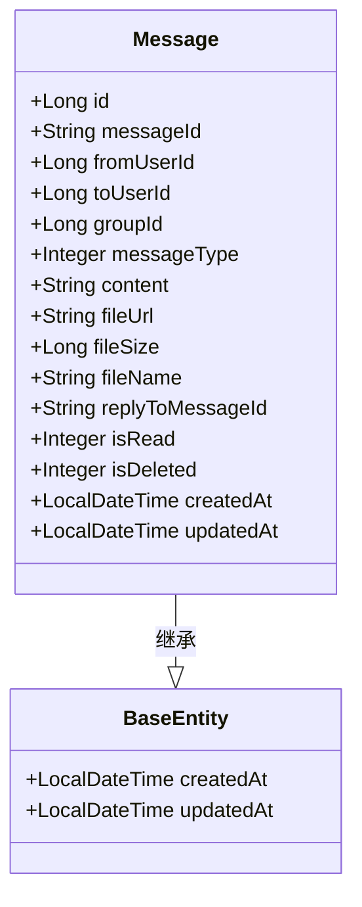

# 消息表设计

<cite>
**本文档引用文件**  
- [schema.sql](file://src/main/resources/schema.sql#L150-L250)
- [Message.java](file://src/main/java/com/example/nettyim/entity/Message.java)
- [MessageServiceImpl.java](file://src/main/java/com/example/nettyim/service/impl/MessageServiceImpl.java)
- [MessageMapper.java](file://src/main/java/com/example/nettyim/mapper/MessageMapper.java)
- [MessageController.java](file://src/main/java/com/example/nettyim/controller/MessageController.java)
</cite>

## 目录
1. [引言](#引言)
2. [消息表结构概览](#消息表结构概览)
3. [核心字段设计与实现机制](#核心字段设计与实现机制)
4. [消息路由逻辑](#消息路由逻辑)
5. [消息类型与内容存储策略](#消息类型与内容存储策略)
6. [状态字段应用：已读与软删除](#状态字段应用已读与软删除)
7. [ORM映射与实体类解析](#orm映射与实体类解析)
8. [高频操作实现与SQL执行分析](#高频操作实现与sql执行分析)
9. [分表分库策略建议](#分表分库策略建议)
10. [索引性能调优方向](#索引性能调优方向)

## 引言
本技术文档全面解析即时通讯系统中`messages`表的设计与实现。围绕消息的唯一性标识、私聊与群聊的消息路由机制、多类型消息支持、状态管理、ORM映射、高频操作实现以及数据库扩展性等核心方面进行深入剖析，旨在为开发者提供一份详尽的技术参考。

## 消息表结构概览
`messages`表是即时通讯系统的核心数据表，用于持久化所有用户间的消息记录。其设计兼顾了功能完整性与查询性能，支持私聊、群聊、多种消息类型及状态管理。

```sql
CREATE TABLE IF NOT EXISTS `messages` (
    `id` BIGINT PRIMARY KEY AUTO_INCREMENT COMMENT '消息ID',
    `message_id` VARCHAR(64) NOT NULL UNIQUE COMMENT '消息唯一标识',
    `from_user_id` BIGINT NOT NULL COMMENT '发送者ID',
    `to_user_id` BIGINT DEFAULT NULL COMMENT '接收者ID（私聊）',
    `group_id` BIGINT DEFAULT NULL COMMENT '群组ID（群聊）',
    `message_type` TINYINT NOT NULL COMMENT '消息类型：1-文本，2-图片，3-文件，4-语音，5-视频，6-系统消息',
    `content` TEXT NOT NULL COMMENT '消息内容',
    `file_url` VARCHAR(500) DEFAULT NULL COMMENT '文件URL（非文本消息）',
    `file_size` BIGINT DEFAULT NULL COMMENT '文件大小',
    `file_name` VARCHAR(255) DEFAULT NULL COMMENT '文件名',
    `reply_to_message_id` VARCHAR(64) DEFAULT NULL COMMENT '回复的消息ID',
    `is_read` TINYINT DEFAULT 0 COMMENT '是否已读：0-未读，1-已读',
    `is_deleted` TINYINT DEFAULT 0 COMMENT '是否删除：0-正常，1-已删除',
    `created_at` DATETIME DEFAULT CURRENT_TIMESTAMP COMMENT '创建时间',
    `updated_at` DATETIME DEFAULT CURRENT_TIMESTAMP ON UPDATE CURRENT_TIMESTAMP COMMENT '更新时间',
    INDEX `idx_message_id` (`message_id`),
    INDEX `idx_from_user_id` (`from_user_id`),
    INDEX `idx_to_user_id` (`to_user_id`),
    INDEX `idx_group_id` (`group_id`),
    INDEX `idx_message_type` (`message_type`),
    INDEX `idx_created_at` (`created_at`),
    INDEX `idx_conversation` (`from_user_id`, `to_user_id`, `created_at`),
    INDEX `idx_group_conversation` (`group_id`, `created_at`),
    FOREIGN KEY (`from_user_id`) REFERENCES `users` (`id`) ON DELETE CASCADE,
    FOREIGN KEY (`to_user_id`) REFERENCES `users` (`id`) ON DELETE CASCADE,
    FOREIGN KEY (`group_id`) REFERENCES `groups` (`id`) ON DELETE CASCADE
) ENGINE=InnoDB DEFAULT CHARSET=utf8mb4 COLLATE=utf8mb4_unicode_ci COMMENT='消息表';
```

**Diagram sources**
- [schema.sql](file://src/main/resources/schema.sql#L150-L250)

**Section sources**
- [schema.sql](file://src/main/resources/schema.sql#L150-L250)

## 核心字段设计与实现机制

### `message_id` 全局唯一性保证
`message_id` 字段（对应Java实体类中的`messageId`）是消息的全局唯一标识符，用于在分布式系统中精确识别每一条消息。该字段在数据库层面通过`UNIQUE`约束保证其唯一性。

在代码实现中，`MessageServiceImpl`的`sendMessage`方法使用`UUID.randomUUID().toString()`生成一个全局唯一的字符串作为`messageId`。这种基于UUID的生成策略确保了即使在高并发场景下，不同服务器或线程生成的消息ID也几乎不会发生冲突，从而实现了跨服务、跨数据库的全局唯一性。

**Section sources**
- [schema.sql](file://src/main/resources/schema.sql#L154)
- [Message.java](file://src/main/java/com/example/nettyim/entity/Message.java#L25-L30)
- [MessageServiceImpl.java](file://src/main/java/com/example/nettyim/service/impl/MessageServiceImpl.java#L65)

## 消息路由逻辑
系统通过`from_user_id`、`to_user_id`和`group_id`三个字段的组合来实现灵活的消息路由，区分私聊和群聊两种场景。

### 私聊消息路由
当`to_user_id`不为空且`group_id`为空时，表示这是一条私聊消息。消息的路由路径为：`from_user_id` → `to_user_id`。在`MessageServiceImpl`的`sendMessage`方法中，会首先验证发送者与接收者是否为好友关系，确保私聊消息的发送权限。

### 群聊消息路由
当`group_id`不为空且`to_user_id`为空时，表示这是一条群聊消息。消息的路由路径为：`from_user_id` → `group_id`。在`sendMessage`方法中，会验证发送者是否为该群组的成员，以保证只有群成员才能发送群消息。

**Section sources**
- [schema.sql](file://src/main/resources/schema.sql#L155-L157)
- [Message.java](file://src/main/java/com/example/nettyim/entity/Message.java#L32-L42)
- [MessageServiceImpl.java](file://src/main/java/com/example/nettyim/service/impl/MessageServiceImpl.java#L47-L57)

## 消息类型与内容存储策略
`message_type`字段定义了消息的类型，系统目前支持六种消息类型：
- **1-文本**：`content`字段存储纯文本内容。
- **2-图片**：`content`字段可存储图片描述或缩略图信息，`file_url`存储图片的访问链接，`file_size`和`file_name`记录文件元数据。
- **3-文件**：`content`字段可存储文件描述，`file_url`、`file_size`、`file_name`分别存储文件的URL、大小和原始名称。
- **4-语音**：`content`字段可存储语音时长或转文字内容，`file_url`存储语音文件链接。
- **5-视频**：`content`字段可存储视频描述或封面图信息，`file_url`存储视频文件链接。
- **6-系统消息**：`content`字段存储系统通知文本，如“用户A加入了群聊”。

这种设计将通用的文本内容与特定类型的文件元数据分离，既保证了数据结构的统一性，又为不同类型的消息提供了灵活的扩展空间。

**Section sources**
- [schema.sql](file://src/main/resources/schema.sql#L158-L159)
- [Message.java](file://src/main/java/com/example/nettyim/entity/Message.java#L44-L54)
- [MessageServiceImpl.java](file://src/main/java/com/example/nettyim/service/impl/MessageServiceImpl.java#L68-L75)

## 状态字段应用：已读与软删除
`is_read`和`is_deleted`是两个关键的状态字段，分别用于实现消息已读回执和软删除功能。

### `is_read` 字段（已读状态）
`is_read`字段用于标记消息的阅读状态（0-未读，1-已读）。在`MessageServiceImpl`中，`markMessageAsRead`方法允许接收者将特定消息标记为已读。该方法首先验证调用者是否有权限（必须是消息的接收者或群成员），然后更新`is_read`字段的值。`getUnreadMessageCount`方法则利用此字段统计指定会话中的未读消息数量，为前端提供未读计数功能。

### `is_deleted` 字段（软删除状态）
`is_deleted`字段实现了消息的软删除功能（0-正常，1-已删除）。当用户调用`deleteMessage`方法时，系统并非物理删除数据库记录，而是将`is_deleted`字段置为1。在查询历史消息（如`getPrivateMessages`和`getGroupMessages`）时，查询条件中会包含`eq("is_deleted", 0)`，从而过滤掉已被删除的消息。这种方式既保留了数据完整性，又支持用户误删后的恢复操作。

**Section sources**
- [schema.sql](file://src/main/resources/schema.sql#L168-L169)
- [Message.java](file://src/main/java/com/example/nettyim/entity/Message.java#L84-L94)
- [MessageServiceImpl.java](file://src/main/java/com/example/nettyim/service/impl/MessageServiceImpl.java#L180-L208)

## ORM映射与实体类解析
`Message`实体类使用MyBatis-Plus框架进行ORM映射，实现了与`messages`数据库表的无缝对接。

- **`@TableName("messages")`**：将Java类`Message`映射到数据库表`messages`。
- **`@TableId(type = IdType.AUTO)`**：将`id`字段标记为主键，并使用数据库自增策略。
- **字段映射**：实体类中的每个属性（如`messageId`, `fromUserId`）通过Lombok的`@Data`注解自动生成Getter/Setter方法，与数据库字段（`message_id`, `from_user_id`）遵循驼峰转下划线的默认映射规则。
- **继承关系**：`Message`类继承自`BaseEntity`，复用了创建时间、更新时间等公共字段。



**Diagram sources**
- [Message.java](file://src/main/java/com/example/nettyim/entity/Message.java)

**Section sources**
- [Message.java](file://src/main/java/com/example/nettyim/entity/Message.java)

## 高频操作实现与SQL执行分析
### 消息发送
**Java实现**：`MessageController`的`sendMessage`接口接收`SendMessageDTO`，调用`MessageService`的`sendMessage`方法。该方法进行权限校验、生成`messageId`、构建`Message`对象并插入数据库，最后通过WebSocket推送消息。
**SQL执行**：`INSERT INTO messages (...) VALUES (...)`。由于`message_id`有唯一索引，插入前无需额外查询，性能高效。

### 历史消息查询
**Java实现**：`getPrivateMessages`和`getGroupMessages`方法使用MyBatis-Plus的`QueryWrapper`构建查询条件，并结合`Page`对象实现分页。
**SQL执行计划**：
- **私聊查询**：`SELECT * FROM messages WHERE (from_user_id = ? AND to_user_id = ?) OR (from_user_id = ? AND to_user_id = ?) AND is_deleted = 0 ORDER BY created_at DESC LIMIT ? OFFSET ?`。此查询依赖`idx_conversation`复合索引，能高效定位会话。
- **群聊查询**：`SELECT * FROM messages WHERE group_id = ? AND is_deleted = 0 ORDER BY created_at DESC LIMIT ? OFFSET ?`。此查询依赖`idx_group_conversation`复合索引。

### 已读状态更新
**Java实现**：`markMessageAsRead`方法先查询消息，验证权限，然后更新`is_read`字段。
**SQL执行**：`UPDATE messages SET is_read = 1, updated_at = NOW() WHERE id = ?`。此操作基于主键`id`，速度极快。

**Section sources**
- [MessageController.java](file://src/main/java/com/example/nettyim/controller/MessageController.java)
- [MessageServiceImpl.java](file://src/main/java/com/example/nettyim/service/impl/MessageServiceImpl.java#L59-L179)

## 分表分库策略建议
随着消息量的增长，单一`messages`表可能成为性能瓶颈。建议采用以下分表分库策略：

### 按时间分表（推荐）
将`messages`表按月或按季度进行水平拆分，例如`messages_202401`, `messages_202402`。优点：
- 符合消息按时间排序的查询习惯。
- 便于实现冷热数据分离，可将历史数据归档到成本更低的存储。
- 查询近期消息时，只需访问少数几个表。

### 按用户ID分库
根据`from_user_id`或`to_user_id`的哈希值，将数据分布到不同的数据库实例中。优点：
- 能有效分散单库的读写压力。
- 适用于用户基数巨大、消息量极高的场景。
- 缺点是跨用户查询（如全局搜索）会变得复杂。

**Section sources**
- [schema.sql](file://src/main/resources/schema.sql#L150-L250)

## 索引性能调优方向
`messages`表的两个核心查询索引是`idx_conversation`和`idx_group_conversation`。

### `idx_conversation` (`from_user_id`, `to_user_id`, `created_at`)
- **作用**：优化私聊会话的消息查询。
- **调优方向**：该索引已非常高效。可监控其使用情况，确保查询语句能正确命中。如果查询条件中包含`is_deleted = 0`，可考虑创建覆盖索引`(from_user_id, to_user_id, is_deleted, created_at)`，但需权衡索引大小。

### `idx_group_conversation` (`group_id`, `created_at`)
- **作用**：优化群聊消息的历史查询。
- **调优方向**：同上，可考虑添加`is_deleted`字段以创建覆盖索引，避免回表查询。对于超大群组，可结合分表策略，将索引压力分散。

**Section sources**
- [schema.sql](file://src/main/resources/schema.sql#L245-L246)