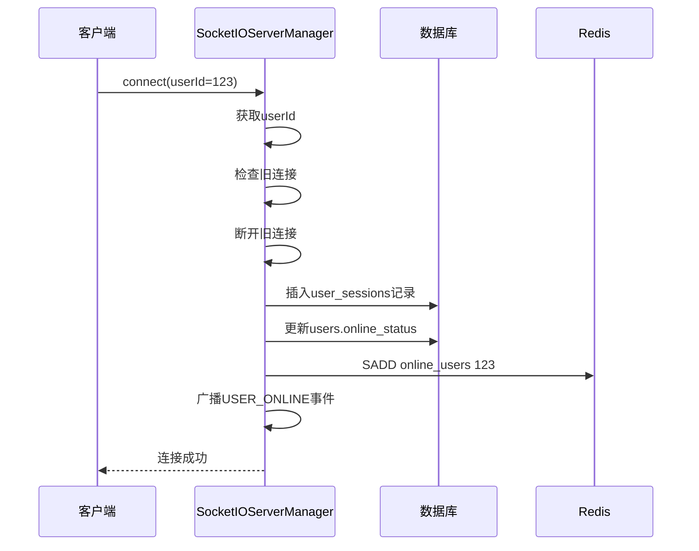
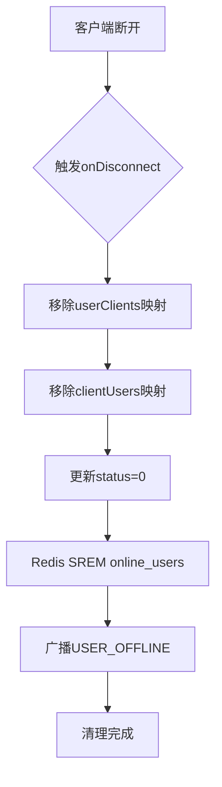

# 用户会话状态表设计

<cite>
**本文档引用文件**  
- [schema.sql](file://src/main/resources/schema.sql)
- [UserSession.java](file://src/main/java/com/example/nettyim/entity/UserSession.java)
- [SocketIOEventHandler.java](file://src/main/java/com/example/nettyim/websocket/SocketIOEventHandler.java)
- [SocketIOServerManager.java](file://src/main/java/com/example/nettyim/websocket/SocketIOServerManager.java)
- [UserServiceImpl.java](file://src/main/java/com/example/nettyim/service/impl/UserServiceImpl.java)
</cite>

## 目录
1. [引言](#引言)
2. [用户会话表结构](#用户会话表结构)
3. [核心字段解析](#核心字段解析)
4. [实体类与数据库映射](#实体类与数据库映射)
5. [会话生命周期管理](#会话生命周期管理)
6. [Redis在线状态同步策略](#redis在线状态同步策略)
7. [数据一致性保障机制](#数据一致性保障机制)
8. [高并发场景优化建议](#高并发场景优化建议)
9. [结论](#结论)

## 引言
本系统采用`user_sessions`表作为用户在线状态的核心管理机制，结合Socket.IO实时通信与Redis缓存，实现高可用、低延迟的在线状态管理。该机制支持多端登录识别、跨节点状态同步，并为用户活跃度分析提供数据基础。

## 用户会话表结构
`user_sessions`表用于记录用户的实时连接状态，是实现在线状态管理的关键数据表。

```mermaid
erDiagram
user_sessions {
bigint id PK
bigint user_id FK
varchar(255) session_id
varchar(50) device_type
varchar(45) ip_address
text user_agent
datetime login_time
datetime last_active_time
tinyint status
datetime created_at
datetime updated_at
}
users ||--o{ user_sessions : "用户-会话"
user_sessions {
"会话ID" id
"用户ID" user_id
"Socket会话ID" session_id
"设备类型" device_type
"IP地址" ip_address
"用户代理" user_agent
"登录时间" login_time
"最后活跃时间" last_active_time
"状态" status
}
```

**图表来源**  
- [schema.sql](file://src/main/resources/schema.sql#L297-L315)

**本节来源**  
- [schema.sql](file://src/main/resources/schema.sql#L297-L315)

## 核心字段解析

### session_id与Socket.IO连接绑定
`session_id`字段存储Socket.IO客户端的唯一会话标识，通过握手参数与用户身份绑定。当客户端连接时，系统从URL参数中提取`userId`，建立用户与Socket会话的映射关系。

**本节来源**  
- [SocketIOServerManager.java](file://src/main/java/com/example/nettyim/websocket/SocketIOServerManager.java#L65-L85)

### device_type与user_agent的多端登录识别
`device_type`和`user_agent`字段共同实现多端登录识别：
- `device_type`：可存储"mobile"、"desktop"、"web"等值，用于区分设备类型
- `user_agent`：完整记录客户端User-Agent信息，用于精确识别浏览器、操作系统等

系统支持同一用户多设备同时在线，通过`user_id`索引可查询所有活跃会话。

**本节来源**  
- [schema.sql](file://src/main/resources/schema.sql#L301-L303)
- [UserSession.java](file://src/main/java/com/example/nettyim/entity/UserSession.java#L28-L36)

### ip_address的记录用途
`ip_address`字段记录用户连接时的IP地址，主要用于：
- 安全审计：检测异常登录行为
- 地理位置分析：结合IP库进行区域统计
- 风控策略：识别高频IP或黑名单IP

**本节来源**  
- [schema.sql](file://src/main/resources/schema.sql#L302)
- [UserSession.java](file://src/main/java/com/example/nettyim/entity/UserSession.java#L32)

### login_time与last_active_time的活跃度分析
`login_time`和`last_active_time`字段为用户活跃度分析提供关键数据：
- `login_time`：记录首次登录时间，用于统计日活/月活用户
- `last_active_time`：每次心跳或消息交互时更新，用于判断用户实时活跃状态

通过这两个字段可计算：
- 会话时长 = last_active_time - login_time
- 用户留存率
- 平均在线时长

**本节来源**  
- [schema.sql](file://src/main/resources/schema.sql#L304-L305)
- [UserSession.java](file://src/main/java/com/example/nettyim/entity/UserSession.java#L40-L48)

### status字段与Redis状态同步
`status`字段（0-离线，1-在线）与Redis中的在线状态保持同步：
- 当用户连接时，数据库`status`更新为1，Redis集合添加用户ID
- 当用户断开时，数据库`status`更新为0，Redis集合移除用户ID
- Redis作为快速查询缓存，数据库作为持久化存储

**本节来源**  
- [schema.sql](file://src/main/resources/schema.sql#L306)
- [UserSession.java](file://src/main/java/com/example/nettyim/entity/UserSession.java#L50)
- [SocketIOServerManager.java](file://src/main/java/com/example/nettyim/websocket/SocketIOServerManager.java#L65-L105)

## 实体类与数据库映射
`UserSession`实体类通过MyBatis Plus实现与数据库表的映射。

```mermaid
classDiagram
class UserSession {
+Long id
+Long userId
+String sessionId
+String deviceType
+String ipAddress
+String userAgent
+LocalDateTime loginTime
+LocalDateTime lastActiveTime
+Integer status
}
UserSession --> BaseEntity : "继承"
note right of UserSession
@TableName("user_sessions")
@TableId(type = IdType.AUTO)
end note
```

**图表来源**  
- [UserSession.java](file://src/main/java/com/example/nettyim/entity/UserSession.java#L1-L63)

**本节来源**  
- [UserSession.java](file://src/main/java/com/example/nettyim/entity/UserSession.java#L1-L63)

## 会话生命周期管理

### 用户上线注册
当用户建立WebSocket连接时，系统执行以下流程：
1. 从握手参数获取`userId`
2. 检查是否存在旧连接，如有则断开
3. 创建新的`user_sessions`记录
4. 更新用户主表的`online_status`
5. 向集群广播上线事件



**图表来源**  
- [SocketIOServerManager.java](file://src/main/java/com/example/nettyim/websocket/SocketIOServerManager.java#L65-L85)

**本节来源**  
- [SocketIOServerManager.java](file://src/main/java/com/example/nettyim/websocket/SocketIOServerManager.java#L65-L85)

### 心跳更新
系统通过客户端定期发送心跳包来维持连接活跃状态：
- 服务端监听消息事件自动更新`last_active_time`
- 无消息交互时，客户端每30秒发送心跳包
- 服务端更新数据库和Redis中的最后活跃时间

**本节来源**  
- [SocketIOEventHandler.java](file://src/main/java/com/example/nettyim/websocket/SocketIOEventHandler.java#L30-L356)

### 下线清理
用户断开连接时的清理流程：
1. 触发`onDisconnect`事件
2. 从内存映射中移除连接
3. 更新数据库`status`为0
4. 从Redis在线集合中移除
5. 广播下线事件



**图表来源**  
- [SocketIOServerManager.java](file://src/main/java/com/example/nettyim/websocket/SocketIOServerManager.java#L95-L110)

**本节来源**  
- [SocketIOServerManager.java](file://src/main/java/com/example/nettyim/websocket/SocketIOServerManager.java#L95-L110)

## Redis在线状态同步策略
系统采用双写策略确保数据库与Redis状态一致：

```mermaid
graph TB
subgraph "数据库"
DB[(user_sessions)]
end
subgraph "缓存"
Redis[(Redis)]
end
subgraph "内存"
Memory[(内存映射)]
end
Client --> |连接| Manager
Manager --> DB: INSERT/UPDATE status=1
Manager --> Redis: SADD online_users
Manager --> Memory: 存储SocketIOClient
Client --> |断开| Manager
Manager --> DB: UPDATE status=0
Manager --> Redis: SREM online_users
Manager --> Memory: 移除连接
Cluster --> |广播事件| Manager
Manager --> Memory: 同步集群状态
```

**图表来源**  
- [SocketIOServerManager.java](file://src/main/java/com/example/nettyim/websocket/SocketIOServerManager.java#L65-L110)
- [schema.sql](file://src/main/resources/schema.sql#L306)

**本节来源**  
- [SocketIOServerManager.java](file://src/main/java/com/example/nettyim/websocket/SocketIOServerManager.java#L65-L110)

## 数据一致性保障机制
在集群部署环境下，系统通过以下机制保障数据一致性：

### 集群事件广播
- 使用`ClusterMessageRouter`在节点间广播连接事件
- `USER_ONLINE`/`USER_OFFLINE`事件确保各节点状态同步
- 跨节点消息路由确保消息可达性

### 原子性操作
- 内存映射使用`ConcurrentHashMap`保证线程安全
- 数据库操作通过事务确保原子性
- Redis操作使用单命令保证原子性

### 故障恢复
- 服务重启后通过数据库状态重建内存映射
- 客户端断线自动重连机制
- 心跳检测机制识别异常断开

**本节来源**  
- [SocketIOServerManager.java](file://src/main/java/com/example/nettyim/websocket/SocketIOServerManager.java#L150-L295)
- [ClusterMessageRouter.java](file://src/main/java/com/example/nettyim/cluster/ClusterMessageRouter.java)

## 高并发场景优化建议

### 表分区策略
建议对`user_sessions`表按用户ID进行哈希分区：
```sql
-- 示例：按user_id哈希分区
ALTER TABLE user_sessions 
PARTITION BY HASH(user_id) 
PARTITIONS 8;
```

### 索引优化
现有索引已较为合理，建议监控查询性能：
- `idx_user_id`：支持按用户查询会话
- `idx_session_id`：支持按会话ID查询
- `idx_status`：支持在线用户查询

### 缓存策略
- Redis中使用`SET`存储在线用户ID，支持O(1)查询
- 考虑使用Redis Module如RedisBloom进行布隆过滤器优化
- 热点用户数据可额外缓存会话信息

### 连接池优化
- WebSocket连接池大小根据服务器资源调整
- 设置合理的心跳间隔（建议30-60秒）
- 实现连接优雅降级机制

**本节来源**  
- [schema.sql](file://src/main/resources/schema.sql#L312-L314)
- [SocketIOServerManager.java](file://src/main/java/com/example/nettyim/websocket/SocketIOServerManager.java)

## 结论
`user_sessions`表通过与Socket.IO、Redis的深度集成，构建了高效可靠的在线状态管理机制。该设计支持多端登录识别、集群状态同步，并为用户行为分析提供数据基础。在海量连接场景下，建议结合表分区、索引优化和缓存策略进一步提升系统性能。