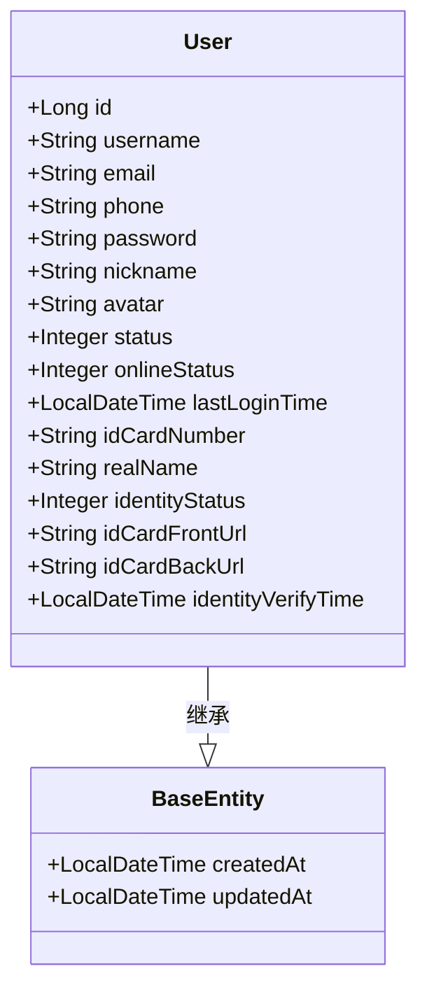
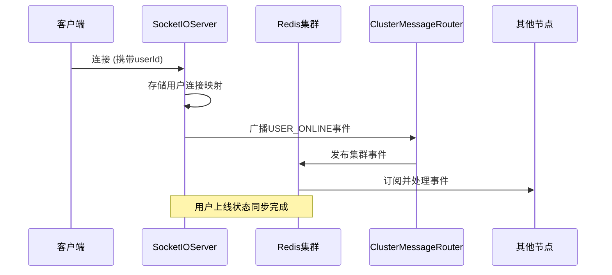

# 用户表设计

<cite>
**本文档引用的文件**  
- [schema.sql](file://src/main/resources/schema.sql)
- [User.java](file://src/main/java/com/example/nettyim/entity/User.java)
- [UserStatus.java](file://src/main/java/com/example/nettyim/entity/enums/UserStatus.java)
- [PasswordConfig.java](file://src/main/java/com/example/nettyim/config/PasswordConfig.java)
- [UserServiceImpl.java](file://src/main/java/com/example/nettyim/service/impl/UserServiceImpl.java)
- [UserController.java](file://src/main/java/com/example/nettyim/controller/UserController.java)
- [RedisConfig.java](file://src/main/java/com/example/nettyim/config/RedisConfig.java)
- [SocketIOServerManager.java](file://src/main/java/com/example/nettyim/websocket/SocketIOServerManager.java)
</cite>

## 目录
1. [简介](#简介)
2. [用户表结构定义](#用户表结构定义)
3. [字段详细说明](#字段详细说明)
4. [索引与性能优化](#索引与性能优化)
5. [实体类映射与MyBatis-Plus注解](#实体类映射与mybatis-plus注解)
6. [数据访问示例](#数据访问示例)
7. [高并发场景下的唯一性处理](#高并发场景下的唯一性处理)
8. [在线状态同步与Redis缓存策略](#在线状态同步与redis缓存策略)
9. [结论](#结论)

## 简介
本文档详细描述即时通讯系统中`users`表的数据模型设计，涵盖字段定义、约束机制、加密存储、状态枚举、索引优化及与Java实体类的映射关系。结合业务逻辑层和服务接口，分析用户注册、登录、状态更新等核心操作的实现方式，并探讨高并发下用户名冲突处理和在线状态的分布式同步方案。

## 用户表结构定义
`users`表是系统的核心用户信息存储表，包含用户身份、认证、状态及扩展信息。其SQL定义如下：

```sql
CREATE TABLE IF NOT EXISTS `users` (
    `id` BIGINT PRIMARY KEY AUTO_INCREMENT COMMENT '用户ID',
    `username` VARCHAR(50) NOT NULL UNIQUE COMMENT '用户名',
    `email` VARCHAR(100) DEFAULT NULL COMMENT '邮箱',
    `phone` VARCHAR(20) NOT NULL UNIQUE COMMENT '手机号',
    `password` VARCHAR(255) NOT NULL COMMENT '密码（加密）',
    `nickname` VARCHAR(50) NOT NULL COMMENT '昵称',
    `avatar` VARCHAR(255) DEFAULT NULL COMMENT '头像URL',
    `status` TINYINT DEFAULT 1 COMMENT '状态：0-禁用，1-启用',
    `online_status` TINYINT DEFAULT 0 COMMENT '在线状态：0-离线，1-在线，2-忙碌，3-离开',
    `last_login_time` DATETIME DEFAULT NULL COMMENT '最后登录时间',
    `id_card_number` VARCHAR(18) DEFAULT NULL COMMENT '身份证号码',
    `real_name` VARCHAR(50) DEFAULT NULL COMMENT '真实姓名',
    `identity_status` TINYINT DEFAULT 0 COMMENT '实名认证状态：0-未认证，1-已认证，2-认证失败',
    `id_card_front_url` VARCHAR(255) DEFAULT NULL COMMENT '身份证正面照片URL',
    `id_card_back_url` VARCHAR(255) DEFAULT NULL COMMENT '身份证反面照片URL',
    `identity_verify_time` DATETIME DEFAULT NULL COMMENT '实名认证时间',
    `created_at` DATETIME DEFAULT CURRENT_TIMESTAMP COMMENT '创建时间',
    `updated_at` DATETIME DEFAULT CURRENT_TIMESTAMP ON UPDATE CURRENT_TIMESTAMP COMMENT '更新时间',
    INDEX `idx_username` (`username`),
    INDEX `idx_email` (`email`),
    INDEX `idx_phone` (`phone`),
    INDEX `idx_status` (`status`),
    INDEX `idx_id_card_number` (`id_card_number`)
) ENGINE=InnoDB DEFAULT CHARSET=utf8mb4 COLLATE=utf8mb4_unicode_ci COMMENT='用户表';
```

**Diagram sources**  
- [schema.sql](file://src/main/resources/schema.sql#L6-L50)

**Section sources**  
- [schema.sql](file://src/main/resources/schema.sql#L6-L50)

## 字段详细说明

### id（主键）
`id`字段为`BIGINT`类型，采用数据库自增策略（`AUTO_INCREMENT`），作为用户的唯一标识。在Java实体中映射为`Long`类型，并通过`@TableId(type = IdType.AUTO)`注解指定自增主键。

### username（用户名）
`username`为`VARCHAR(50)`类型，非空且具有唯一性约束（`UNIQUE`），确保系统内用户名不重复。该字段用于用户登录和身份识别。

### email（邮箱）
`email`为`VARCHAR(100)`类型，可为空，但若提供则需保证唯一性。系统通过`idx_email`索引优化邮箱查询性能。

### password（密码）
`password`字段存储加密后的密码，长度为`VARCHAR(255)`，使用BCrypt算法进行哈希加密。系统通过`PasswordEncoder`接口实现密码编码，确保明文密码不会直接存储。

### nickname 与 avatar（用户信息扩展）
`nickname`为用户昵称，`avatar`为头像URL，二者均用于展示用户个性化信息。`nickname`不可为空，`avatar`可为空，支持用户自定义头像。

### status 与 online_status（状态枚举）
- `status`：用户账户状态，`0`表示禁用，`1`表示启用。用于控制用户是否可登录。
- `online_status`：用户在线状态，枚举值包括：`0`离线、`1`在线、`2`忙碌、`3`离开。该状态由WebSocket连接管理动态更新。

### last_login_time（最后登录时间）
记录用户最后一次成功登录的时间，用于安全审计和活跃度分析。每次登录成功后由服务层更新。

**Section sources**  
- [schema.sql](file://src/main/resources/schema.sql#L6-L50)
- [User.java](file://src/main/java/com/example/nettyim/entity/User.java#L20-L140)
- [UserStatus.java](file://src/main/java/com/example/nettyim/entity/enums/UserStatus.java#L4-L25)

## 索引与性能优化
为提升查询效率，`users`表定义了多个索引：

- `idx_username`：加速用户名查询，常用于登录验证。
- `idx_email`：优化邮箱唯一性检查和登录查询。
- `idx_phone`：支持手机号登录和注册校验。
- `idx_status`：快速筛选启用/禁用用户。
- `idx_id_card_number`：提高身份证号码查重效率。

这些索引显著提升了用户登录、注册校验等高频操作的响应速度。

**Section sources**  
- [schema.sql](file://src/main/resources/schema.sql#L45-L50)

## 实体类映射与MyBatis-Plus注解
`User`实体类通过MyBatis-Plus注解与数据库表映射：

- `@TableName("users")`：指定实体类对应的数据库表名。
- `@TableId(type = IdType.AUTO)`：标识`id`为主键并使用自增策略。
- `@TableField(fill = FieldFill.INSERT)`：`createdAt`在插入时自动填充。
- `@TableField(fill = FieldFill.INSERT_UPDATE)`：`updatedAt`在插入和更新时自动填充。

实体类继承`BaseEntity`，复用创建时间和更新时间字段。



**Diagram sources**  
- [User.java](file://src/main/java/com/example/nettyim/entity/User.java#L15-L140)
- [BaseEntity.java](file://src/main/java/com/example/nettyim/entity/BaseEntity.java#L15-L40)

**Section sources**  
- [User.java](file://src/main/java/com/example/nettyim/entity/User.java#L15-L140)
- [BaseEntity.java](file://src/main/java/com/example/nettyim/entity/BaseEntity.java#L15-L40)

## 数据访问示例

### 用户注册
注册流程包括用户名、手机号、邮箱唯一性校验，密码加密存储：

```java
public User register(UserRegisterDTO registerDTO) {
    if (existsByUsername(registerDTO.getUsername())) {
        throw new BusinessException("用户名已存在");
    }
    if (existsByPhone(registerDTO.getPhone())) {
        throw new BusinessException("手机号已存在");
    }
    User user = new User();
    user.setUsername(registerDTO.getUsername());
    user.setPassword(passwordEncoder.encode(registerDTO.getPassword()));
    // ... 其他字段赋值
    userMapper.insert(user);
    return user;
}
```

### 用户登录
登录时验证账号（支持用户名或手机号）和密码，更新最后登录时间并生成JWT令牌：

```java
public String login(UserLoginDTO loginDTO) {
    User user = getUserByAccount(loginDTO.getAccount());
    if (!passwordEncoder.matches(loginDTO.getPassword(), user.getPassword())) {
        throw new BusinessException("密码错误");
    }
    user.setLastLoginTime(LocalDateTime.now());
    userMapper.updateById(user);
    return jwtUtils.generateToken(user.getUsername(), user.getId());
}
```

### 状态更新
通过REST API更新用户在线状态：

```java
@PutMapping("/{userId}/status")
public Result<String> updateOnlineStatus(@PathVariable Long userId, @RequestParam Integer status) {
    userService.updateOnlineStatus(userId, status);
    return Result.success("状态更新成功");
}
```

**Section sources**  
- [UserServiceImpl.java](file://src/main/java/com/example/nettyim/service/impl/UserServiceImpl.java#L45-L100)
- [UserController.java](file://src/main/java/com/example/nettyim/controller/UserController.java#L50-L70)

## 高并发场景下的唯一性处理
在高并发注册场景下，尽管数据库层面有唯一索引约束，但仍需在应用层进行预校验。系统通过`QueryWrapper`先查询用户名是否存在，若存在则抛出业务异常。数据库的`UNIQUE`约束作为最终保障，防止并发插入导致的数据不一致。

此外，可通过Redis分布式锁进一步优化，但在本系统中依赖数据库约束已足够保证数据一致性。

**Section sources**  
- [UserServiceImpl.java](file://src/main/java/com/example/nettyim/service/impl/UserServiceImpl.java#L45-L60)
- [schema.sql](file://src/main/resources/schema.sql#L8-L9)

## 在线状态同步与Redis缓存策略
系统使用Socket.IO实现WebSocket通信，并通过`SocketIOServerManager`管理用户连接状态：

- 当用户连接时，将`userId`与`SocketIOClient`映射存储在`ConcurrentHashMap`中。
- 用户断开连接时，从映射中移除。
- 通过`isUserOnline()`方法快速判断用户在线状态。

在集群部署模式下，启用Redis作为消息中间件，通过`RedisMessageListenerContainer`广播用户上下线事件，确保各节点状态同步。`RedisTemplate`配置了Jackson序列化，支持复杂对象传输。



**Diagram sources**  
- [SocketIOServerManager.java](file://src/main/java/com/example/nettyim/websocket/SocketIOServerManager.java#L60-L150)
- [RedisConfig.java](file://src/main/java/com/example/nettyim/config/RedisConfig.java#L15-L40)

**Section sources**  
- [SocketIOServerManager.java](file://src/main/java/com/example/nettyim/websocket/SocketIOServerManager.java#L60-L150)
- [RedisConfig.java](file://src/main/java/com/example/nettyim/config/RedisConfig.java#L15-L40)

## 结论
`users`表设计充分考虑了用户身份管理、安全性、扩展性和性能需求。通过MyBatis-Plus注解实现ORM映射，结合BCrypt密码加密、唯一性约束和索引优化，保障了数据安全与查询效率。在高并发场景下，利用数据库约束与应用层校验双重机制确保数据一致性。通过WebSocket与Redis集群实现用户在线状态的实时同步，支持分布式部署，具备良好的可扩展性。