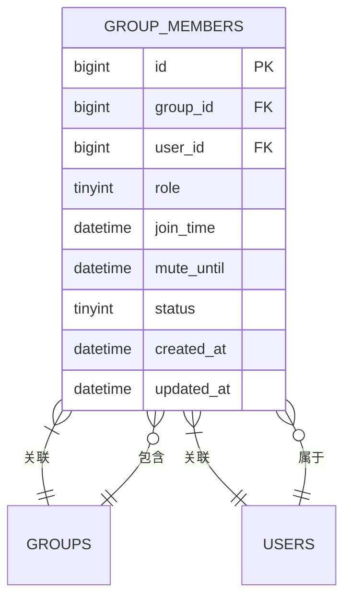
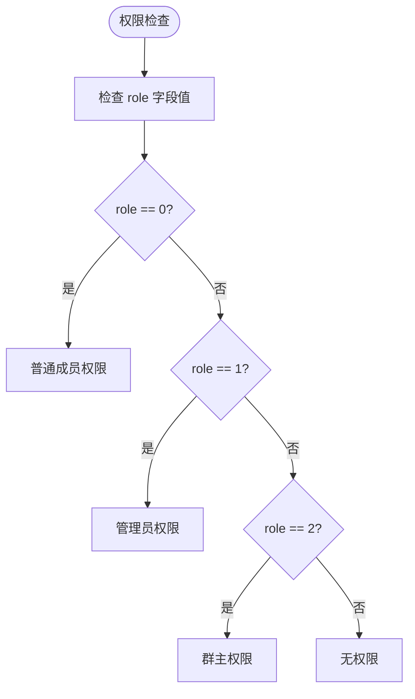
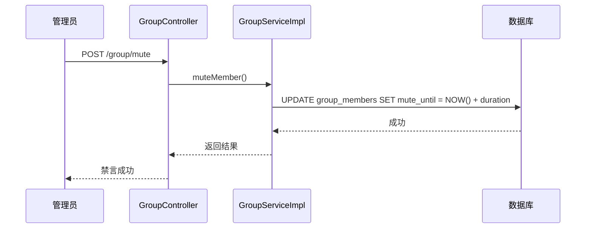
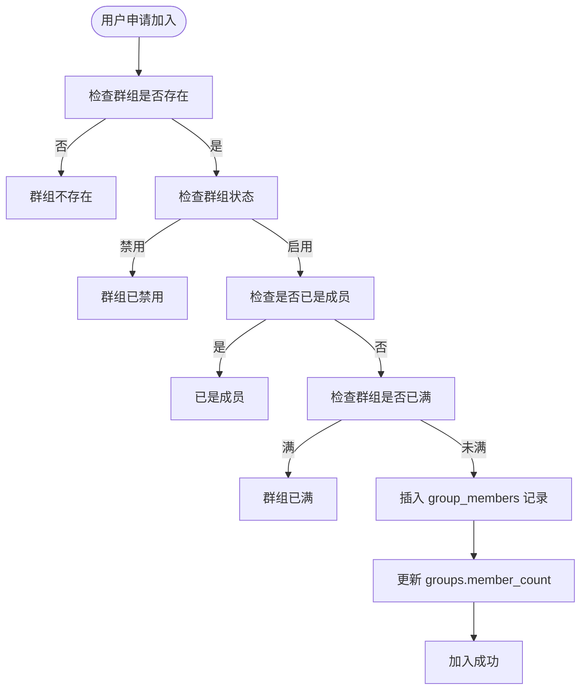

# 群组成员表设计

<cite>
**本文档引用文件**  
- [schema.sql](file://src/main/resources/schema.sql#L100-L130)
- [GroupMember.java](file://src/main/java/com/example/nettyim/entity/GroupMember.java#L1-L110)
- [GroupServiceImpl.java](file://src/main/java/com/example/nettyim/service/impl/GroupServiceImpl.java#L20-L396)
- [GroupController.java](file://src/main/java/com/example/nettyim/controller/GroupController.java#L13-L173)
</cite>

## 目录
1. [引言](#引言)
2. [表结构与字段设计](#表结构与字段设计)
3. [多对多关系管理机制](#多对多关系管理机制)
4. [角色权限模型](#角色权限模型)
5. [禁言功能实现](#禁言功能实现)
6. [成员状态管理](#成员状态管理)
7. [唯一性约束](#唯一性约束)
8. [实体类映射](#实体类映射)
9. [核心业务流程](#核心业务流程)
10. [性能优化策略](#性能优化策略)

## 引言
`group_members` 表是即时通讯系统中用于管理群组成员关系的核心数据表。该表通过多对多关系模型连接用户与群组，支持复杂的权限控制、状态管理和时间约束功能。本文将系统化分析该表的设计原理与实现机制，涵盖字段语义、索引策略、实体映射及关键业务流程。

## 表结构与字段设计

**图示来源**  
- [schema.sql](file://src/main/resources/schema.sql#L100-L130)

**本节来源**  
- [schema.sql](file://src/main/resources/schema.sql#L100-L130)

## 多对多关系管理机制
`group_members` 表作为用户表（`users`）与群组表（`groups`）之间的关联表，实现了标准的多对多关系模型。每个记录代表一个用户在特定群组中的成员身份，通过 `group_id` 和 `user_id` 外键分别引用群组和用户主键，确保数据一致性。

该机制支持灵活的成员管理操作，包括加入、退出、邀请、踢出等，所有变更均通过插入或删除 `group_members` 表记录实现。成员数量统计通过 `groups` 表的 `member_count` 字段维护，保证实时性。

**本节来源**  
- [schema.sql](file://src/main/resources/schema.sql#L100-L130)
- [GroupServiceImpl.java](file://src/main/java/com/example/nettyim/service/impl/GroupServiceImpl.java#L20-L396)

## 角色权限模型
`role` 字段采用整型枚举值定义三种角色权限：

| 角色 | 值 | 权限说明 |
|------|----|----------|
| 普通成员 | 0 | 仅可发送消息 |
| 管理员 | 1 | 可管理成员（踢出、禁言）、修改群信息 |
| 群主 | 2 | 拥有全部权限，可转让群主、解散群组 |

权限验证通过 `GroupServiceImpl` 中的 `isMember`、`isAdmin`、`isOwner` 方法实现，使用 MyBatis Plus 的 `QueryWrapper` 构造条件查询，检查角色与状态字段。

**图示来源**  
- [GroupMember.java](file://src/main/java/com/example/nettyim/entity/GroupMember.java#L45-L50)
- [GroupServiceImpl.java](file://src/main/java/com/example/nettyim/service/impl/GroupServiceImpl.java#L361-L396)

**本节来源**  
- [schema.sql](file://src/main/resources/schema.sql#L115)
- [GroupMember.java](file://src/main/java/com/example/nettyim/entity/GroupMember.java#L45-L50)
- [GroupServiceImpl.java](file://src/main/java/com/example/nettyim/service/impl/GroupServiceImpl.java#L361-L396)

## 禁言功能实现
`mute_until` 字段用于实现禁言功能的时间控制逻辑。当管理员或群主对成员执行禁言操作时，系统将当前时间加上禁言时长（分钟）后的时间戳写入该字段。

禁言状态检查逻辑如下：
- 若 `mute_until` 为 NULL，则未被禁言
- 若 `mute_until` 大于当前时间，则处于禁言期
- 若 `mute_until` 小于等于当前时间，则禁言已过期

禁言与解除禁言操作由 `muteMember` 和 `unmuteMember` 方法实现，更新 `mute_until` 字段值。

**图示来源**  
- [GroupServiceImpl.java](file://src/main/java/com/example/nettyim/service/impl/GroupServiceImpl.java#L280-L308)
- [GroupController.java](file://src/main/java/com/example/nettyim/controller/GroupController.java#L120-L130)

**本节来源**  
- [schema.sql](file://src/main/resources/schema.sql#L118)
- [GroupMember.java](file://src/main/java/com/example/nettyim/entity/GroupMember.java#L60-L65)
- [GroupServiceImpl.java](file://src/main/java/com/example/nettyim/service/impl/GroupServiceImpl.java#L280-L308)

## 成员状态管理
`status` 字段用于标识成员的退出状态：
- `1`：正常（在群内）
- `0`：已退出（不在群内）

成员退出或被踢出时，系统并非物理删除记录，而是将 `status` 设为 `0`，实现软删除。这种设计保留了历史数据，支持审计与恢复操作。

成员查询时，所有服务方法均添加 `.eq("status", 1)` 条件，确保只返回有效成员。

**本节来源**  
- [schema.sql](file://src/main/resources/schema.sql#L119)
- [GroupMember.java](file://src/main/java/com/example/nettyim/entity/GroupMember.java#L70-L75)
- [GroupServiceImpl.java](file://src/main/java/com/example/nettyim/service/impl/GroupServiceImpl.java#L200-L220)

## 唯一性约束
联合唯一索引 `uk_group_user` (`group_id`, `user_id`) 确保同一用户在同一个群组中只能有一条有效记录，防止重复加入。

该约束与 `status` 字段配合工作：当用户退出群组后，其记录的 `status` 变为 `0`，此时若重新加入，可通过更新原记录的 `status` 为 `1` 实现，无需插入新记录，保持数据连续性。

**本节来源**  
- [schema.sql](file://src/main/resources/schema.sql#L122)
- [GroupServiceImpl.java](file://src/main/java/com/example/nettyim/service/impl/GroupServiceImpl.java#L150-L160)

## 实体类映射
`GroupMember.java` 实体类通过 MyBatis Plus 注解完成与数据库表的映射：

- `@TableName("group_members")`：指定表名
- `@TableId(type = IdType.AUTO)`：配置主键自增
- 继承 `BaseEntity`：复用创建时间与更新时间字段
- Lombok `@Data`：自动生成 Getter/Setter

实体字段与数据库列一一对应，使用 `LocalDateTime` 类型映射 `DATETIME` 字段，保证时间精度。

**本节来源**  
- [GroupMember.java](file://src/main/java/com/example/nettyim/entity/GroupMember.java#L1-L110)
- [BaseEntity.java](file://src/main/java/com/example/nettyim/entity/BaseEntity.java#L1-L42)

## 核心业务流程

### 成员加入流程

**图示来源**  
- [GroupServiceImpl.java](file://src/main/java/com/example/nettyim/service/impl/GroupServiceImpl.java#L140-L180)

### 角色变更流程
群主可通过 `setAdmin` 方法变更成员角色。系统首先验证操作者是否为群主，然后更新目标成员的 `role` 字段值（1为管理员，0为普通成员）。

### 批量导入流程
创建群组时可通过 `CreateGroupDTO` 的 `memberIds` 字段批量导入成员。系统遍历ID列表，调用 `inviteToGroup` 方法逐个邀请，自动处理权限与容量检查。

**本节来源**  
- [GroupServiceImpl.java](file://src/main/java/com/example/nettyim/service/impl/GroupServiceImpl.java#L20-L140)
- [GroupController.java](file://src/main/java/com/example/nettyim/controller/GroupController.java#L70-L80)

## 性能优化策略
### 成员数量实时性保证
`groups` 表的 `member_count` 字段在每次成员变更时同步更新，避免实时 COUNT 查询，确保数量显示的实时性与高性能。

### 大规模群组查询优化
- **索引优化**：`group_id`、`role`、`join_time` 均建立索引，加速查询排序
- **分页支持**：`getGroupMembers` 方法可扩展分页参数，避免全量加载
- **缓存策略**：可结合 Redis 缓存热门群组成员列表，减少数据库压力
- **字段裁剪**：查询用户信息时清除密码等敏感字段，减少网络传输

**本节来源**  
- [schema.sql](file://src/main/resources/schema.sql#L124-L127)
- [GroupServiceImpl.java](file://src/main/java/com/example/nettyim/service/impl/GroupServiceImpl.java#L318-L363)