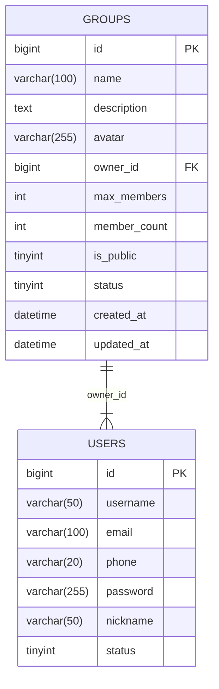
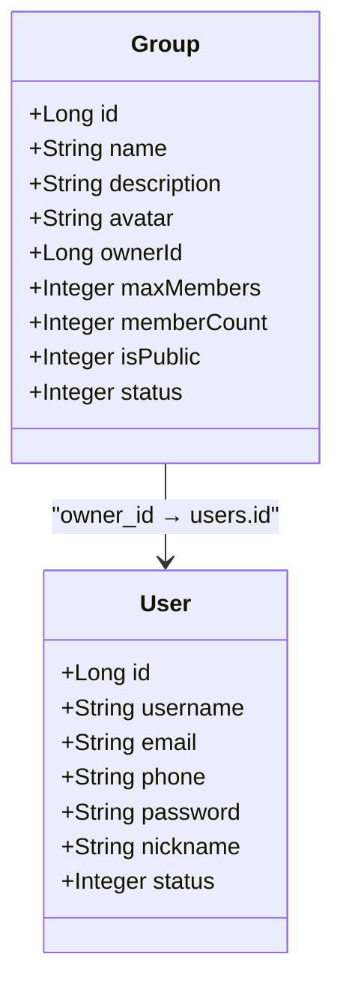
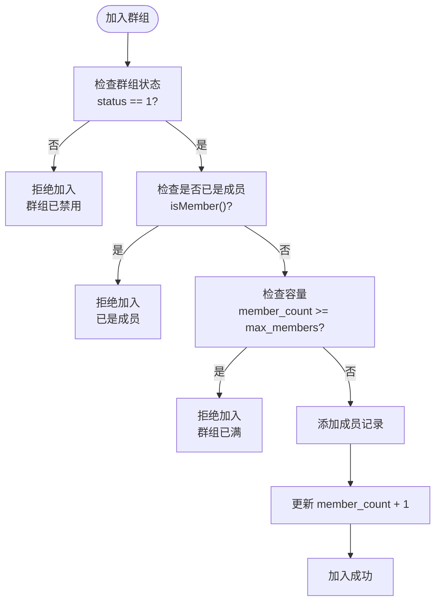
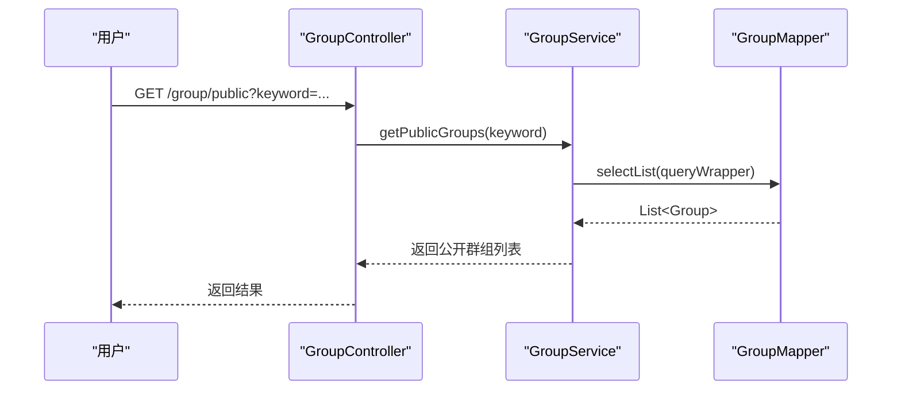
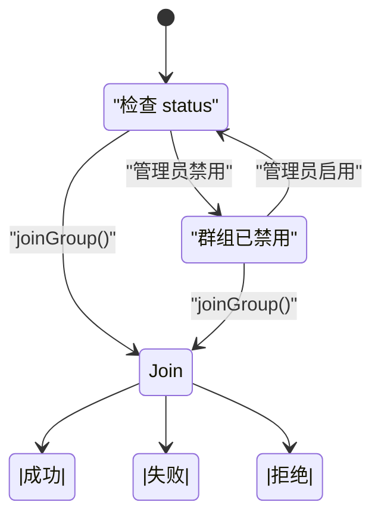
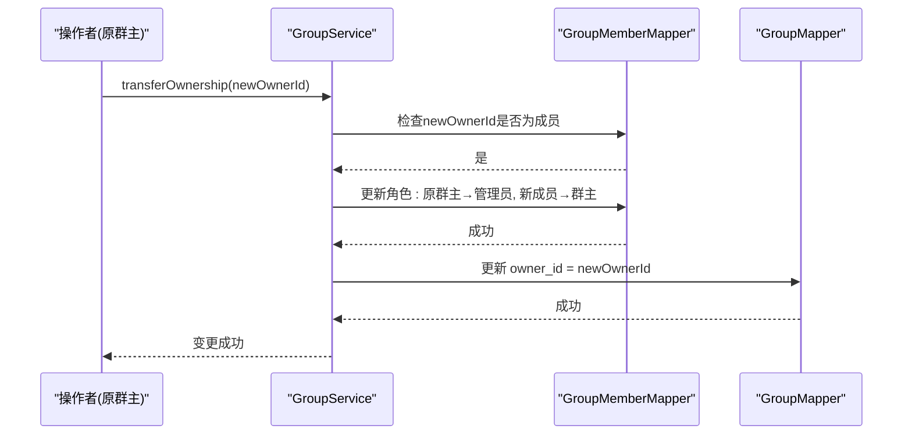

# 群组表设计

<cite>
**本文档引用的文件**  
- [schema.sql](file://src/main/resources/schema.sql#L30-L60)
- [Group.java](file://src/main/java/com/example/nettyim/entity/Group.java#L1-L135)
- [GroupServiceImpl.java](file://src/main/java/com/example/nettyim/service/impl/GroupServiceImpl.java#L1-L397)
- [GroupMapper.java](file://src/main/java/com/example/nettyim/mapper/GroupMapper.java#L1-L12)
- [GroupController.java](file://src/main/java/com/example/nettyim/controller/GroupController.java#L1-L174)
</cite>

## 目录
1. [引言](#引言)
2. [群组表结构设计](#群组表结构设计)
3. [外键关联机制](#外键关联机制)
4. [成员容量控制机制](#成员容量控制机制)
5. [公开性与群组发现](#公开性与群组发现)
6. [状态字段与禁用处理](#状态字段与禁用处理)
7. [MyBatis-Plus字段映射](#mybatis-plus字段映射)
8. [核心功能数据操作](#核心功能数据操作)
9. [全文索引优化建议](#全文索引优化建议)
10. [群主变更与数据一致性](#群主变更与数据一致性)

## 引言
本文件全面文档化即时通讯系统中`groups`表的设计细节与实现逻辑。通过分析数据库结构、实体类映射、服务层实现及控制器接口，深入阐述群组功能的核心机制，包括成员管理、权限控制、状态流转及数据一致性保障。文档旨在为开发人员提供清晰的技术参考，确保群组功能的正确使用与扩展。

## 群组表结构设计

群组表（`groups`）是系统中管理群组信息的核心数据表，其设计遵循高可用性、易扩展性和数据一致性的原则。表结构包含群组的基本信息、管理属性、状态标识及时间戳。



**图示来源**  
- [schema.sql](file://src/main/resources/schema.sql#L30-L60)

**本节来源**  
- [schema.sql](file://src/main/resources/schema.sql#L30-L60)

## 外键关联机制

`owner_id`字段作为外键，直接关联至`users`表的`id`字段，建立了群组与用户的强引用关系。该设计确保了群组必须有且仅有一个有效的群主，且群主必须是系统中的注册用户。



**图示来源**  
- [schema.sql](file://src/main/resources/schema.sql#L30-L60)
- [Group.java](file://src/main/java/com/example/nettyim/entity/Group.java#L1-L135)

**本节来源**  
- [schema.sql](file://src/main/resources/schema.sql#L30-L60)
- [Group.java](file://src/main/java/com/example/nettyim/entity/Group.java#L1-L135)

## 成员容量控制机制

群组的成员容量由`max_members`（最大成员数）和`member_count`（当前成员数）两个字段协同控制。`max_members`定义了群组的理论容量上限，而`member_count`则实时反映当前成员数量。



**图示来源**  
- [GroupServiceImpl.java](file://src/main/java/com/example/nettyim/service/impl/GroupServiceImpl.java#L70-L85)

**本节来源**  
- [schema.sql](file://src/main/resources/schema.sql#L30-L60)
- [GroupServiceImpl.java](file://src/main/java/com/example/nettyim/service/impl/GroupServiceImpl.java#L70-L85)

## 公开性与群组发现

`is_public`标志位（0-私有，1-公开）决定了群组的可发现性。公开群组可以被用户通过搜索等方式发现并申请加入，而私有群组则只能通过邀请加入。



**图示来源**  
- [schema.sql](file://src/main/resources/schema.sql#L30-L60)
- [GroupController.java](file://src/main/java/com/example/nettyim/controller/GroupController.java#L1-L174)

**本节来源**  
- [schema.sql](file://src/main/resources/schema.sql#L30-L60)
- [GroupController.java](file://src/main/java/com/example/nettyim/controller/GroupController.java#L1-L174)

## 状态字段与禁用处理

`status`字段（0-禁用，1-启用）用于控制群组的生命周期。当群组被禁用时，所有加入、邀请、消息发送等操作均会被拒绝。



**图示来源**  
- [schema.sql](file://src/main/resources/schema.sql#L30-L60)
- [GroupServiceImpl.java](file://src/main/java/com/example/nettyim/service/impl/GroupServiceImpl.java#L70-L75)

**本节来源**  
- [schema.sql](file://src/main/resources/schema.sql#L30-L60)
- [GroupServiceImpl.java](file://src/main/java/com/example/nettyim/service/impl/GroupServiceImpl.java#L70-L75)

## MyBatis-Plus字段映射

`Group`实体类通过MyBatis-Plus注解精确映射数据库字段，确保了ORM层的正确性。

```mermaid
classDiagram
class Group {
+@TableId(type = IdType.AUTO)
+Long id
+String name
+String description
+String avatar
+Long ownerId
+Integer maxMembers
+Integer memberCount
+Integer isPublic
+Integer status
}
note right of Group
@Data : 自动生成Getter/Setter
@EqualsAndHashCode : 生成equals/hashCode
@TableName("groups") : 指定表名
@TableId : 主键注解
end note
```

**图示来源**  
- [Group.java](file://src/main/java/com/example/nettyim/entity/Group.java#L1-L135)

**本节来源**  
- [Group.java](file://src/main/java/com/example/nettyim/entity/Group.java#L1-L135)

## 核心功能数据操作

### 创建群组
```java
// [createGroup](file://src/main/java/com/example/nettyim/service/impl/GroupServiceImpl.java#L30-L60)
```

### 查询公开群组
```java
// [getPublicGroups](file://src/main/java/com/example/nettyim/service/impl/GroupServiceImpl.java#L200-L220)
```

### 更新群组信息
```java
// [updateGroup](file://src/main/java/com/example/nettyim/service/impl/GroupServiceImpl.java#L250-L270)
```

**本节来源**  
- [GroupServiceImpl.java](file://src/main/java/com/example/nettyim/service/impl/GroupServiceImpl.java#L30-L270)
- [GroupController.java](file://src/main/java/com/example/nettyim/controller/GroupController.java#L30-L60)

## 全文索引优化建议

当前`description`字段为TEXT类型，但未建立全文索引。为提升群组搜索体验，建议在`name`和`description`字段上建立全文索引：

```sql
-- 建议的优化SQL
ALTER TABLE `groups` ADD FULLTEXT KEY `ft_name_description` (`name`, `description`);
-- 使用示例
SELECT * FROM `groups` WHERE MATCH(name, description) AGAINST('搜索关键词' IN NATURAL LANGUAGE MODE);
```

**本节来源**  
- [schema.sql](file://src/main/resources/schema.sql#L30-L60)

## 群主变更与数据一致性

群主变更涉及`owner_id`字段更新和`group_members`表中角色变更。为保证数据一致性，应使用事务处理：



**图示来源**  
- [GroupServiceImpl.java](file://src/main/java/com/example/nettyim/service/impl/GroupServiceImpl.java#L300-L330)

**本节来源**  
- [GroupServiceImpl.java](file://src/main/java/com/example/nettyim/service/impl/GroupServiceImpl.java#L300-L330)