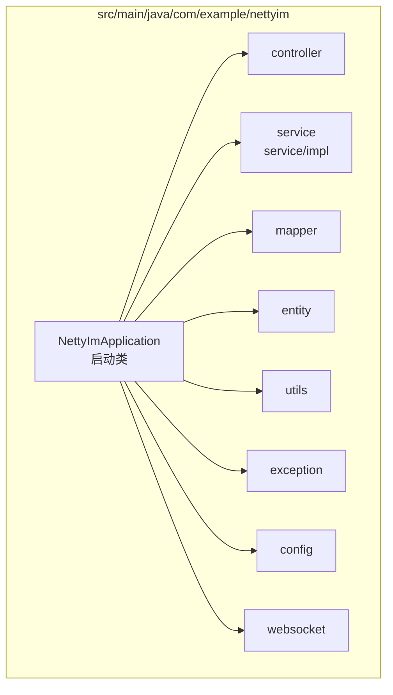
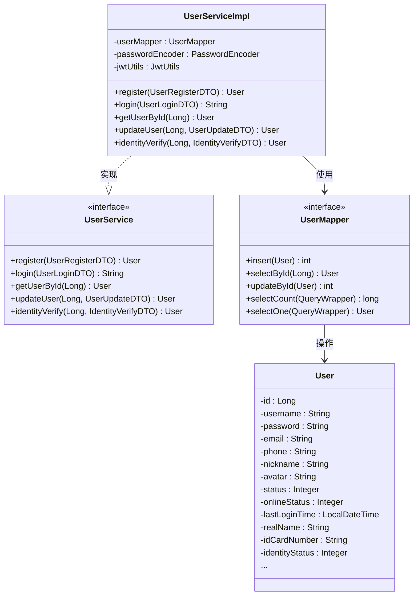
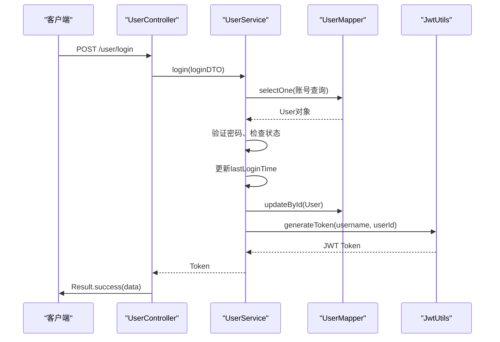

# 代码结构

<cite>
**本文档引用的文件**  
- [NettyImApplication.java](file://src/main/java/com/example/nettyim/NettyImApplication.java)
- [UserController.java](file://src/main/java/com/example/nettyim/controller/UserController.java)
- [UserService.java](file://src/main/java/com/example/nettyim/service/UserService.java)
- [UserServiceImpl.java](file://src/main/java/com/example/nettyim/service/impl/UserServiceImpl.java)
- [UserMapper.java](file://src/main/java/com/example/nettyim/mapper/UserMapper.java)
- [User.java](file://src/main/java/com/example/nettyim/entity/User.java)
- [JwtUtils.java](file://src/main/java/com/example/nettyim/utils/JwtUtils.java)
- [GlobalExceptionHandler.java](file://src/main/java/com/example/nettyim/exception/GlobalExceptionHandler.java)
- [Result.java](file://src/main/java/com/example/nettyim/dto/Result.java)
</cite>

## 目录
1. [简介](#简介)
2. [项目结构概览](#项目结构概览)
3. [MVC分层架构解析](#mvc分层架构解析)
4. [典型调用链分析](#典型调用链分析)
5. [工具类与异常处理](#工具类与异常处理)
6. [代码可维护性与团队协作优势](#代码可维护性与团队协作优势)
7. [关键代码入口点](#关键代码入口点)

## 简介
本项目 `netty-im-sample` 是一个基于Netty的即时通讯系统示例，采用标准的MVC（Model-View-Controller）架构模式进行分层设计。尽管项目主要为后端服务，但其清晰的代码组织结构体现了典型的MVC思想：`controller` 层负责暴露HTTP API接口，`service` 层实现核心业务逻辑，`mapper` 层定义数据访问接口，`entity` 层封装数据库实体。本文档将深入解析各层职责、协作机制及关键组件，展示其如何促进代码的可维护性和团队协作。

## 项目结构概览
项目遵循标准的Maven目录结构，核心Java代码位于 `src/main/java/com/example/nettyim` 目录下，主要包含以下包：
- `controller`：REST控制器，处理HTTP请求。
- `service` 和 `service/impl`：服务接口与实现，承载业务逻辑。
- `mapper`：MyBatis-Plus数据访问接口。
- `entity`：与数据库表映射的实体类。
- `dto`：数据传输对象，用于API输入输出。
- `utils`：通用工具类。
- `exception`：全局异常处理。
- `config`：各类配置类。
- `websocket`：Socket.IO相关配置和事件处理。



**图示来源**
- [NettyImApplication.java](file://src/main/java/com/example/nettyim/NettyImApplication.java)
- 项目结构信息

## MVC分层架构解析

### 控制器层 (Controller)
`controller` 包中的类是系统的入口，负责接收HTTP请求、校验参数、调用服务层并返回标准化的响应结果。所有控制器均使用 `@RestController` 注解，表明其返回的是JSON数据。

以 `UserController` 为例，它通过 `@RequestMapping("/user")` 定义了用户相关的API端点，如 `/register`、`/login`、`/update` 等。每个方法都使用 `@PostMapping`、`@GetMapping` 等注解映射具体的HTTP方法和路径。它依赖于 `UserService` 接口，通过构造函数注入，实现了控制层与业务逻辑的解耦。

**本节来源**
- [UserController.java](file://src/main/java/com/example/nettyim/controller/UserController.java)

### 服务层 (Service)
`service` 包定义了业务逻辑的接口，而 `service/impl` 包则提供了具体的实现。这种接口与实现分离的设计，使得代码更加灵活，易于进行单元测试和依赖注入。

`UserService` 接口声明了用户注册、登录、信息更新等核心操作。`UserServiceImpl` 类实现了该接口，并使用 `@Service` 和 `@Transactional` 注解，确保业务操作的事务性。服务层是业务逻辑的核心，它协调数据访问层（Mapper）和工具类（如 `JwtUtils`）来完成复杂的业务流程。

**本节来源**
- [UserService.java](file://src/main/java/com/example/nettyim/service/UserService.java)
- [UserServiceImpl.java](file://src/main/java/com/example/nettyim/service/impl/UserServiceImpl.java)

### 数据访问层 (Mapper)
`mapper` 包中的接口继承自MyBatis-Plus的 `BaseMapper<T>`，从而自动获得对实体类 `T` 的CRUD（增删改查）操作能力。`UserMapper` 接口仅需一个空的接口定义，即可使用 `insert`、`selectById`、`updateById` 等方法。

`UserServiceImpl` 通过依赖注入使用 `UserMapper` 实例，直接与数据库进行交互。这种基于接口的编程方式，使得数据访问逻辑与业务逻辑分离，提高了代码的可维护性。



**图示来源**
- [UserService.java](file://src/main/java/com/example/nettyim/service/UserService.java)
- [UserServiceImpl.java](file://src/main/java/com/example/nettyim/service/impl/UserServiceImpl.java)
- [UserMapper.java](file://src/main/java/com/example/nettyim/mapper/UserMapper.java)
- [User.java](file://src/main/java/com/example/nettyim/entity/User.java)

### 实体层 (Entity)
`entity` 包包含与数据库表直接映射的Java类。`User` 类使用Lombok的 `@Data` 注解自动生成getter、setter、toString等方法，并使用MyBatis-Plus的 `@TableName("users")` 和 `@TableId` 注解指定表名和主键。

实体类是数据在内存中的表现形式，贯穿于整个调用链，从Controller接收参数，到Service处理，再到Mapper持久化。

**本节来源**
- [User.java](file://src/main/java/com/example/nettyim/entity/User.java)

## 典型调用链分析
以用户登录为例，展示MVC各层间的协作流程：

1.  **Controller层**：`UserController.login()` 方法接收到 `/user/login` 的POST请求，参数 `UserLoginDTO` 经过校验后，调用 `userService.login()`。
2.  **Service层**：`UserServiceImpl.login()` 方法被调用。它首先通过 `userMapper.selectOne()` 根据账号查询用户，然后使用 `PasswordEncoder` 验证密码，检查用户状态，更新最后登录时间，并调用 `jwtUtils.generateToken()` 生成JWT令牌。
3.  **Mapper层**：`UserMapper` 执行SQL查询数据库，返回 `User` 实体。
4.  **返回**：`UserServiceImpl` 将生成的token和用户信息返回给 `UserController`，后者通过 `Result.success()` 包装成统一的响应格式返回给客户端。



**图示来源**
- [UserController.java](file://src/main/java/com/example/nettyim/controller/UserController.java#L45-L58)
- [UserServiceImpl.java](file://src/main/java/com/example/nettyim/service/impl/UserServiceImpl.java#L78-L110)
- [UserMapper.java](file://src/main/java/com/example/nettyim/mapper/UserMapper.java)
- [JwtUtils.java](file://src/main/java/com/example/nettyim/utils/JwtUtils.java#L28-L38)

## 工具类与异常处理

### 工具类 (Utils)
`utils` 包中的 `JwtUtils` 是一个典型的工具类，使用 `@Component` 注解使其成为Spring管理的Bean。它封装了JWT令牌的生成、解析、验证等操作，通过 `@Value` 注解注入密钥和过期时间。这种设计使得JWT功能可以在任何需要的地方通过依赖注入使用，避免了代码重复。

**本节来源**
- [JwtUtils.java](file://src/main/java/com/example/nettyim/utils/JwtUtils.java)

### 全局异常处理 (Exception)
`exception` 包中的 `GlobalExceptionHandler` 使用 `@RestControllerAdvice` 注解，实现了全局的异常捕获和处理。它能够捕获 `BusinessException`、`MethodArgumentNotValidException`（参数校验异常）、`BadCredentialsException`（认证异常）等，并统一返回格式化的错误响应（`Result.error()`），保证了API返回结果的一致性，极大地方便了前端的错误处理。

**本节来源**
- [GlobalExceptionHandler.java](file://src/main/java/com/example/nettyim/exception/GlobalExceptionHandler.java)
- [Result.java](file://src/main/java/com/example/nettyim/dto/Result.java)

## 代码可维护性与团队协作优势
本项目的代码结构清晰地遵循了MVC模式，带来了显著的可维护性和团队协作优势：
- **职责分离**：每一层都有明确的职责，降低了代码的耦合度。开发者可以专注于某一层的开发，而无需了解其他层的细节。
- **易于测试**：服务层和工具类可以独立于Web容器进行单元测试。Mock `Mapper` 接口即可测试 `Service` 的业务逻辑。
- **便于扩展**：新增功能时，只需在对应的层添加代码。例如，增加一个“忘记密码”功能，只需在 `UserService` 中添加方法，在 `UserController` 中添加API，在 `UserMapper` 中可能需要添加查询方法。
- **团队协作**：不同开发者可以并行工作在不同的层或不同的模块上，减少了代码冲突的可能性。

## 关键代码入口点
`NettyImApplication` 是整个应用的启动类。它使用 `@SpringBootApplication` 注解启动Spring Boot应用，并通过 `@MapperScan("com.example.nettyim.mapper")` 指定MyBatis-Plus Mapper接口的位置，确保所有Mapper能被正确扫描和注入。

```java
@SpringBootApplication(exclude = {SecurityAutoConfiguration.class, RedisAutoConfiguration.class})
@MapperScan("com.example.nettyim.mapper")
public class NettyImApplication {
    public static void main(String[] args) {
        SpringApplication.run(NettyImApplication.class, args);
    }
}
```

**本节来源**
- [NettyImApplication.java](file://src/main/java/com/example/nettyim/NettyImApplication.java)