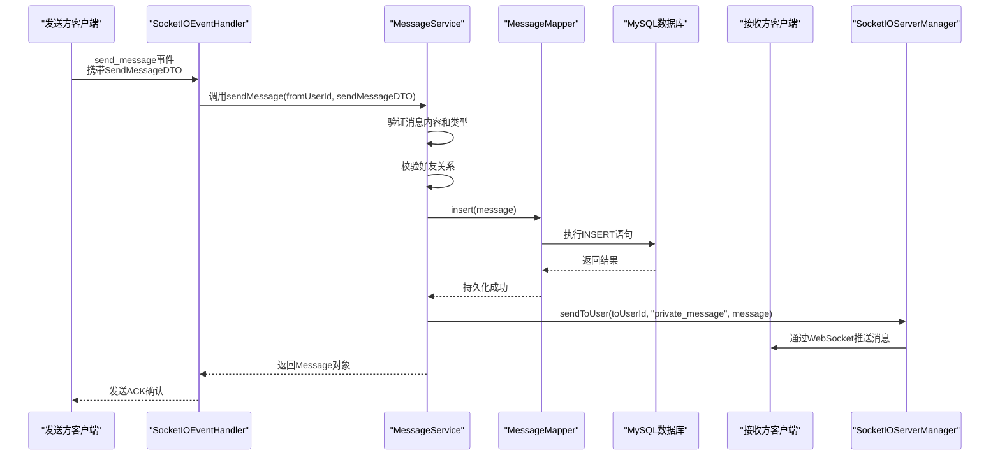

# 数据流

<cite>
**本文档引用的文件**
- [SocketIOEventHandler.java](file://src/main/java/com/example/nettyim/websocket/SocketIOEventHandler.java)
- [MessageServiceImpl.java](file://src/main/java/com/example/nettyim/service/impl/MessageServiceImpl.java)
- [MessageMapper.java](file://src/main/java/com/example/nettyim/mapper/MessageMapper.java)
- [schema.sql](file://src/main/resources/schema.sql)
- [Message.java](file://src/main/java/com/example/nettyim/entity/Message.java)
- [SendMessageDTO.java](file://src/main/java/com/example/nettyim/dto/SendMessageDTO.java)
- [SocketIOServerManager.java](file://src/main/java/com/example/nettyim/websocket/SocketIOServerManager.java)
</cite>

## 目录
1. [引言](#引言)
2. [核心数据流分析](#核心数据流分析)
3. [私聊消息发送序列图](#私聊消息发送序列图)
4. [数据持久化与表结构](#数据持久化与表结构)
5. [实时消息推送机制](#实时消息推送机制)
6. [数据一致性与异常处理](#数据一致性与异常处理)
7. [结论](#结论)

## 引言
本文档详细追踪了`netty-im-sample`项目中私聊消息发送操作的完整数据流转路径。从客户端通过WebSocket触发`send_message`事件开始，到消息通过SocketIO事件处理器、业务服务层、数据访问层最终持久化至MySQL数据库，并通过Socket.IO会话实时推送给接收方客户端的全过程。文档旨在清晰描绘这一关键操作的数据闭环，包括事件触发、业务逻辑执行、数据持久化和实时推送等环节，并讨论数据一致性保障和异常情况下的处理机制。

## 核心数据流分析
私聊消息的发送流程是一个典型的事件驱动、分层处理的数据流转过程，涉及多个核心组件的协同工作。

1.  **事件触发**：客户端通过WebSocket连接，向服务器端发送一个名为`send_message`的事件，并携带`SendMessageDTO`格式的消息数据。
2.  **事件处理**：`SocketIOEventHandler`作为WebSocket事件处理器，监听到`send_message`事件后，会调用其`onSendMessage`方法进行处理。该方法从客户端的握手信息中提取发送者`userId`，并构建`SendMessageDTO`对象。
3.  **业务逻辑执行**：事件处理器调用`MessageService`的`sendMessage`方法，将发送者ID和消息DTO作为参数传入。`MessageService`负责核心业务逻辑，包括：
    -   **参数验证**：检查消息类型和内容是否为空。
    -   **消息类型判断**：确保消息是私聊（`toUserId`不为空）或群聊（`groupId`不为空），不能同时指定。
    -   **权限校验**：对于私聊，调用`FriendshipService`检查发送者与接收者是否为好友关系。
4.  **数据持久化**：业务逻辑校验通过后，`MessageService`创建一个`Message`实体对象，填充所有字段（包括生成唯一的`messageId`），然后调用`MessageMapper`的`insert`方法将消息数据持久化到MySQL数据库的`messages`表中。
5.  **实时推送**：数据持久化成功后，`MessageService`通过`SocketIOServerManager`向接收方客户端推送消息。在私聊场景下，调用`sendToUser`方法，将消息以`private_message`事件的形式发送给指定的接收者。

**本节来源**
- [SocketIOEventHandler.java](file://src/main/java/com/example/nettyim/websocket/SocketIOEventHandler.java#L79-L115)
- [MessageServiceImpl.java](file://src/main/java/com/example/nettyim/service/impl/MessageServiceImpl.java#L41-L104)

## 私聊消息发送序列图
以下序列图直观地展示了从客户端发送消息到接收方收到消息的完整数据流。

**图示来源**
- [SocketIOEventHandler.java](file://src/main/java/com/example/nettyim/websocket/SocketIOEventHandler.java#L79-L115)
- [MessageServiceImpl.java](file://src/main/java/com/example/nettyim/service/impl/MessageServiceImpl.java#L41-L104)
- [MessageMapper.java](file://src/main/java/com/example/nettyim/mapper/MessageMapper.java#L9-L11)
- [SocketIOServerManager.java](file://src/main/java/com/example/nettyim/websocket/SocketIOServerManager.java#L150-L160)

## 数据持久化与表结构
消息数据的持久化是通过MyBatis-Plus框架完成的。`MessageMapper`接口继承自`BaseMapper<Message>`，自动获得了对`Message`实体进行CRUD操作的能力。

`Message`实体类通过`@TableName("messages")`注解映射到数据库中的`messages`表。该表的结构在`schema.sql`文件中定义，关键字段包括：
- `id`: 消息的自增主键。
- `message_id`: 消息的全局唯一标识符（UUID），用于幂等性处理。
- `from_user_id`: 发送者用户ID。
- `to_user_id`: 接收者用户ID（私聊时使用）。
- `message_type`: 消息类型（1-文本，2-图片等）。
- `content`: 消息内容。
- `is_read`: 阅读状态（0-未读，1-已读）。
- `is_deleted`: 删除状态（0-正常，1-已删除）。

当`MessageService`调用`messageMapper.insert(message)`时，MyBatis-Plus会自动生成并执行相应的SQL `INSERT`语句，将`Message`对象的所有非空字段写入`messages`表。

**本节来源**
- [MessageMapper.java](file://src/main/java/com/example/nettyim/mapper/MessageMapper.java#L9-L11)
- [Message.java](file://src/main/java/com/example/nettyim/entity/Message.java#L1-L187)
- [schema.sql](file://src/main/resources/schema.sql#L150-L200)

## 实时消息推送机制
消息的实时推送依赖于`SocketIOServerManager`组件。该组件维护了一个`ConcurrentHashMap<Long, SocketIOClient>`，用于存储用户ID与`SocketIOClient`（客户端连接）之间的映射关系。

当用户连接到服务器时，`SocketIOServerManager`会监听`connect`事件，从连接参数中获取`userId`，并将其与`SocketIOClient`实例关联起来。当用户断开连接时，会清理相应的映射。

在`MessageService`成功将消息存入数据库后，会调用`socketIOServerManager.sendToUser(toUserId, "private_message", message)`。该方法会：
1.  在本地的`userClients`映射中查找接收者的`SocketIOClient`。
2.  如果找到且连接有效，则直接通过该客户端连接发送`private_message`事件和消息数据。
3.  如果项目启用了集群模式，且本地未找到连接，则会通过集群消息路由器将消息广播到其他节点，确保消息能送达。

**本节来源**
- [SocketIOServerManager.java](file://src/main/java/com/example/nettyim/websocket/SocketIOServerManager.java#L80-L110)
- [SocketIOServerManager.java](file://src/main/java/com/example/nettyim/websocket/SocketIOServerManager.java#L150-L160)
- [MessageServiceImpl.java](file://src/main/java/com/example/nettyim/service/impl/MessageServiceImpl.java#L95-L98)

## 数据一致性与异常处理
该系统通过以下机制保障数据一致性并处理异常情况：

1.  **事务管理**：`MessageServiceImpl`类使用了`@Transactional`注解。这意味着`sendMessage`方法中的所有数据库操作（如`insert`）都在一个数据库事务中执行。如果在持久化过程中发生任何异常（例如数据库连接中断），整个事务将被回滚，确保不会出现消息已发送但未存入数据库的不一致状态。
2.  **异常捕获与回滚**：在`SocketIOEventHandler`的`onSendMessage`方法中，整个处理流程被`try-catch`块包裹。一旦在业务处理或数据持久化阶段抛出异常，系统会记录错误日志，并通过`ackRequest`向客户端发送一个包含错误信息的ACK响应，告知消息发送失败。由于事务的存在，失败的操作不会对数据库产生任何影响。
3.  **幂等性设计**：虽然当前代码未直接体现，但`message_id`字段的唯一性约束（`UNIQUE KEY uk_message_id`）为实现消息发送的幂等性提供了基础。客户端可以生成唯一的`messageId`，即使因网络问题导致重试，数据库的唯一性约束也能防止消息被重复插入。
4.  **连接状态检查**：在推送消息前，`SocketIOServerManager`会检查`SocketIOClient`的`isChannelOpen()`状态，避免向已断开的连接发送数据，防止潜在的异常。

**本节来源**
- [MessageServiceImpl.java](file://src/main/java/com/example/nettyim/service/impl/MessageServiceImpl.java#L30-L31)
- [SocketIOEventHandler.java](file://src/main/java/com/example/nettyim/websocket/SocketIOEventHandler.java#L88-L115)
- [schema.sql](file://src/main/resources/schema.sql#L150-L200)

## 结论
`netty-im-sample`项目中私聊消息的发送流程设计清晰，实现了从客户端到服务端再到数据库的完整数据闭环。系统通过分层架构（WebSocket处理器、Service、Mapper）实现了关注点分离，利用MyBatis-Plus简化了数据持久化操作，并通过`SocketIOServerManager`实现了高效的实时消息推送。通过Spring的声明式事务管理，系统在数据一致性方面得到了有效保障，能够正确处理各种异常情况，确保了消息系统的可靠性和健壮性。