# 整体架构

<cite>
**本文档引用的文件**  
- [NettyImApplication.java](file://src/main/java/com/example/nettyim/NettyImApplication.java)
- [SocketIOConfig.java](file://src/main/java/com/example/nettyim/config/SocketIOConfig.java)
- [SocketIOServerManager.java](file://src/main/java/com/example/nettyim/websocket/SocketIOServerManager.java)
- [SocketIOEventHandler.java](file://src/main/java/com/example/nettyim/websocket/SocketIOEventHandler.java)
- [MessageController.java](file://src/main/java/com/example/nettyim/controller/MessageController.java)
- [MessageServiceImpl.java](file://src/main/java/com/example/nettyim/service/impl/MessageServiceImpl.java)
- [MessageMapper.java](file://src/main/java/com/example/nettyim/mapper/MessageMapper.java)
- [UserController.java](file://src/main/java/com/example/nettyim/controller/UserController.java)
- [GlobalExceptionHandler.java](file://src/main/java/com/example/nettyim/exception/GlobalExceptionHandler.java)
- [pom.xml](file://pom.xml)
</cite>

## 目录
1. [简介](#简介)
2. [项目结构](#项目结构)
3. [MVC分层架构](#mvc分层架构)
4. [实时通信核心流程](#实时通信核心流程)
5. [请求处理链路分析](#请求处理链路分析)
6. [系统上下文图](#系统上下文图)
7. [组件依赖图](#组件依赖图)
8. [高并发性能分析](#高并发性能分析)
9. [结论](#结论)

## 简介
本架构文档详细描述了`netty-im-sample`项目的整体设计，重点阐述基于Spring Boot的MVC分层架构与实时通信机制。系统采用标准的三层架构：Controller层处理HTTP请求，Service层封装业务逻辑，Mapper层与数据库交互。同时，通过WebSocket实现即时通讯功能，支持用户上下线、消息收发、群组聊天等核心场景。文档为初学者提供系统级上下文视图，为高级开发者揭示内部组件依赖关系，并分析系统在高并发场景下的表现特性。

## 项目结构

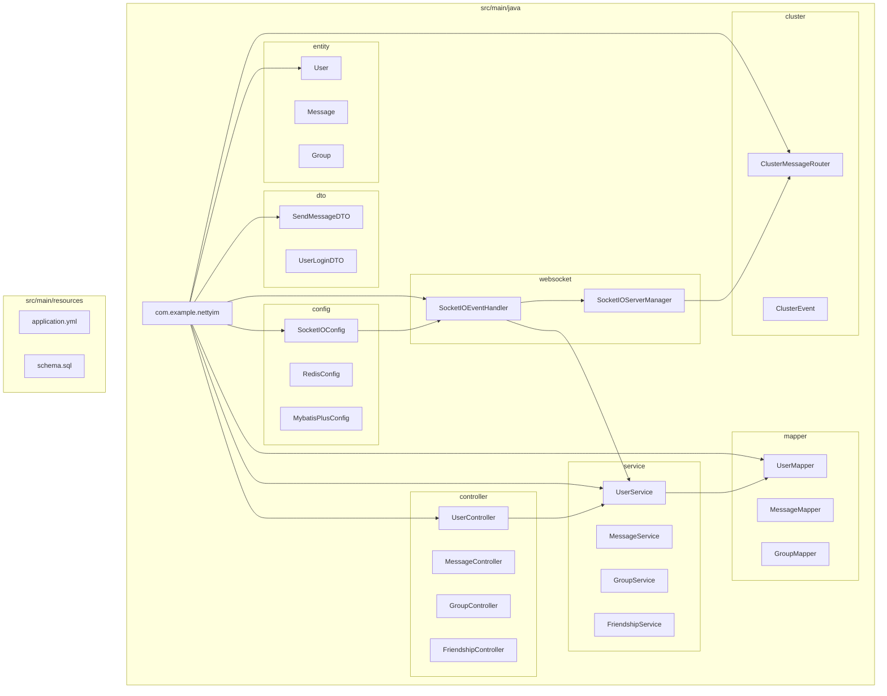

**图示来源**  
- [SocketIOConfig.java](file://src/main/java/com/example/nettyim/config/SocketIOConfig.java)
- [MessageController.java](file://src/main/java/com/example/nettyim/controller/MessageController.java)
- [MessageServiceImpl.java](file://src/main/java/com/example/nettyim/service/impl/MessageServiceImpl.java)
- [MessageMapper.java](file://src/main/java/com/example/nettyim/mapper/MessageMapper.java)
- [SocketIOServerManager.java](file://src/main/java/com/example/nettyim/websocket/SocketIOServerManager.java)

## MVC分层架构

### Controller层
Controller层负责接收HTTP请求并返回响应，是系统的入口点。各控制器按功能划分，如`UserController`处理用户注册登录，`MessageController`处理消息相关操作。

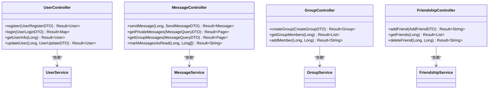

**图示来源**  
- [UserController.java](file://src/main/java/com/example/nettyim/controller/UserController.java)
- [MessageController.java](file://src/main/java/com/example/nettyim/controller/MessageController.java)

### Service层
Service层封装核心业务逻辑，实现具体的功能处理，如用户注册、消息发送、好友关系管理等。

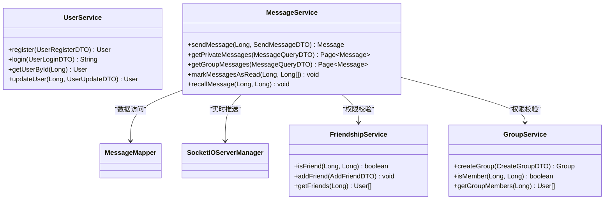

**图示来源**  
- [MessageServiceImpl.java](file://src/main/java/com/example/nettyim/service/impl/MessageServiceImpl.java)
- [UserService.java](file://src/main/java/com/example/nettyim/service/UserService.java)

### Mapper层
Mapper层基于MyBatis Plus实现，负责与MySQL数据库进行交互，执行CRUD操作。

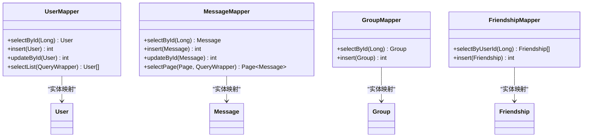

**图示来源**  
- [MessageMapper.java](file://src/main/java/com/example/nettyim/mapper/MessageMapper.java)
- [UserMapper.java](file://src/main/java/com/example/nettyim/mapper/UserMapper.java)

## 实时通信核心流程

### WebSocket初始化
系统通过`SocketIOConfig`配置并初始化Socket.IO服务器，支持WebSocket连接。

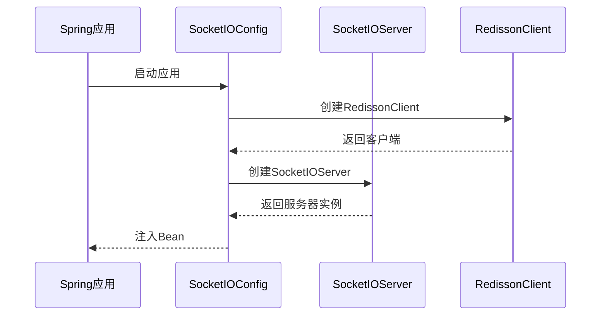

**图示来源**  
- [SocketIOConfig.java](file://src/main/java/com/example/nettyim/config/SocketIOConfig.java)

### 会话管理机制
`SocketIOServerManager`负责管理用户与客户端的映射关系，维护在线状态。

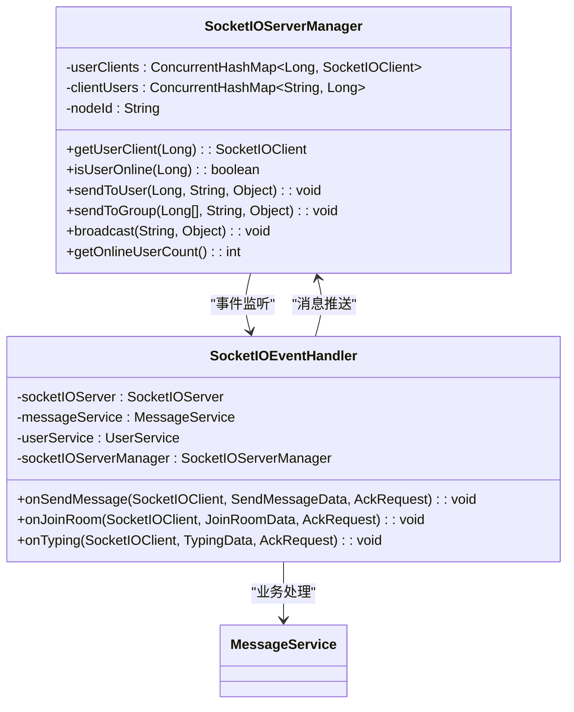

**图示来源**  
- [SocketIOServerManager.java](file://src/main/java/com/example/nettyim/websocket/SocketIOServerManager.java)
- [SocketIOEventHandler.java](file://src/main/java/com/example/nettyim/websocket/SocketIOEventHandler.java)

### 事件处理流程
`SocketIOEventHandler`监听并响应各类WebSocket事件，触发相应业务处理。

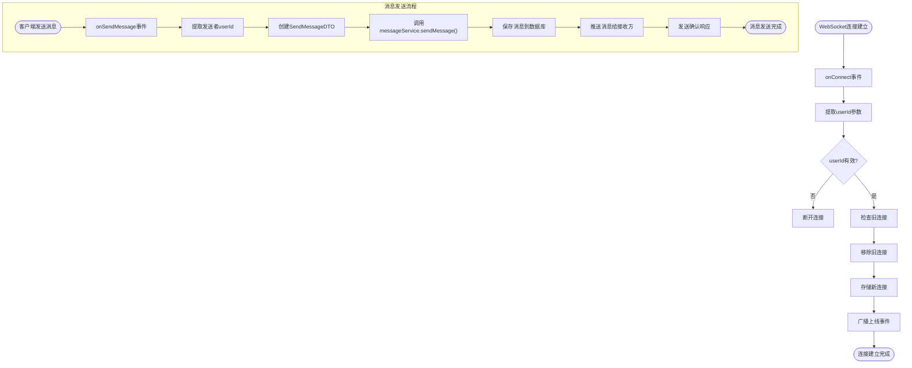

**图示来源**  
- [SocketIOEventHandler.java](file://src/main/java/com/example/nettyim/websocket/SocketIOEventHandler.java)
- [MessageServiceImpl.java](file://src/main/java/com/example/nettyim/service/impl/MessageServiceImpl.java)

## 请求处理链路分析

### HTTP请求链路
以发送消息为例，展示从HTTP请求到响应的完整链路。

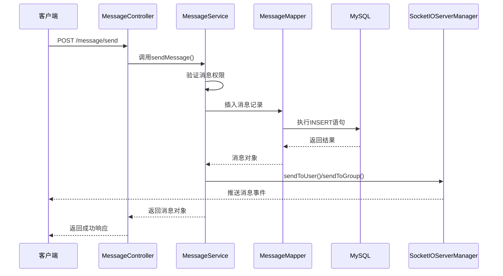

**图示来源**  
- [MessageController.java](file://src/main/java/com/example/nettyim/controller/MessageController.java)
- [MessageServiceImpl.java](file://src/main/java/com/example/nettyim/service/impl/MessageServiceImpl.java)

### WebSocket事件链路
展示WebSocket事件从接收到处理的完整流程。

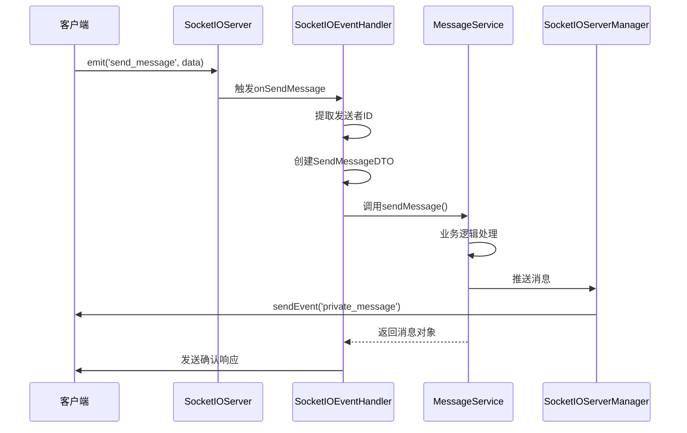

**图示来源**  
- [SocketIOEventHandler.java](file://src/main/java/com/example/nettyim/websocket/SocketIOEventHandler.java)
- [MessageServiceImpl.java](file://src/main/java/com/example/nettyim/service/impl/MessageServiceImpl.java)

## 系统上下文图

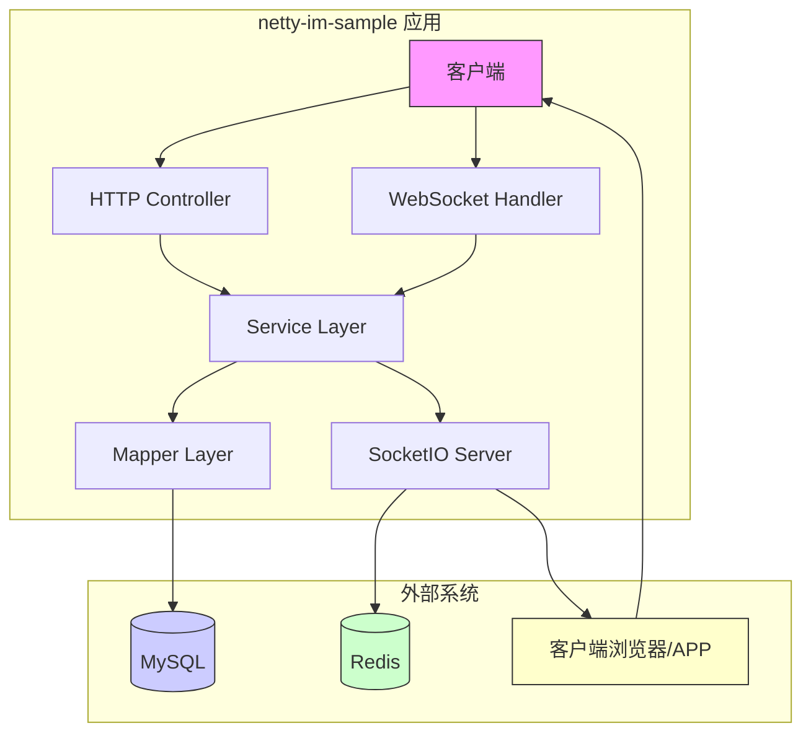

**图示来源**  
- [SocketIOConfig.java](file://src/main/java/com/example/nettyim/config/SocketIOConfig.java)
- [RedisConfig.java](file://src/main/java/com/example/nettyim/config/RedisConfig.java)
- [pom.xml](file://pom.xml)

## 组件依赖图

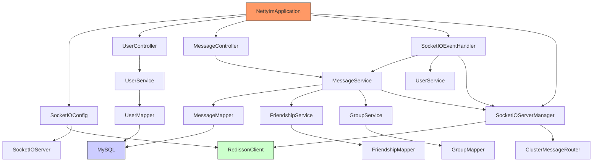

**图示来源**  
- [NettyImApplication.java](file://src/main/java/com/example/nettyim/NettyImApplication.java)
- [SocketIOConfig.java](file://src/main/java/com/example/nettyim/config/SocketIOConfig.java)
- [SocketIOServerManager.java](file://src/main/java/com/example/nettyim/websocket/SocketIOServerManager.java)

## 高并发性能分析

### 架构优势
1. **异步非阻塞I/O**：基于Netty的Socket.IO实现，支持高并发连接
2. **内存映射管理**：使用`ConcurrentHashMap`高效管理用户会话
3. **集群支持**：通过Redisson实现多节点集群部署
4. **分层解耦**：MVC架构清晰分离关注点，便于水平扩展

### 潜在瓶颈
1. **单点推送性能**：`sendToUser`在用户量大时可能成为性能瓶颈
2. **数据库压力**：消息频繁读写对MySQL造成较大压力
3. **内存占用**：大量在线用户时，会话映射表占用较多JVM内存
4. **序列化开销**：WebSocket消息的JSON序列化/反序列化消耗CPU资源

### 优化建议
1. **引入消息队列**：使用Kafka或RabbitMQ解耦消息处理流程
2. **多级缓存**：增加Redis缓存层，减少数据库访问
3. **分库分表**：对消息表进行水平拆分，提升数据库性能
4. **连接压缩**：启用WebSocket压缩，减少网络传输开销
5. **批量处理**：对消息确认、已读标记等操作进行批量处理

## 结论
`netty-im-sample`项目采用清晰的MVC分层架构与WebSocket实时通信机制，实现了完整的即时通讯功能。系统通过Spring Boot提供RESTful API，同时利用Socket.IO实现双向实时通信，支持私聊、群聊等核心场景。架构设计合理，具备良好的可扩展性，通过Redisson支持集群部署。在高并发场景下，系统主要瓶颈在于数据库访问与单点推送性能，建议通过引入消息队列、多级缓存等手段进一步优化性能。整体架构适合中等规模的即时通讯应用，为开发者提供了良好的学习和扩展基础。