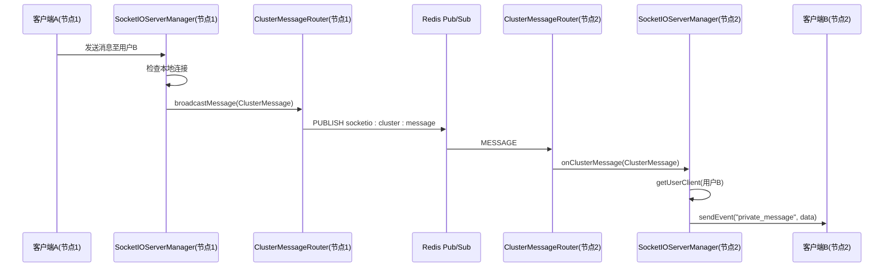
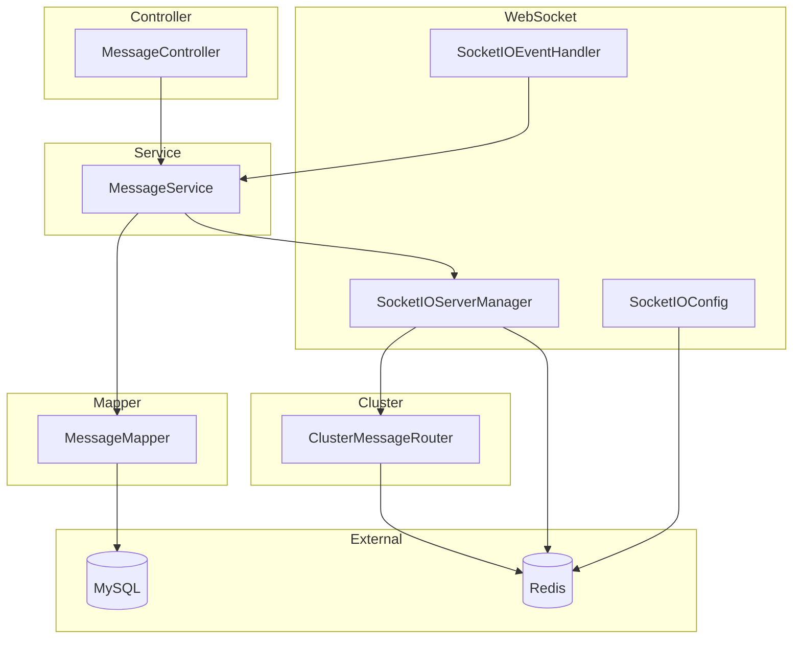

# 架构设计

<cite>
**本文档引用的文件**  
- [SocketIOConfig.java](file://src/main/java/com/example/nettyim/config/SocketIOConfig.java)
- [SocketIOServerManager.java](file://src/main/java/com/example/nettyim/websocket/SocketIOServerManager.java)
- [SocketIOEventHandler.java](file://src/main/java/com/example/nettyim/websocket/SocketIOEventHandler.java)
- [ClusterMessageRouter.java](file://src/main/java/com/example/nettyim/cluster/ClusterMessageRouter.java)
- [MessageController.java](file://src/main/java/com/example/nettyim/controller/MessageController.java)
- [MessageServiceImpl.java](file://src/main/java/com/example/nettyim/service/impl/MessageServiceImpl.java)
- [RedisConfig.java](file://src/main/java/com/example/nettyim/config/RedisConfig.java)
- [application-cluster.yml](file://src/main/resources/application-cluster.yml)
- [application.yml](file://src/main/resources/application.yml)
</cite>

## 目录
1. [引言](#引言)
2. [系统分层架构](#系统分层架构)
3. [实时通信架构](#实时通信架构)
4. [集群架构](#集群架构)
5. [系统上下文图](#系统上下文图)
6. [组件图](#组件图)
7. [架构优势与潜在瓶颈](#架构优势与潜在瓶颈)
8. [设计模式应用](#设计模式应用)
9. [结论](#结论)

## 引言
本架构设计文档旨在全面阐述基于Netty与Socket.IO的即时通讯系统（IM）的整体架构。系统采用典型的MVC分层模式，结合WebSocket实现实时通信，并通过Redis Pub/Sub机制支持多节点集群部署。文档将从宏观角度解析系统的分层结构、组件交互、集群消息路由机制，并通过图表展示系统全貌，最后讨论其架构优势、潜在瓶颈及设计模式的应用。

## 系统分层架构
系统遵循标准的MVC（Model-View-Controller）分层架构，各层职责清晰，耦合度低。

- **Controller层**：位于`controller`包下，如`MessageController.java`。该层是系统的入口，负责接收HTTP请求，进行参数校验，并将请求委派给对应的Service层处理。例如，`MessageController`接收发送消息、查询历史消息等RESTful API请求。
- **Service层**：位于`service`包下，核心业务逻辑在此层实现。`MessageServiceImpl.java`是其典型代表，它处理消息的发送、存储、权限校验、历史查询等核心业务。该层依赖于Mapper层进行数据持久化，并调用`SocketIOServerManager`进行实时消息推送。
- **Mapper层**：位于`mapper`包下，基于MyBatis-Plus框架，负责与MySQL数据库进行交互。`MessageMapper.java`等接口定义了对`Message`、`User`等实体的CRUD操作，实现了数据访问逻辑与业务逻辑的分离。

这种分层结构确保了代码的可维护性和可测试性，每一层只关注自身的职责。

**Section sources**
- [MessageController.java](file://src/main/java/com/example/nettyim/controller/MessageController.java)
- [MessageServiceImpl.java](file://src/main/java/com/example/nettyim/service/impl/MessageServiceImpl.java)
- [MessageMapper.java](file://src/main/java/com/example/nettyim/mapper/MessageMapper.java)

## 实时通信架构
系统的实时通信能力由Socket.IO技术栈驱动，其核心组件包括`SocketIOConfig`、`SocketIOServerManager`和`SocketIOEventHandler`。

- **SocketIOConfig**：该配置类`SocketIOConfig.java`负责初始化Socket.IO服务器。它通过`@Bean`注解创建`SocketIOServer`实例，并根据配置（如`socketio.host`、`socketio.port`）设置服务器参数。在集群模式下，它会配置Redis作为会话存储，确保不同节点间的会话状态同步。
- **SocketIOServerManager**：`SocketIOServerManager.java`是Socket.IO服务器的管理核心。它在`@PostConstruct`方法中启动服务器，并注册连接（Connect）和断开（Disconnect）监听器。该管理器维护了两个关键的`ConcurrentHashMap`：`userClients`（用户ID -> 客户端连接）和`clientUsers`（会话ID -> 用户ID），用于快速查找在线用户的连接。
- **SocketIOEventHandler**：`SocketIOEventHandler.java`类通过`@OnEvent`注解或`socketIOServer.addEventListener`方法注册了多个事件处理器，如`send_message`、`join_room`等。当客户端触发这些事件时，处理器会调用`MessageService`等业务服务处理逻辑，并通过`SocketIOServerManager`将结果实时推送给客户端。

整个流程为：客户端通过WebSocket连接并携带`userId`参数 -> `SocketIOServerManager`建立连接映射 -> 客户端触发事件 -> `SocketIOEventHandler`响应 -> 调用`Service`处理业务 -> 通过`SocketIOServerManager`推送结果。

**Section sources**
- [SocketIOConfig.java](file://src/main/java/com/example/nettyim/config/SocketIOConfig.java)
- [SocketIOServerManager.java](file://src/main/java/com/example/nettyim/websocket/SocketIOServerManager.java)
- [SocketIOEventHandler.java](file://src/main/java/com/example/nettyim/websocket/SocketIOEventHandler.java)

## 集群架构
为支持高并发和可扩展性，系统设计了基于Redis Pub/Sub的集群架构。当多个`SocketIOServerManager`实例部署在不同节点时，`ClusterMessageRouter.java`负责跨节点的消息路由。

1.  **初始化**：`ClusterMessageRouter`在`@PostConstruct`方法中，通过`RedisMessageListenerContainer`订阅两个Redis频道：`socketio:cluster:message`（用于消息）和`socketio:cluster:event`（用于事件）。
2.  **消息路由**：当节点A上的`SocketIOServerManager`需要向一个不在线于本节点的用户发送消息时，它会调用`sendToUser`方法。该方法检测到本地无连接后，会构造一个`ClusterMessage`对象，并调用`ClusterMessageRouter.broadcastMessage()`方法。
3.  **广播与接收**：`broadcastMessage()`方法将`ClusterMessage`序列化为JSON，并通过`redisTemplate.convertAndSend()`发布到`socketio:cluster:message`频道。
4.  **跨节点处理**：所有集群节点都订阅了该频道。当节点B接收到这条消息时，`handleClusterMessage()`方法被触发，它反序列化消息，并通知所有`ClusterMessageListener`（包括本节点的`SocketIOServerManager`）。
5.  **本地投递**：节点B的`SocketIOServerManager`的`onClusterMessage()`方法被调用，检查消息类型为`SEND_TO_USER`后，它会尝试通过本地的`userClients`映射找到目标用户的连接，并将消息通过WebSocket推送出去。

此机制确保了即使用户连接分布在不同节点，系统也能实现消息的准确投递。`application-cluster.yml`文件中的`socketio.cluster.enabled: true`配置用于启用此集群模式。



**Diagram sources**
- [ClusterMessageRouter.java](file://src/main/java/com/example/nettyim/cluster/ClusterMessageRouter.java)
- [SocketIOServerManager.java](file://src/main/java/com/example/nettyim/websocket/SocketIOServerManager.java)
- [application-cluster.yml](file://src/main/resources/application-cluster.yml)

**Section sources**
- [ClusterMessageRouter.java](file://src/main/java/com/example/nettyim/cluster/ClusterMessageRouter.java)
- [SocketIOServerManager.java](file://src/main/java/com/example/nettyim/websocket/SocketIOServerManager.java)
- [application-cluster.yml](file://src/main/resources/application-cluster.yml)

## 系统上下文图
系统上下文图展示了本系统与外部环境的交互关系。

```mermaid
graph TD
A[客户端 Web/App] < --> B[Netty IM 系统]
B < --> C[(MySQL)]
B < --> D[(Redis)]
B < --> E[其他微服务(可选)]
subgraph "Netty IM 系统"
B
end
style A fill:#f9f,stroke:#333
style C fill:#ccf,stroke:#333
style D fill:#cfc,stroke:#333
style E fill:#ffc,stroke:#333
```

**Diagram sources**
- [RedisConfig.java](file://src/main/java/com/example/nettyim/config/RedisConfig.java)
- [application.yml](file://src/main/resources/application.yml)

## 组件图
组件图详细展示了系统内部的主要组件及其依赖关系。



**Diagram sources**
- [MessageController.java](file://src/main/java/com/example/nettyim/controller/MessageController.java)
- [MessageServiceImpl.java](file://src/main/java/com/example/nettyim/service/impl/MessageServiceImpl.java)
- [MessageMapper.java](file://src/main/java/com/example/nettyim/mapper/MessageMapper.java)
- [SocketIOEventHandler.java](file://src/main/java/com/example/nettyim/websocket/SocketIOEventHandler.java)
- [SocketIOServerManager.java](file://src/main/java/com/example/nettyim/websocket/SocketIOServerManager.java)
- [SocketIOConfig.java](file://src/main/java/com/example/nettyim/config/SocketIOConfig.java)
- [ClusterMessageRouter.java](file://src/main/java/com/example/nettyim/cluster/ClusterMessageRouter.java)
- [RedisConfig.java](file://src/main/java/com/example/nettyim/config/RedisConfig.java)

## 架构优势与潜在瓶颈
### 架构优势
- **高并发**：基于Netty的NIO模型和Socket.IO的长连接，能够支撑大量用户的并发在线和实时通信。
- **可扩展性**：通过Redis Pub/Sub实现的集群架构，可以轻松地通过增加节点来横向扩展系统容量，应对用户增长。
- **职责分离**：MVC分层和组件化设计使得代码结构清晰，便于团队协作开发和维护。
- **实时性强**：WebSocket协议保证了消息的低延迟、双向实时推送。

### 潜在瓶颈
- **Redis单点故障**：Redis作为集群通信的核心枢纽，如果出现故障，将导致所有节点间通信中断，整个集群的实时消息功能将失效。虽然Redis支持主从复制和哨兵模式，但配置和维护复杂度增加。
- **消息堆积**：在高负载场景下，如果某个节点处理消息的速度跟不上发布速度，可能会导致Redis频道中的消息堆积，增加延迟，甚至耗尽内存。需要监控Redis的内存和队列长度。
- **网络延迟**：集群模式下，跨节点消息需要经过Redis中转，相比单节点部署，增加了网络IO开销和延迟。

## 设计模式应用
系统中巧妙地应用了多种设计模式：
- **观察者模式（Observer Pattern）**：这是系统实时通信的核心。`SocketIOEventHandler`注册事件监听器的行为，以及`ClusterMessageRouter`管理`ClusterMessageListener`列表并通知所有监听器的机制，都是观察者模式的典型应用。当事件（如`send_message`或集群消息）发生时，所有注册的监听器（观察者）都会收到通知并作出响应。
- **单例模式（Singleton Pattern）**：Spring框架管理的Bean（如`SocketIOServerManager`、`ClusterMessageRouter`）默认为单例，确保了全局配置和状态的统一。
- **工厂模式（Factory Pattern）**：`SocketIOConfig`类可以看作是一个工厂，它根据配置创建并配置`SocketIOServer`和`RedissonClient`实例。

## 结论
本系统架构设计合理，通过MVC分层实现了业务逻辑的清晰划分，利用Socket.IO和Netty提供了强大的实时通信能力，并通过基于Redis Pub/Sub的集群架构解决了单点瓶颈，具备良好的高并发处理能力和可扩展性。尽管存在Redis单点和消息堆积的潜在风险，但通过合理的运维监控和高可用部署方案可以有效规避。整体架构体现了现代分布式实时应用的设计精髓。