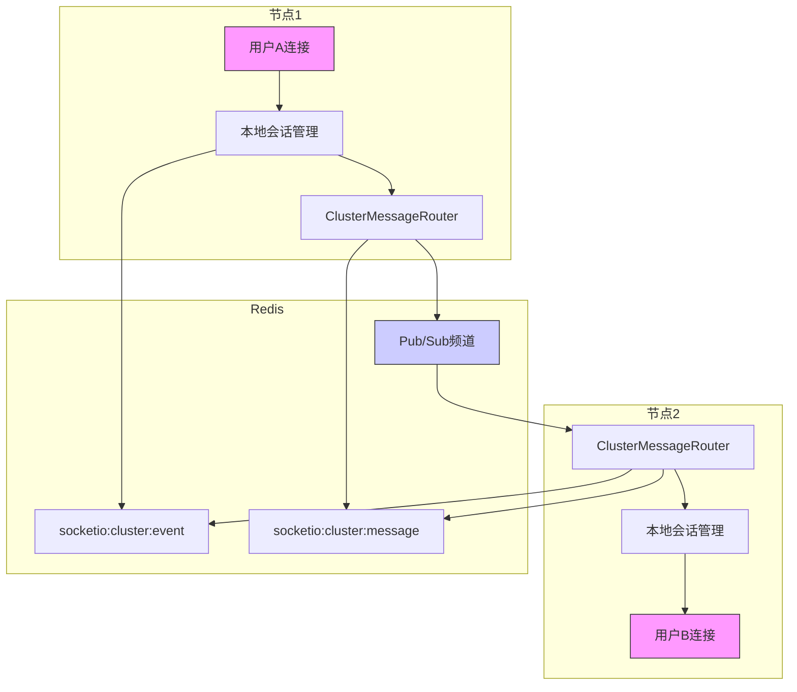
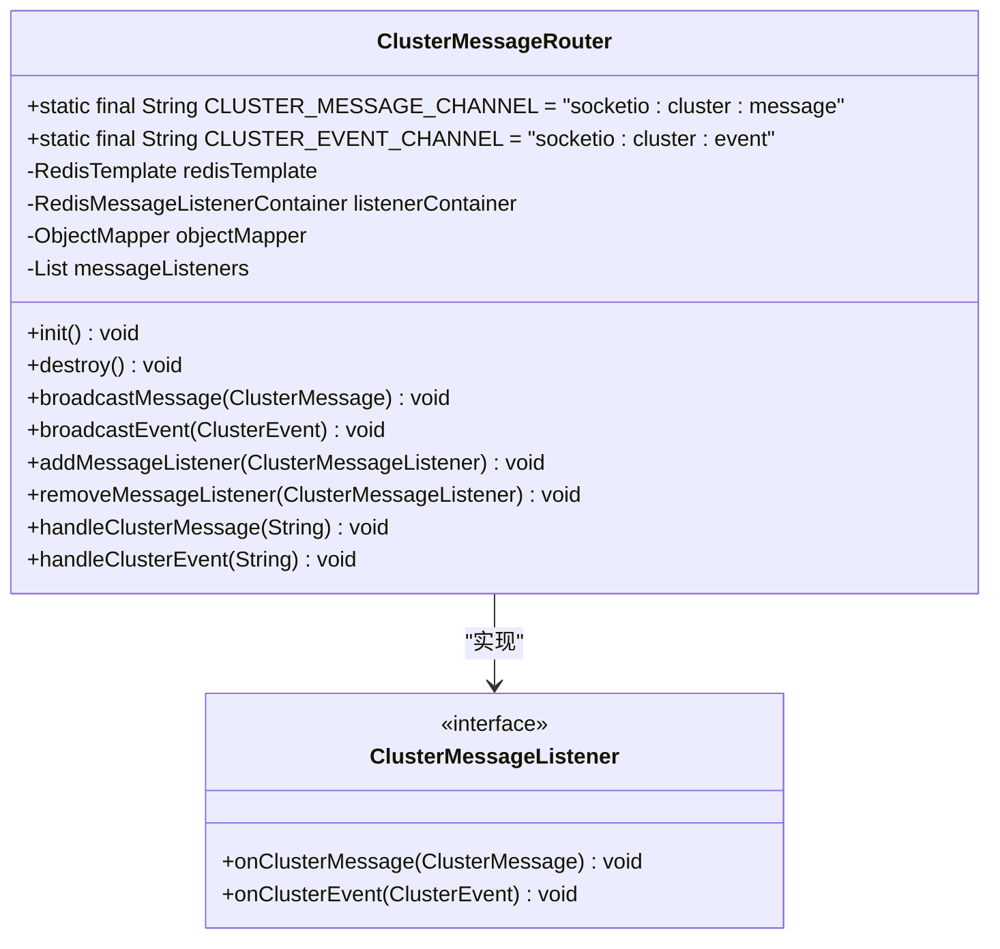
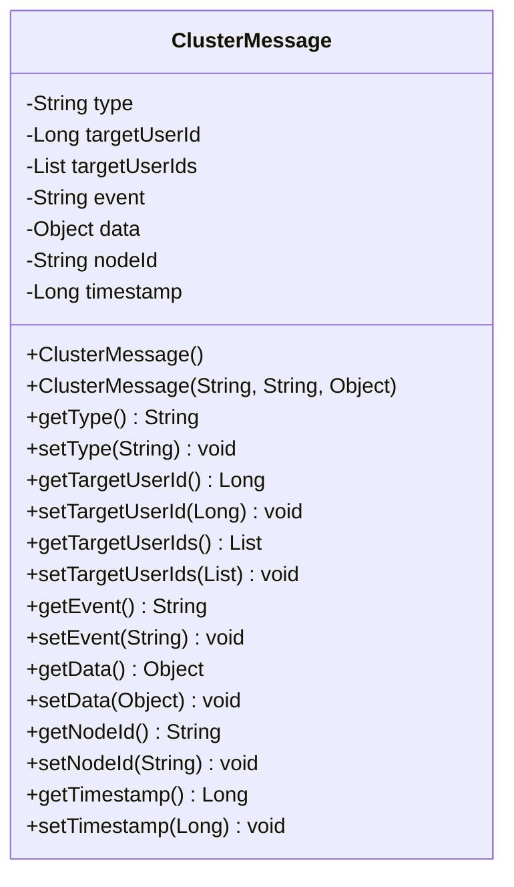
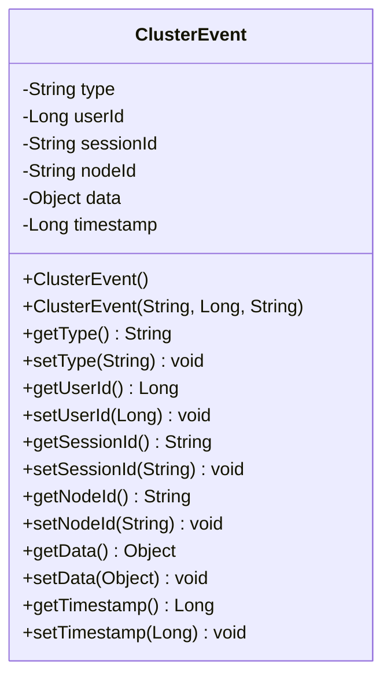
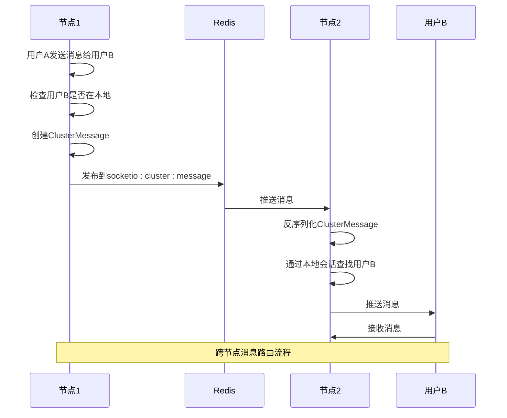
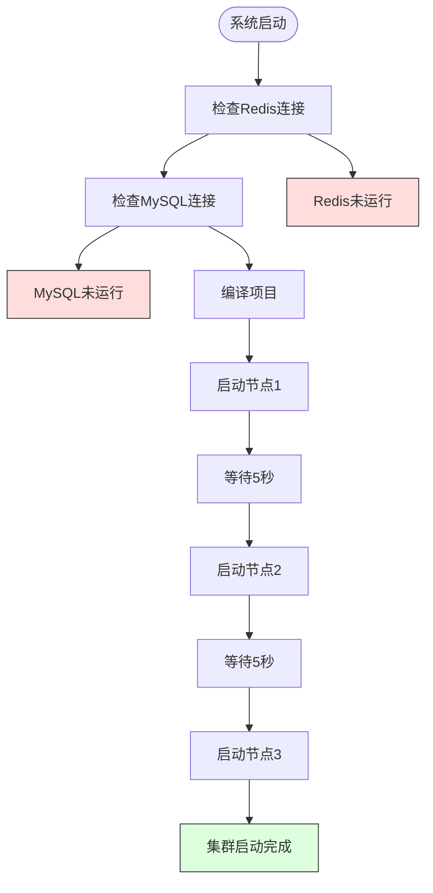
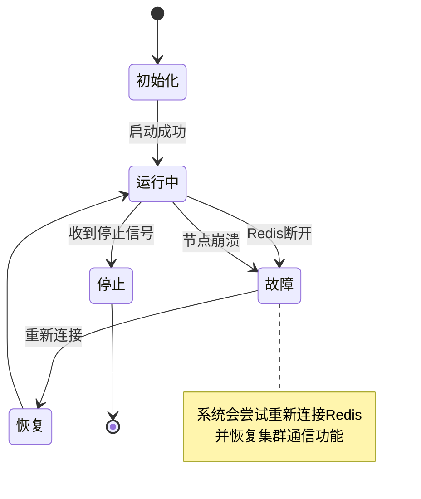

# 集群通信机制

<cite>
**本文档引用的文件**   
- [ClusterMessageRouter.java](file://src/main/java/com/example/nettyim/cluster/ClusterMessageRouter.java)
- [ClusterMessage.java](file://src/main/java/com/example/nettyim/cluster/ClusterMessage.java)
- [ClusterEvent.java](file://src/main/java/com/example/nettyim/cluster/ClusterEvent.java)
- [SocketIOServerManager.java](file://src/main/java/com/example/nettyim/websocket/SocketIOServerManager.java)
- [application-cluster.yml](file://src/main/resources/application-cluster.yml)
- [RedisConfig.java](file://src/main/java/com/example/nettyim/config/RedisConfig.java)
- [SocketIOConfig.java](file://src/main/java/com/example/nettyim/config/SocketIOConfig.java)
</cite>

## 目录
1. [引言](#引言)
2. [集群通信架构](#集群通信架构)
3. [核心组件分析](#核心组件分析)
4. [消息路由流程](#消息路由流程)
5. [配置与命名规则](#配置与命名规则)
6. [可扩展性与性能](#可扩展性与性能)
7. [容错与可靠性](#容错与可靠性)
8. [配置优化建议](#配置优化建议)
9. [结论](#结论)

## 引言

在多节点部署场景下，当用户A和用户B连接到不同的应用实例时，系统需要确保消息的可达性。本技术文档深入分析了基于Redis发布/订阅（Pub/Sub）模式的集群通信机制，重点阐述了ClusterMessageRouter组件如何实现跨节点消息路由。通过该机制，当节点1需要向在节点2上线的用户B发送消息时，会将消息封装为ClusterMessage并发布到Redis的特定频道；所有节点的ClusterMessageRouter都订阅该频道，节点2接收到消息后，通过其管理的本地会话将消息推送给用户B。

**Section sources**
- [ClusterMessageRouter.java](file://src/main/java/com/example/nettyim/cluster/ClusterMessageRouter.java#L1-L151)
- [application-cluster.yml](file://src/main/resources/application-cluster.yml#L1-L75)

## 集群通信架构



**Diagram sources**
- [ClusterMessageRouter.java](file://src/main/java/com/example/nettyim/cluster/ClusterMessageRouter.java#L18-L19)
- [SocketIOServerManager.java](file://src/main/java/com/example/nettyim/websocket/SocketIOServerManager.java#L24-L63)

## 核心组件分析

### ClusterMessageRouter组件

ClusterMessageRouter是集群通信的核心组件，负责在不同SocketIO节点之间路由消息。该组件通过Redis的发布/订阅模式实现跨节点通信。



**Diagram sources**
- [ClusterMessageRouter.java](file://src/main/java/com/example/nettyim/cluster/ClusterMessageRouter.java#L1-L151)

**Section sources**
- [ClusterMessageRouter.java](file://src/main/java/com/example/nettyim/cluster/ClusterMessageRouter.java#L1-L151)

### ClusterMessage数据结构

ClusterMessage类定义了在集群节点间传输的消息格式，包含消息类型、目标用户、事件名称、数据负载、发送节点ID和时间戳等关键属性。



**Diagram sources**
- [ClusterMessage.java](file://src/main/java/com/example/nettyim/cluster/ClusterMessage.java#L1-L111)

**Section sources**
- [ClusterMessage.java](file://src/main/java/com/example/nettyim/cluster/ClusterMessage.java#L1-L111)

### ClusterEvent数据结构

ClusterEvent类用于在集群节点间同步用户状态事件，如用户上线和下线事件，确保各节点对用户在线状态有一致的认知。



**Diagram sources**
- [ClusterEvent.java](file://src/main/java/com/example/nettyim/cluster/ClusterEvent.java#L1-L100)

**Section sources**
- [ClusterEvent.java](file://src/main/java/com/example/nettyim/cluster/ClusterEvent.java#L1-L100)

## 消息路由流程



**Diagram sources**
- [ClusterMessageRouter.java](file://src/main/java/com/example/nettyim/cluster/ClusterMessageRouter.java#L75-L85)
- [SocketIOServerManager.java](file://src/main/java/com/example/nettyim/websocket/SocketIOServerManager.java#L200-L250)

**Section sources**
- [ClusterMessageRouter.java](file://src/main/java/com/example/nettyim/cluster/ClusterMessageRouter.java#L75-L85)
- [SocketIOServerManager.java](file://src/main/java/com/example/nettyim/websocket/SocketIOServerManager.java#L200-L250)

## 配置与命名规则

### Redis连接配置

根据application-cluster.yml文件，系统通过以下配置连接Redis：

```yaml
spring:
  data:
    redis:
      host: localhost
      port: 6379
      database: 0
      timeout: 3000ms
      lettuce:
        pool:
          max-active: 8
          max-idle: 8
          min-idle: 0
```

这些配置在RedisConfig.java中被Spring框架加载并创建RedisTemplate实例，用于序列化和反序列化Redis中的数据。

**Section sources**
- [application-cluster.yml](file://src/main/resources/application-cluster.yml#L15-L25)
- [RedisConfig.java](file://src/main/java/com/example/nettyim/config/RedisConfig.java#L16-L42)

### 频道命名规则

系统使用两个固定的Redis频道进行集群通信：

- **消息频道**: `socketio:cluster:message` - 用于传输需要路由到特定用户的消息
- **事件频道**: `socketio:cluster:event` - 用于同步用户上线/下线等集群事件

这些常量在ClusterMessageRouter类中定义为静态字段，确保所有节点使用相同的频道名称。

```java
private static final String CLUSTER_MESSAGE_CHANNEL = "socketio:cluster:message";
private static final String CLUSTER_EVENT_CHANNEL = "socketio:cluster:event";
```

**Section sources**
- [ClusterMessageRouter.java](file://src/main/java/com/example/nettyim/cluster/ClusterMessageRouter.java#L18-L19)

### 节点标识配置

节点ID通过application-cluster.yml中的配置项设置，支持通过环境变量动态指定：

```yaml
socketio:
  cluster:
    enabled: true
    nodeId: ${NODE_ID:node-1}
```

在SocketIOServerManager中，系统会生成唯一的节点ID，结合主机名、端口和时间戳，确保集群中每个节点都有唯一的标识。

**Section sources**
- [application-cluster.yml](file://src/main/resources/application-cluster.yml#L61-L74)
- [SocketIOServerManager.java](file://src/main/java/com/example/nettyim/websocket/SocketIOServerManager.java#L100-L120)

## 可扩展性与性能

### 可扩展性分析

该设计具有良好的水平扩展能力。新增节点时，只需确保：
1. 连接到相同的Redis实例
2. 订阅相同的Pub/Sub频道
3. 使用唯一的节点ID

系统通过start-cluster.sh脚本演示了三节点集群的部署，可轻松扩展到更多节点。



**Diagram sources**
- [start-cluster.sh](file://start-cluster.sh#L1-L85)

**Section sources**
- [start-cluster.sh](file://start-cluster.sh#L1-L85)

### 性能影响

#### 延迟分析
- **网络延迟**: 消息需要经过Redis中转，增加了网络往返时间
- **序列化开销**: 消息需要JSON序列化和反序列化
- **处理延迟**: 每个节点都需要处理所有广播消息，即使目标用户不在本地

#### 优化策略
- 使用高效的JSON序列化库（如Jackson）
- 优化Redis连接池配置
- 实现消息过滤机制，减少不必要的处理

## 容错与可靠性

### 故障检测与恢复

系统通过以下机制确保可靠性：
1. **Redis连接监控**: 在启动时检查Redis和MySQL服务状态
2. **节点健康检查**: 通过日志和进程监控确保节点正常运行
3. **优雅关闭**: 使用stop-cluster.sh脚本优雅地停止所有节点



**Diagram sources**
- [start-cluster.sh](file://start-cluster.sh#L1-L85)
- [stop-cluster.sh](file://stop-cluster.sh#L1-L35)

**Section sources**
- [start-cluster.sh](file://start-cluster.sh#L1-L85)
- [stop-cluster.sh](file://stop-cluster.sh#L1-L35)

### 数据一致性

通过以下机制确保数据一致性：
- 所有节点使用相同的Redis实例作为共享状态存储
- 用户会话信息存储在Redis中，支持跨节点访问
- 使用原子操作确保消息发布的可靠性

## 配置优化建议

### Redis配置优化

| 配置项 | 当前值 | 建议值 | 说明 |
|--------|--------|--------|------|
| max-active | 8 | 16-32 | 增加连接池大小以支持更高并发 |
| max-idle | 8 | 16 | 保持更多空闲连接减少创建开销 |
| timeout | 3000ms | 5000ms | 增加超时时间应对网络波动 |
| database | 0 | 1-2 | 使用独立数据库避免冲突 |

**Section sources**
- [application-cluster.yml](file://src/main/resources/application-cluster.yml#L20-L25)

### 集群参数优化

1. **消息批量处理**: 考虑实现消息批量发布，减少Redis网络调用次数
2. **频道细分**: 根据消息类型创建多个专用频道，减少无关消息的处理
3. **连接复用**: 确保Redis连接被有效复用，避免频繁创建和销毁
4. **监控集成**: 添加Prometheus等监控工具，实时跟踪集群通信性能

### 部署建议

1. **Redis高可用**: 在生产环境中使用Redis哨兵或集群模式
2. **网络优化**: 确保应用节点与Redis服务器之间的网络延迟最小化
3. **资源分配**: 为每个节点分配足够的内存和CPU资源
4. **日志管理**: 集中收集和分析各节点日志，便于故障排查

## 结论

本文档详细分析了基于Redis Pub/Sub模式的集群通信机制。通过ClusterMessageRouter组件，系统实现了高效的跨节点消息路由，确保在多节点部署场景下消息的可达性。该设计具有良好的可扩展性，支持水平扩展以应对增长的用户量。通过合理的配置优化，可以进一步提升系统性能和可靠性。建议在生产环境中采用Redis高可用方案，并实施全面的监控策略，以确保集群通信的稳定运行。