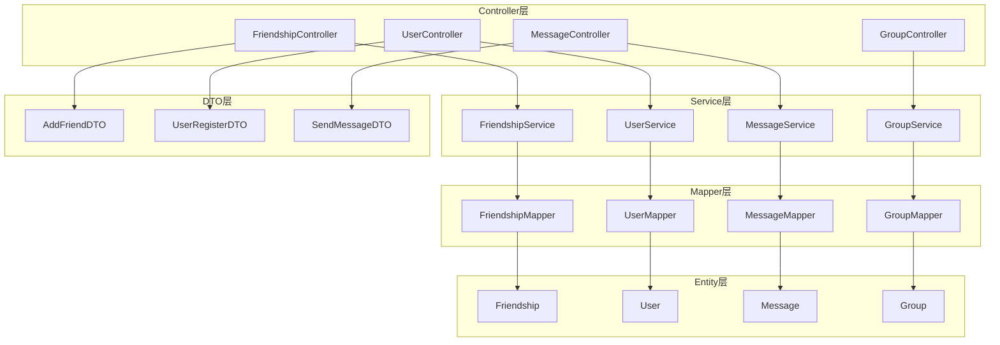
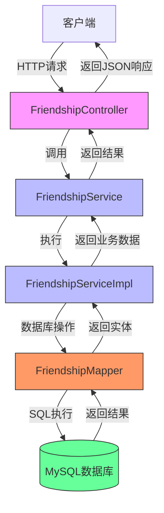
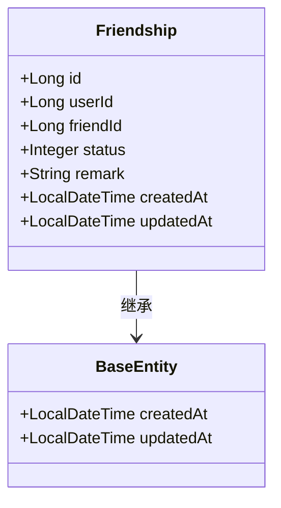
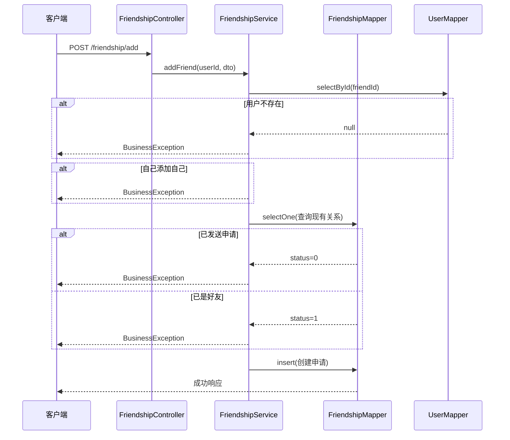
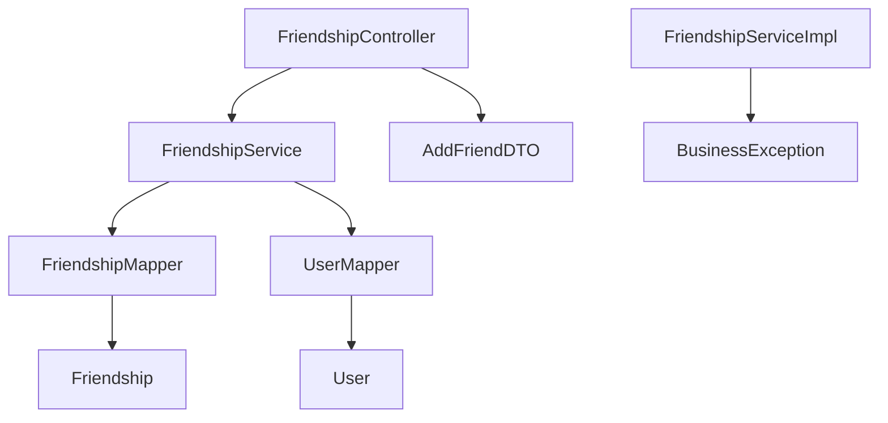

# 好友系统

<cite>
**本文档引用文件**  
- [Friendship.java](file://src/main/java/com/example/nettyim/entity/Friendship.java)
- [FriendshipService.java](file://src/main/java/com/example/nettyim/service/FriendshipService.java)
- [FriendshipServiceImpl.java](file://src/main/java/com/example/nettyim/service/impl/FriendshipServiceImpl.java)
- [FriendshipController.java](file://src/main/java/com/example/nettyim/controller/FriendshipController.java)
- [AddFriendDTO.java](file://src/main/java/com/example/nettyim/dto/AddFriendDTO.java)
- [FriendshipMapper.java](file://src/main/java/com/example/nettyim/mapper/FriendshipMapper.java)
- [schema.sql](file://src/main/resources/schema.sql)
- [User.java](file://src/main/java/com/example/nettyim/entity/User.java)
</cite>

## 目录
1. [简介](#简介)
2. [项目结构](#项目结构)
3. [核心组件](#核心组件)
4. [架构概览](#架构概览)
5. [详细组件分析](#详细组件分析)
6. [依赖分析](#依赖分析)
7. [性能考虑](#性能考虑)
8. [故障排除指南](#故障排除指南)
9. [结论](#结论)

## 简介
本系统实现了一个完整的即时通讯平台中的好友管理功能，支持添加好友申请、审批、列表查询、删除及备注修改等核心操作。系统采用Spring Boot + MyBatis-Plus技术栈，结合RESTful API设计，实现了高内聚、低耦合的服务架构。通过`Friendship`实体的双向关系存储机制，确保了好友关系的一致性与完整性。

## 项目结构
系统采用典型的分层架构设计，主要包含controller、service、mapper、entity、dto等模块，职责清晰，便于维护和扩展。



**Diagram sources **  
- [FriendshipController.java](file://src/main/java/com/example/nettyim/controller/FriendshipController.java)
- [FriendshipService.java](file://src/main/java/com/example/nettyim/service/FriendshipService.java)
- [FriendshipMapper.java](file://src/main/java/com/example/nettyim/mapper/FriendshipMapper.java)
- [Friendship.java](file://src/main/java/com/example/nettyim/entity/Friendship.java)
- [AddFriendDTO.java](file://src/main/java/com/example/nettyim/dto/AddFriendDTO.java)

**Section sources**  
- [FriendshipController.java](file://src/main/java/com/example/nettyim/controller/FriendshipController.java)
- [FriendshipService.java](file://src/main/java/com/example/nettyim/service/FriendshipService.java)

## 核心组件

系统围绕`Friendship`实体构建好友关系管理，通过`FriendshipService`接口定义业务契约，`FriendshipServiceImpl`实现具体逻辑，`FriendshipController`暴露REST API，`AddFriendDTO`封装请求数据，`FriendshipMapper`完成数据库操作。

**Section sources**  
- [Friendship.java](file://src/main/java/com/example/nettyim/entity/Friendship.java)
- [FriendshipService.java](file://src/main/java/com/example/nettyim/service/FriendshipService.java)
- [FriendshipServiceImpl.java](file://src/main/java/com/example/nettyim/service/impl/FriendshipServiceImpl.java)
- [FriendshipController.java](file://src/main/java/com/example/nettyim/controller/FriendshipController.java)
- [AddFriendDTO.java](file://src/main/java/com/example/nettyim/dto/AddFriendDTO.java)

## 架构概览

系统采用经典的三层架构：表现层（Controller）、业务逻辑层（Service）、数据访问层（Mapper），各层之间通过接口解耦，保证系统的可维护性和可测试性。



**Diagram sources **  
- [FriendshipController.java](file://src/main/java/com/example/nettyim/controller/FriendshipController.java)
- [FriendshipServiceImpl.java](file://src/main/java/com/example/nettyim/service/impl/FriendshipServiceImpl.java)
- [FriendshipMapper.java](file://src/main/java/com/example/nettyim/mapper/FriendshipMapper.java)
- [schema.sql](file://src/main/resources/schema.sql)

## 详细组件分析

### 好友实体分析
`Friendship`实体用于表示用户间的好友关系，采用双向存储方式确保关系对称性。



**Diagram sources **  
- [Friendship.java](file://src/main/java/com/example/nettyim/entity/Friendship.java)

**Section sources**  
- [Friendship.java](file://src/main/java/com/example/nettyim/entity/Friendship.java)

### 服务层逻辑分析
`FriendshipServiceImpl`实现了好友管理的核心业务逻辑，包括添加、审批、查询、删除和备注更新。

#### 添加好友流程


**Diagram sources **  
- [FriendshipServiceImpl.java](file://src/main/java/com/example/nettyim/service/impl/FriendshipServiceImpl.java)
- [FriendshipController.java](file://src/main/java/com/example/nettyim/controller/FriendshipController.java)

**Section sources**  
- [FriendshipServiceImpl.java](file://src/main/java/com/example/nettyim/service/impl/FriendshipServiceImpl.java)

### 控制器与API分析
`FriendshipController`提供了RESTful风格的API接口，参数绑定清晰，响应结构统一。

#### API接口定义
| 接口 | 方法 | 参数 | 说明 |
|------|------|------|------|
| `/friendship/add` | POST | userId, friendId, remark, message | 发送好友申请 |
| `/friendship/handle` | POST | userId, requestId, action, remark | 处理好友申请 |
| `/friendship/list` | GET | userId | 获取好友列表 |
| `/friendship/requests` | GET | userId | 获取好友申请列表 |
| `/friendship/delete` | DELETE | userId, friendId | 删除好友 |
| `/friendship/remark` | PUT | userId, friendId, remark | 更新好友备注 |
| `/friendship/check` | GET | userId, friendId | 检查是否为好友 |

**Section sources**  
- [FriendshipController.java](file://src/main/java/com/example/nettyim/controller/FriendshipController.java)

### DTO与数据封装
`AddFriendDTO`用于封装添加好友请求的数据，包含参数校验规则。

```mermaid
classDiagram
class AddFriendDTO {
+Long friendId
+String remark
+String message
}
note right of AddFriendDTO
校验规则：
- friendId : 必填
- remark : 最大50字符
- message : 最大200字符
end
```

**Diagram sources **  
- [AddFriendDTO.java](file://src/main/java/com/example/nettyim/dto/AddFriendDTO.java)

**Section sources**  
- [AddFriendDTO.java](file://src/main/java/com/example/nettyim/dto/AddFriendDTO.java)

## 依赖分析

系统各组件之间的依赖关系清晰，遵循依赖倒置原则。



**Diagram sources **  
- [FriendshipController.java](file://src/main/java/com/example/nettyim/controller/FriendshipController.java)
- [FriendshipServiceImpl.java](file://src/main/java/com/example/nettyim/service/impl/FriendshipServiceImpl.java)
- [FriendshipMapper.java](file://src/main/java/com/example/nettyim/mapper/FriendshipMapper.java)
- [UserMapper.java](file://src/main/java/com/example/nettyim/mapper/UserMapper.java)
- [AddFriendDTO.java](file://src/main/java/com/example/nettyim/dto/AddFriendDTO.java)
- [BusinessException.java](file://src/main/java/com/example/nettyim/exception/BusinessException.java)

**Section sources**  
- [FriendshipController.java](file://src/main/java/com/example/nettyim/controller/FriendshipController.java)
- [FriendshipServiceImpl.java](file://src/main/java/com/example/nettyim/service/impl/FriendshipServiceImpl.java)

## 性能考虑
- 使用MyBatis-Plus的`selectBatchIds`批量查询好友信息，减少数据库访问次数
- 在`friendships`表上建立复合唯一索引`uk_user_friend`，防止重复申请
- 对用户密码等敏感字段在返回前置空，避免信息泄露
- 所有数据库操作均在事务中执行，保证数据一致性

## 故障排除指南
常见异常及处理策略：

| 异常场景 | 错误信息 | 处理建议 |
|--------|--------|--------|
| 用户不存在 | "用户不存在" | 检查friendId是否正确 |
| 自己添加自己 | "不能添加自己为好友" | 前端应禁用此操作 |
| 已发送申请 | "好友申请已发送，请等待对方确认" | 提示用户等待或取消申请 |
| 已是好友 | "已经是好友关系" | 直接跳转聊天界面 |
| 无权处理 | "无权处理该好友申请" | 检查当前用户权限 |
| 申请已处理 | "该申请已被处理" | 刷新好友申请列表 |

**Section sources**  
- [FriendshipServiceImpl.java](file://src/main/java/com/example/nettyim/service/impl/FriendshipServiceImpl.java)
- [BusinessException.java](file://src/main/java/com/example/nettyim/exception/BusinessException.java)

## 结论
本好友系统设计合理，功能完整，具备良好的扩展性和可维护性。通过双向关系存储、状态机管理、参数校验、异常处理等机制，确保了系统的健壮性。未来可扩展消息通知、好友分组、黑名单等功能。