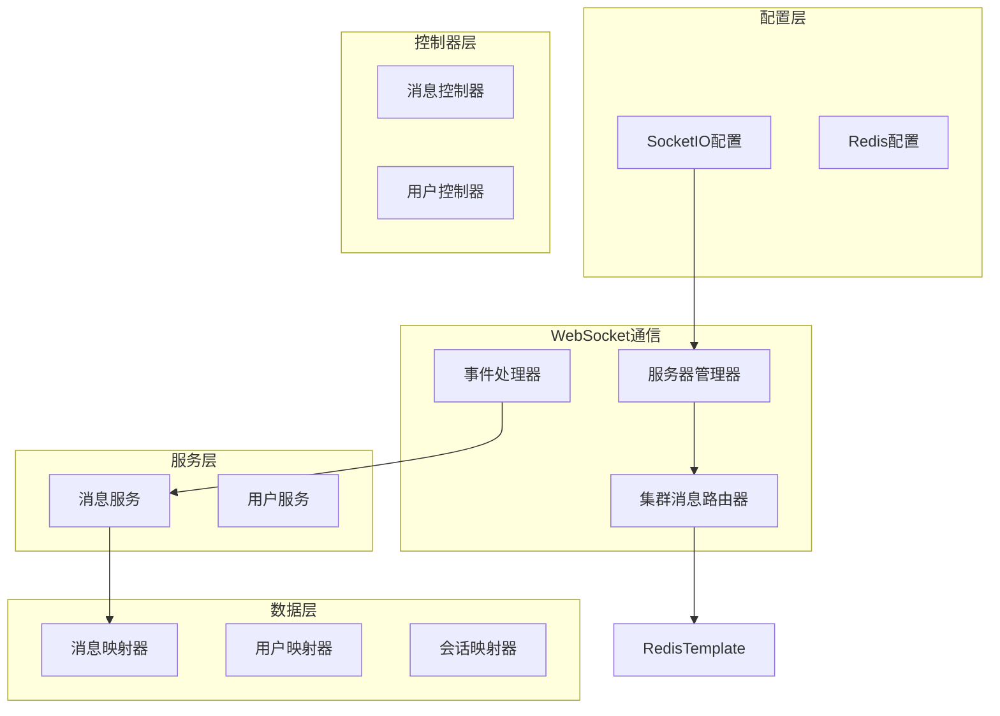
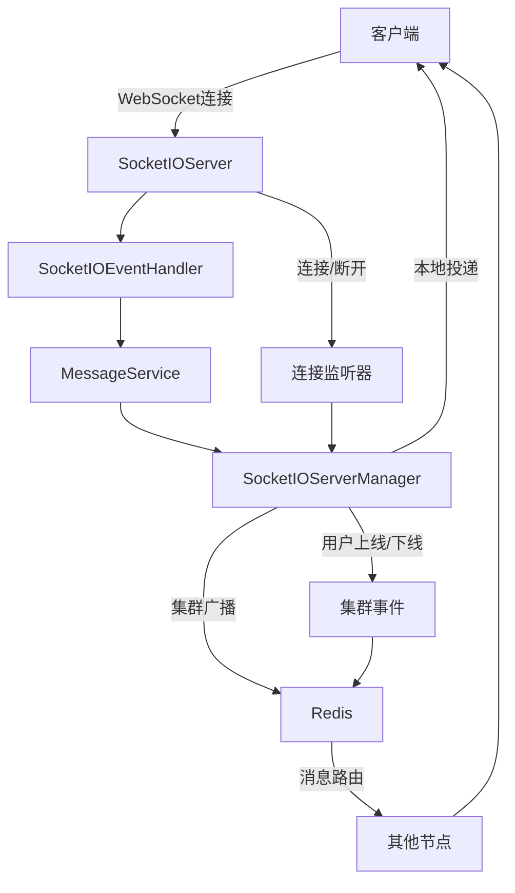
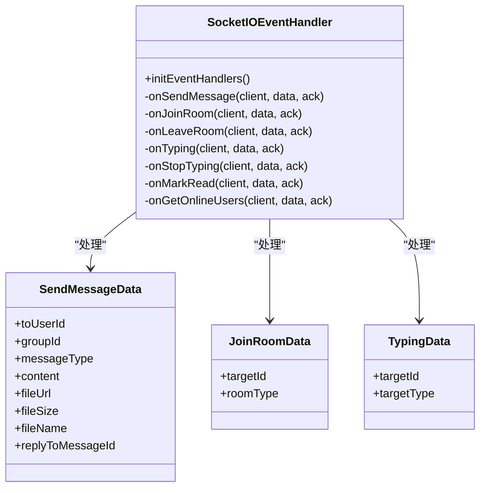
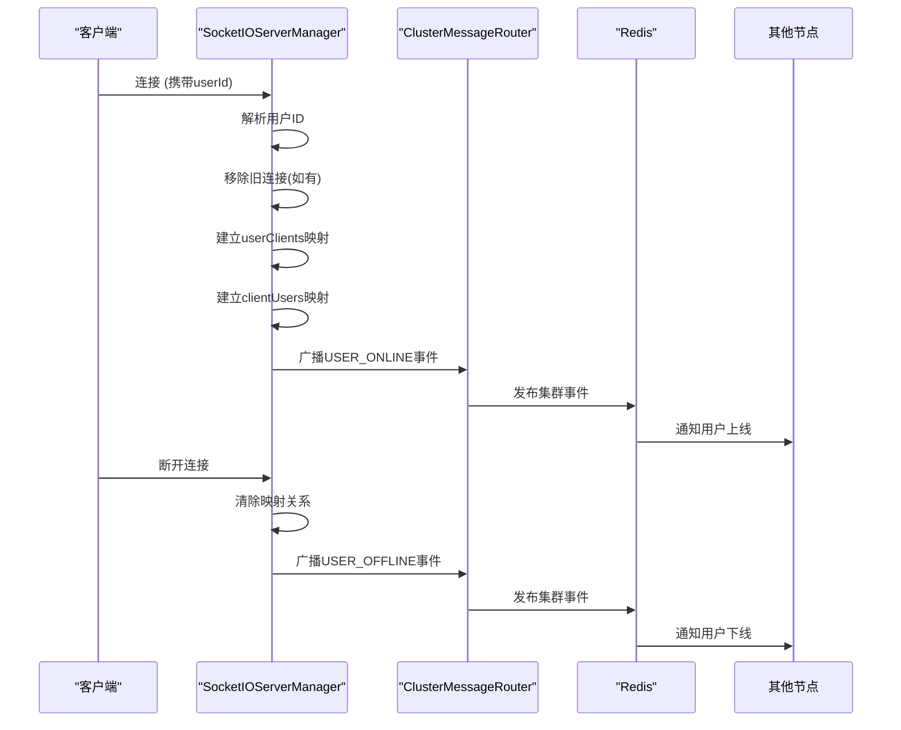
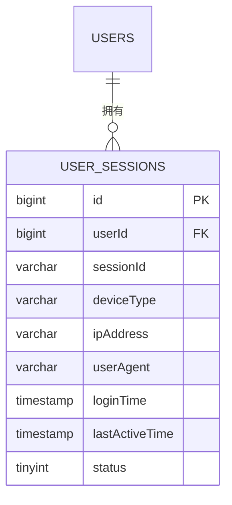
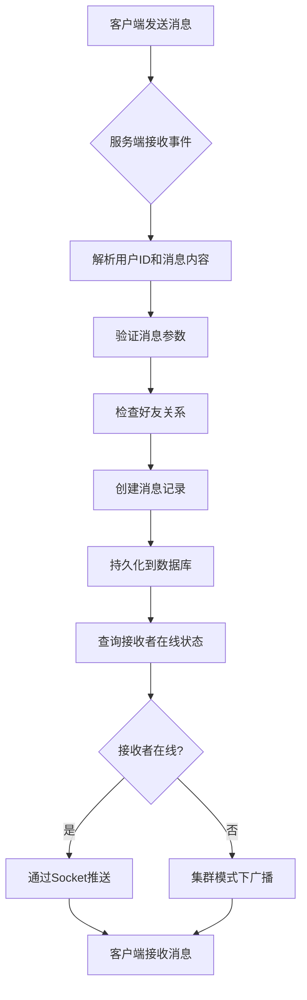
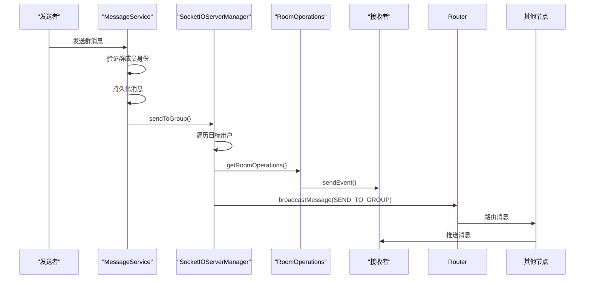
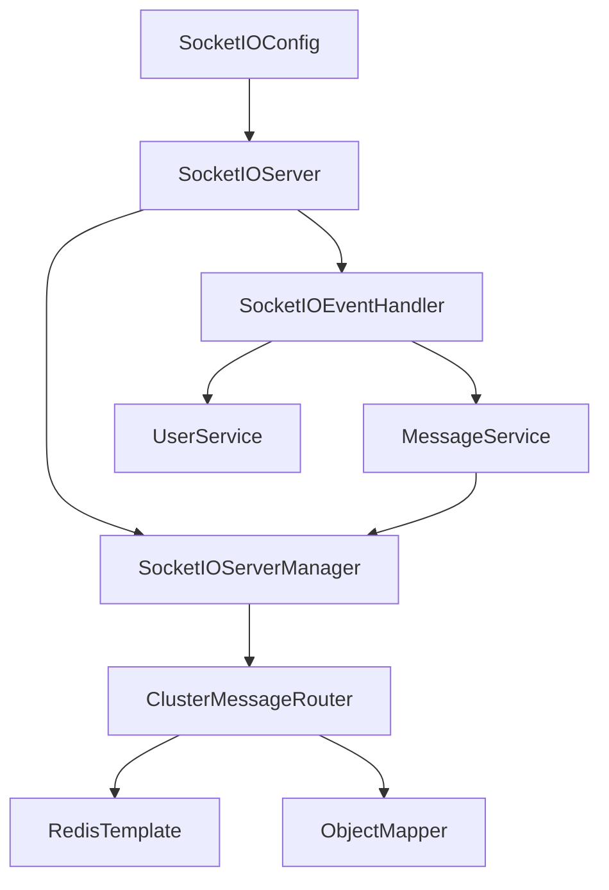

# 实时通信

<cite>
**本文档引用文件**   
- [SocketIOEventHandler.java](file://src/main/java/com/example/nettyim/websocket/SocketIOEventHandler.java)
- [SocketIOServerManager.java](file://src/main/java/com/example/nettyim/websocket/SocketIOServerManager.java)
- [SocketIOConfig.java](file://src/main/java/com/example/nettyim/config/SocketIOConfig.java)
- [UserSession.java](file://src/main/java/com/example/nettyim/entity/UserSession.java)
- [MessageServiceImpl.java](file://src/main/java/com/example/nettyim/service/impl/MessageServiceImpl.java)
- [ClusterMessageRouter.java](file://src/main/java/com/example/nettyim/cluster/ClusterMessageRouter.java)
- [ClusterMessage.java](file://src/main/java/com/example/nettyim/cluster/ClusterMessage.java)
- [ClusterEvent.java](file://src/main/java/com/example/nettyim/cluster/ClusterEvent.java)
</cite>

## 目录
1. [简介](#简介)
2. [项目结构](#项目结构)
3. [核心组件](#核心组件)
4. [架构概览](#架构概览)
5. [详细组件分析](#详细组件分析)
6. [依赖分析](#依赖分析)
7. [性能考虑](#性能考虑)
8. [故障排除指南](#故障排除指南)
9. [结论](#结论)

## 简介
本项目是一个基于Netty-SocketIO的实时通信系统，支持私聊、群聊、在线状态同步、消息已读标记等功能。系统采用WebSocket协议实现全双工通信，结合Redis实现集群部署下的消息路由与状态同步。核心功能包括用户连接管理、消息实时投递、会话状态维护、集群事件广播等。通过SocketIOConfig配置WebSocket服务器参数，SocketIOServerManager管理客户端会话，SocketIOEventHandler处理各类通信事件。

## 项目结构
项目采用典型的Spring Boot分层架构，主要分为配置、控制器、数据传输对象、实体、异常、数据访问层、服务层、工具类和WebSocket通信模块。WebSocket相关核心逻辑集中在`websocket`包中，包括事件处理器、服务器管理器和集群通信组件。系统支持单机与集群两种部署模式，通过Redis实现节点间状态同步。

**图示来源**
- [SocketIOConfig.java](file://src/main/java/com/example/nettyim/config/SocketIOConfig.java)
- [SocketIOServerManager.java](file://src/main/java/com/example/nettyim/websocket/SocketIOServerManager.java)
- [ClusterMessageRouter.java](file://src/main/java/com/example/nettyim/cluster/ClusterMessageRouter.java)

**本节来源**
- [SocketIOConfig.java](file://src/main/java/com/example/nettyim/config/SocketIOConfig.java)
- [SocketIOServerManager.java](file://src/main/java/com/example/nettyim/websocket/SocketIOServerManager.java)

## 核心组件
系统核心组件包括SocketIOEventHandler、SocketIOServerManager和SocketIOConfig。SocketIOEventHandler负责处理客户端发送的各类事件，如消息发送、房间加入、输入状态通知等。SocketIOServerManager管理所有客户端连接会话，维护用户ID与SocketIOClient的映射关系，并支持消息精准投递。SocketIOConfig定义WebSocket服务器的初始化配置，包括端口、心跳机制、包大小限制等。在集群模式下，通过Redisson实现分布式会话存储和消息广播。

**本节来源**
- [SocketIOEventHandler.java](file://src/main/java/com/example/nettyim/websocket/SocketIOEventHandler.java#L1-L357)
- [SocketIOServerManager.java](file://src/main/java/com/example/nettyim/websocket/SocketIOServerManager.java#L1-L296)
- [SocketIOConfig.java](file://src/main/java/com/example/nettyim/config/SocketIOConfig.java#L1-L93)

## 架构概览
系统采用事件驱动架构，基于Netty-SocketIO实现WebSocket通信。客户端通过握手连接时携带用户ID，服务器端建立用户ID与SocketIOClient的映射关系。消息发送时，服务端查询接收者在线状态，若在线则通过SocketIOServerManager直接推送；若在集群模式下且接收者位于其他节点，则通过Redis广播集群消息实现跨节点投递。用户上下线事件通过集群事件机制同步，确保全局在线状态一致性。

**图示来源**
- [SocketIOEventHandler.java](file://src/main/java/com/example/nettyim/websocket/SocketIOEventHandler.java)
- [SocketIOServerManager.java](file://src/main/java/com/example/nettyim/websocket/SocketIOServerManager.java)
- [ClusterMessageRouter.java](file://src/main/java/com/example/nettyim/cluster/ClusterMessageRouter.java)

## 详细组件分析

### 事件处理机制分析
SocketIOEventHandler通过@OnEvent注解注册各类事件监听器，在初始化时通过socketIOServer.addEventListener方法绑定事件处理器。每个事件处理方法接收SocketIOClient、事件数据和AckRequest作为参数，实现消息确认机制。事件处理包含参数验证、业务逻辑调用和结果响应三个阶段，异常情况下记录日志并返回错误信息。

#### 事件处理类图

**图示来源**
- [SocketIOEventHandler.java](file://src/main/java/com/example/nettyim/websocket/SocketIOEventHandler.java#L50-L357)

**本节来源**
- [SocketIOEventHandler.java](file://src/main/java/com/example/nettyim/websocket/SocketIOEventHandler.java#L1-L357)

### 会话管理机制分析
SocketIOServerManager使用ConcurrentHashMap存储用户ID与SocketIOClient的映射关系（userClients）以及会话ID与用户ID的映射关系（clientUsers）。当用户连接时，从握手参数中提取用户ID，建立双向映射；当用户断开时，清除映射关系。系统支持同一用户多端登录，新连接会顶替旧连接。在集群模式下，通过ClusterMessageRouter广播用户上下线事件，确保各节点状态同步。

#### 会话管理序列图

**图示来源**
- [SocketIOServerManager.java](file://src/main/java/com/example/nettyim/websocket/SocketIOServerManager.java#L80-L180)

**本节来源**
- [SocketIOServerManager.java](file://src/main/java/com/example/nettyim/websocket/SocketIOServerManager.java#L1-L296)

### 配置初始化分析
SocketIOConfig通过@Configuration注解定义Bean，使用@Value注入配置参数。socketIOServer Bean配置了主机名、端口、线程数、超时时间等参数，并根据clusterEnabled配置决定是否使用RedissonStoreFactory实现分布式会话存储。RedissonClient Bean配置了Redis连接参数，支持单机模式。配置项涵盖网络参数、心跳机制、跨域设置等，确保服务器稳定运行。

#### 配置参数表
| **配置项** | **默认值** | **说明** |
|-----------|----------|---------|
| socketio.host | localhost | 服务器主机名 |
| socketio.port | 8081 | 服务器端口 |
| socketio.bossCount | 1 | Boss线程数 |
| socketio.workCount | 100 | Worker线程数 |
| socketio.upgradeTimeout | 1000000 | 升级超时(毫秒) |
| socketio.pingTimeout | 6000000 | Ping超时(毫秒) |
| socketio.pingInterval | 25000 | Ping间隔(毫秒) |
| socketio.cluster.enabled | false | 是否启用集群 |

**本节来源**
- [SocketIOConfig.java](file://src/main/java/com/example/nettyim/config/SocketIOConfig.java#L1-L93)

### 用户会话持久化分析
用户上线时，系统虽未直接创建UserSession实体并存入数据库，但通过Redis存储会话状态。UserSession实体定义了会话ID、用户ID、设备类型、IP地址、登录时间等字段，可通过扩展逻辑在用户连接时创建并持久化。当前系统主要依赖内存映射和Redis广播维护会话状态，确保实时通信效率。

#### 用户会话实体图

**图示来源**
- [UserSession.java](file://src/main/java/com/example/nettyim/entity/UserSession.java#L1-L64)

**本节来源**
- [UserSession.java](file://src/main/java/com/example/nettyim/entity/UserSession.java#L1-L64)

### 消息路由流程分析
私聊消息路由流程：客户端发送"send_message"事件 → 服务端解析事件数据 → 调用MessageService.sendMessage → 验证好友关系 → 持久化消息 → 调用SocketIOServerManager.sendToUser → 查询接收者在线状态 → 若在线则推送消息，否则在集群模式下广播消息。

#### 私聊消息流程图

**图示来源**
- [SocketIOEventHandler.java](file://src/main/java/com/example/nettyim/websocket/SocketIOEventHandler.java#L100-L150)
- [MessageServiceImpl.java](file://src/main/java/com/example/nettyim/service/impl/MessageServiceImpl.java#L50-L100)

**本节来源**
- [SocketIOEventHandler.java](file://src/main/java/com/example/nettyim/websocket/SocketIOEventHandler.java#L1-L357)
- [MessageServiceImpl.java](file://src/main/java/com/example/nettyim/service/impl/MessageServiceImpl.java#L1-L281)

### 群聊广播机制分析
群聊消息通过房间(Room)机制实现广播。客户端加入"group_{groupId}"房间，服务端通过socketIOServer.getRoomOperations("group_{groupId}")获取房间操作对象，调用sendEvent向房间内所有成员广播消息。在集群模式下，通过SEND_TO_GROUP类型的ClusterMessage广播到其他节点，确保跨节点成员都能接收到消息。

#### 群聊广播序列图

**图示来源**
- [MessageServiceImpl.java](file://src/main/java/com/example/nettyim/service/impl/MessageServiceImpl.java#L70-L90)
- [SocketIOServerManager.java](file://src/main/java/com/example/nettyim/websocket/SocketIOServerManager.java#L200-L230)

**本节来源**
- [MessageServiceImpl.java](file://src/main/java/com/example/nettyim/service/impl/MessageServiceImpl.java#L1-L281)
- [SocketIOServerManager.java](file://src/main/java/com/example/nettyim/websocket/SocketIOServerManager.java#L1-L296)

## 依赖分析
系统核心依赖关系以SocketIOServerManager为中心，被SocketIOEventHandler和ClusterMessageRouter依赖。SocketIOEventHandler依赖MessageService和UserService处理业务逻辑。在集群模式下，SocketIOServerManager依赖ClusterMessageRouter实现跨节点通信，ClusterMessageRouter依赖RedisTemplate实现消息发布订阅。所有WebSocket组件依赖SocketIOServer实例，由SocketIOConfig统一配置和创建。

**图示来源**
- [SocketIOConfig.java](file://src/main/java/com/example/nettyim/config/SocketIOConfig.java)
- [SocketIOEventHandler.java](file://src/main/java/com/example/nettyim/websocket/SocketIOEventHandler.java)
- [SocketIOServerManager.java](file://src/main/java/com/example/nettyim/websocket/SocketIOServerManager.java)
- [ClusterMessageRouter.java](file://src/main/java/com/example/nettyim/cluster/ClusterMessageRouter.java)

**本节来源**
- [SocketIOConfig.java](file://src/main/java/com/example/nettyim/config/SocketIOConfig.java#L1-L93)
- [SocketIOEventHandler.java](file://src/main/java/com/example/nettyim/websocket/SocketIOEventHandler.java#L1-L357)
- [SocketIOServerManager.java](file://src/main/java/com/example/nettyim/websocket/SocketIOServerManager.java#L1-L296)
- [ClusterMessageRouter.java](file://src/main/java/com/example/nettyim/cluster/ClusterMessageRouter.java#L1-L151)

## 性能考虑
系统通过ConcurrentHashMap实现O(1)复杂度的用户连接查询，确保消息投递高效。采用异步事件处理机制，避免阻塞I/O操作。心跳参数（pingInterval=25s, pingTimeout=6000s）平衡了连接检测及时性与网络开销。集群模式下，通过Redis发布订阅实现消息广播，避免轮询开销。建议生产环境根据并发量调整workCount线程数，并监控Redis性能瓶颈。

## 故障排除指南
常见问题包括连接失败、消息丢失、集群不同步等。连接失败通常因未携带userId参数或用户ID格式错误，需检查客户端握手请求。消息丢失可能因接收者不在线且未启用集群模式，需确认clusterEnabled配置。集群不同步问题多由Redis连接异常引起，需检查Redis服务状态和网络连通性。日志中"处理XX事件失败"提示需检查对应服务方法的异常处理逻辑。

**本节来源**
- [SocketIOEventHandler.java](file://src/main/java/com/example/nettyim/websocket/SocketIOEventHandler.java#L1-L357)
- [SocketIOServerManager.java](file://src/main/java/com/example/nettyim/websocket/SocketIOServerManager.java#L1-L296)
- [ClusterMessageRouter.java](file://src/main/java/com/example/nettyim/cluster/ClusterMessageRouter.java#L1-L151)

## 结论
本系统基于Netty-SocketIO构建了高效的实时通信机制，通过事件驱动架构实现各类通信功能。SocketIOEventHandler集中处理客户端事件，SocketIOServerManager精细化管理用户会话，配合SocketIOConfig的灵活配置，支持单机与集群部署。消息路由机制确保私聊精准投递，群聊高效广播。系统设计充分考虑了可扩展性与可靠性，为即时通讯应用提供了坚实基础。