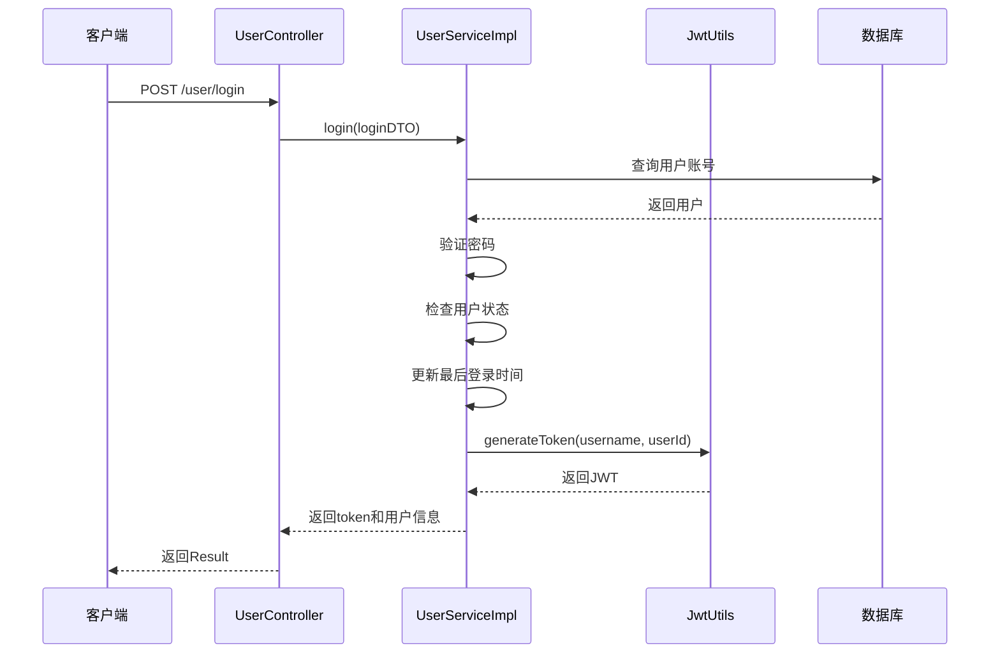
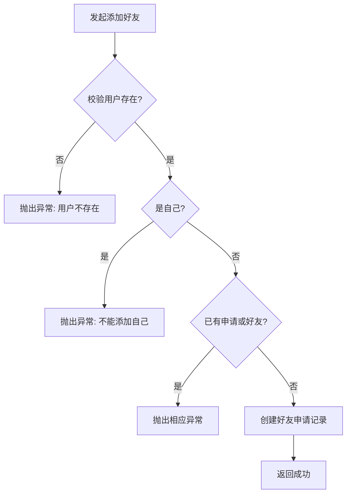
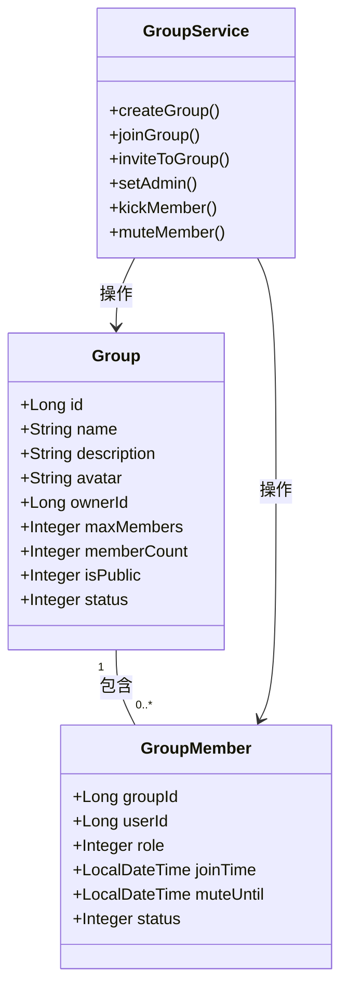
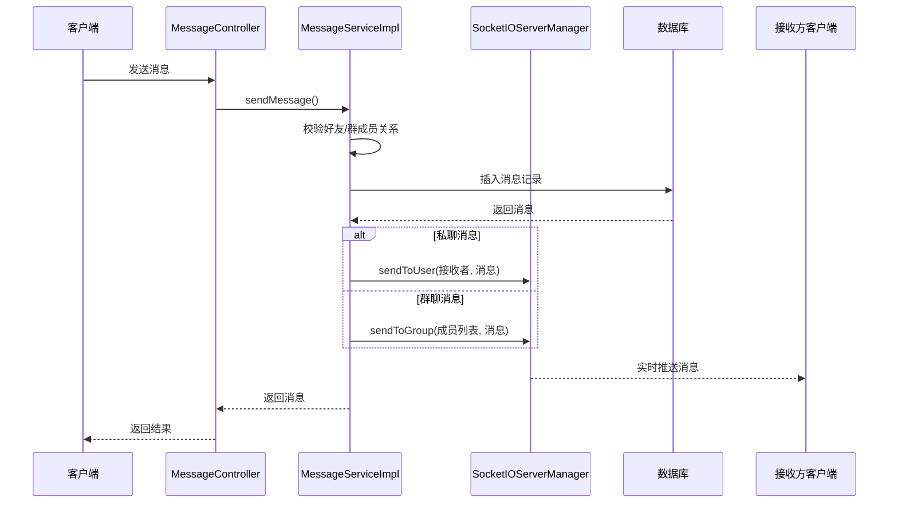
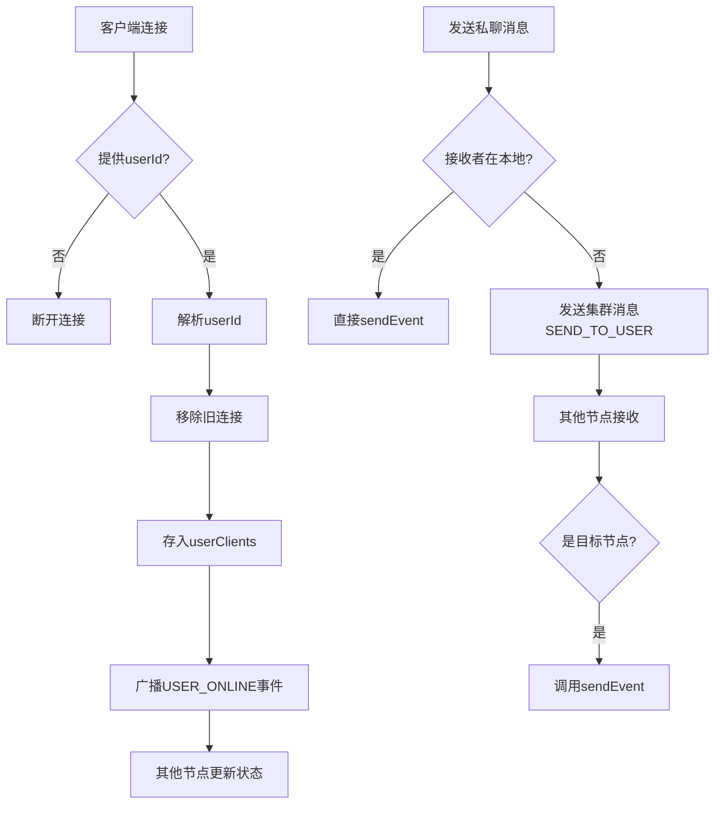

# 核心功能详解

<cite>
**本文档引用的文件**
- [UserController.java](file://src/main/java/com/example/nettyim/controller/UserController.java)
- [UserServiceImpl.java](file://src/main/java/com/example/nettyim/service/impl/UserServiceImpl.java)
- [FriendshipController.java](file://src/main/java/com/example/nettyim/controller/FriendshipController.java)
- [FriendshipServiceImpl.java](file://src/main/java/com/example/nettyim/service/impl/FriendshipServiceImpl.java)
- [GroupController.java](file://src/main/java/com/example/nettyim/controller/GroupController.java)
- [GroupServiceImpl.java](file://src/main/java/com/example/nettyim/service/impl/GroupServiceImpl.java)
- [MessageController.java](file://src/main/java/com/example/nettyim/controller/MessageController.java)
- [MessageServiceImpl.java](file://src/main/java/com/example/nettyim/service/impl/MessageServiceImpl.java)
- [SocketIOEventHandler.java](file://src/main/java/com/example/nettyim/websocket/SocketIOEventHandler.java)
- [SocketIOServerManager.java](file://src/main/java/com/example/nettyim/websocket/SocketIOServerManager.java)
- [JwtUtils.java](file://src/main/java/com/example/nettyim/utils/JwtUtils.java)
</cite>

## 目录
1. [用户系统](#用户系统)
2. [好友系统](#好友系统)
3. [群组系统](#群组系统)
4. [消息系统](#消息系统)
5. [实时通信机制](#实时通信机制)

## 用户系统

用户系统负责用户身份的创建、认证与信息管理，是整个即时通讯平台的基础模块。该系统通过 `UserController` 提供 RESTful 接口，调用 `UserServiceImpl` 实现核心业务逻辑。

### 注册流程
用户注册通过 `/user/register` 接口实现。系统首先校验用户名、手机号和邮箱的唯一性，防止重复注册。若校验通过，则使用 Spring Security 的 `PasswordEncoder` 对密码进行加密存储，并将用户状态初始化为启用（status=1）和离线（onlineStatus=0）。注册成功后返回用户信息（密码字段被清除）。

### 登录与 JWT 生成
登录接口 `/user/login` 支持通过用户名或手机号登录。系统通过 `getUserByAccount` 方法查询用户，验证密码后检查账户状态。登录成功后，调用 `JwtUtils.generateToken` 生成 JWT 令牌，并更新用户的最后登录时间。返回数据包含 JWT 令牌和用户信息。

### 信息更新与状态管理
用户可通过 `/user/{userId}` 接口更新昵称、头像和在线状态。系统通过 `updateUser` 和 `updateOnlineStatus` 方法实现，确保只有合法用户可以修改自身信息。此外，系统提供实名认证接口，支持上传身份证正反面照片，并确保身份证号码的全局唯一性。

**图示来源**
- [UserController.java](file://src/main/java/com/example/nettyim/controller/UserController.java#L30-L50)
- [UserServiceImpl.java](file://src/main/java/com/example/nettyim/service/impl/UserServiceImpl.java#L70-L100)
- [JwtUtils.java](file://src/main/java/com/example/nettyim/utils/JwtUtils.java)

**本节来源**
- [UserController.java](file://src/main/java/com/example/nettyim/controller/UserController.java)
- [UserServiceImpl.java](file://src/main/java/com/example/nettyim/service/impl/UserServiceImpl.java)

## 好友系统

好友系统实现了好友申请、审批、列表查询和备注管理等功能，通过双向关系维护用户间的社交连接。

### 添加好友与审批流程
用户通过 `/friendship/add` 接口发起好友申请。系统首先检查目标用户是否存在，防止添加自己为好友，并验证是否已存在待处理的申请或已是好友。若校验通过，则创建一条状态为“待确认”（status=0）的好友关系记录。

审批接口 `/friendship/handle` 允许用户处理好友申请。系统验证操作权限后，若同意申请（action=1），则不仅更新原申请状态为“已同意”（status=1），还会在反向创建一条已同意的好友关系，形成双向连接。

### 好友列表与管理
`getFriendList` 方法通过查询所有状态为1的好友关系，获取好友ID列表，再批量查询用户信息。系统提供 `deleteFriend` 方法删除双向好友关系，`updateFriendRemark` 方法更新好友备注，以及 `isFriend` 方法快速检查好友关系。

**图示来源**
- [FriendshipController.java](file://src/main/java/com/example/nettyim/controller/FriendshipController.java#L20-L40)
- [FriendshipServiceImpl.java](file://src/main/java/com/example/nettyim/service/impl/FriendshipServiceImpl.java#L20-L60)

**本节来源**
- [FriendshipController.java](file://src/main/java/com/example/nettyim/controller/FriendshipController.java)
- [FriendshipServiceImpl.java](file://src/main/java/com/example/nettyim/service/impl/FriendshipServiceImpl.java)

## 群组系统

群组系统支持群组的创建、成员管理、权限控制和信息维护，满足多人群聊需求。

### 群组创建与成员管理
群主通过 `/group/create` 接口创建群组，系统自动将群主添加为成员（角色为2）。其他成员可通过 `/group/join` 主动加入（需群组公开且未满员），或通过 `/group/invite` 被邀请加入。成员可主动 `/group/leave` 退出，但群主需先转让权限或解散群组。

### 权限与角色控制
系统定义了三种角色：普通成员（0）、管理员（1）、群主（2）。`setAdmin` 接口允许群主设置或取消管理员。`kickMember`、`muteMember` 等接口均通过 `isAdmin` 和 `isOwner` 方法进行权限校验，确保操作合法性。例如，只有群主可踢出管理员，管理员不能被普通成员禁言。

### 群组信息更新
群组信息（名称、描述、头像）可通过 `/group/{groupId}` 接口更新，仅群主和管理员有权限。群主可通过 `/group/{groupId}` 的 DELETE 方法解散群组，系统会删除所有成员记录和群组本身。

**图示来源**
- [GroupController.java](file://src/main/java/com/example/nettyim/controller/GroupController.java)
- [GroupServiceImpl.java](file://src/main/java/com/example/nettyim/service/impl/GroupServiceImpl.java)

**本节来源**
- [GroupController.java](file://src/main/java/com/example/nettyim/controller/GroupController.java)
- [GroupServiceImpl.java](file://src/main/java/com/example/nettyim/service/impl/GroupServiceImpl.java)

## 消息系统

消息系统负责消息的发送、接收、持久化、已读回执和撤回，是即时通讯的核心。

### 消息发送与权限校验
`sendMessage` 方法在发送消息前进行严格校验：消息内容不能为空，且必须指定私聊用户或群组。对于私聊，系统调用 `friendshipService.isFriend` 确保双方是好友；对于群聊，调用 `groupService.isMember` 确保发送者是群成员。

### 消息持久化与实时推送
消息通过 `MessageMapper` 持久化到数据库，生成全局唯一的 `messageId`。发送成功后，系统通过 `SocketIOServerManager` 进行实时推送：私聊消息发送给指定用户，群聊消息发送给除发送者外的所有群成员。

### 已读回执与消息管理
系统提供 `markMessageAsRead` 和 `markMessagesAsRead` 接口标记消息为已读，`getUnreadMessageCount` 查询未读消息数。用户可删除自己的消息（`deleteMessage`）或在2分钟内撤回（`recallMessage`），系统会通知相关用户消息状态变更。

**图示来源**
- [MessageController.java](file://src/main/java/com/example/nettyim/controller/MessageController.java)
- [MessageServiceImpl.java](file://src/main/java/com/example/nettyim/service/impl/MessageServiceImpl.java)
- [SocketIOServerManager.java](file://src/main/java/com/example/nettyim/websocket/SocketIOServerManager.java)

**本节来源**
- [MessageController.java](file://src/main/java/com/example/nettyim/controller/MessageController.java)
- [MessageServiceImpl.java](file://src/main/java/com/example/nettyim/service/impl/MessageServiceImpl.java)

## 实时通信机制

实时通信机制基于 Socket.IO 实现，通过事件驱动模型处理客户端的实时交互，并支持集群部署。

### 事件驱动模型
`SocketIOEventHandler` 通过 `@OnEvent` 注解监听客户端事件。`initEventHandlers` 方法在启动时注册 `send_message`、`join_room` 等事件的处理器。例如，`onSendMessage` 处理器接收消息数据，调用 `MessageService` 发送消息，并通过 `AckRequest` 向客户端发送确认。

### 在线状态与集群路由
`SocketIOServerManager` 维护 `userClients` 映射表，记录用户ID与 `SocketIOClient` 的关联。在 `ConnectListener` 中，当用户连接时，系统将其加入映射表，并通过 `ClusterMessageRouter` 广播“用户上线”事件到集群。断开连接时则移除记录并广播“用户下线”事件。

### 集群消息路由
在集群模式下，当目标用户不在线于当前节点时，`sendToUser` 方法会通过 `ClusterMessageRouter` 将消息广播到其他节点。`onClusterMessage` 方法在接收到集群消息时，检查类型并调用本地 `sendToUser` 或 `sendToGroup` 进行最终投递，实现跨节点消息路由。

**图示来源**
- [SocketIOEventHandler.java](file://src/main/java/com/example/nettyim/websocket/SocketIOEventHandler.java)
- [SocketIOServerManager.java](file://src/main/java/com/example/nettyim/websocket/SocketIOServerManager.java)
- [ClusterMessageRouter.java](file://src/main/java/com/example/nettyim/cluster/ClusterMessageRouter.java)

**本节来源**
- [SocketIOEventHandler.java](file://src/main/java/com/example/nettyim/websocket/SocketIOEventHandler.java)
- [SocketIOServerManager.java](file://src/main/java/com/example/nettyim/websocket/SocketIOServerManager.java)