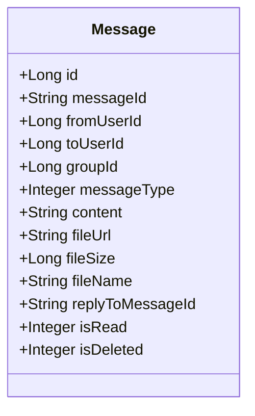
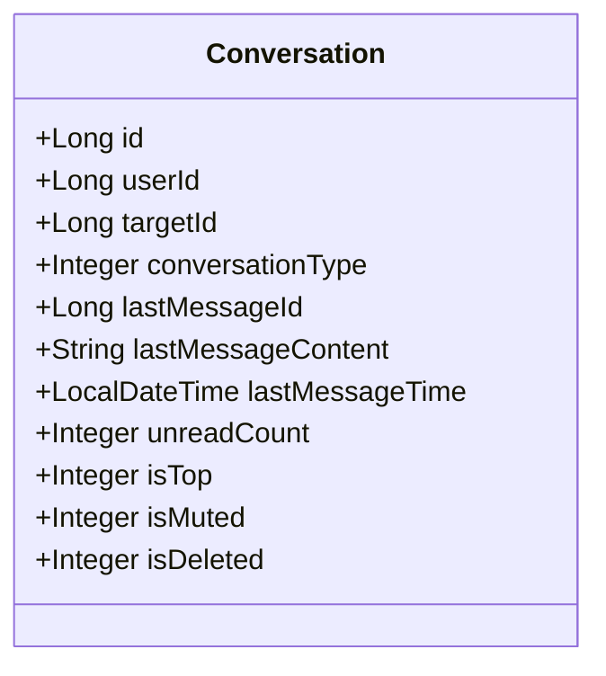
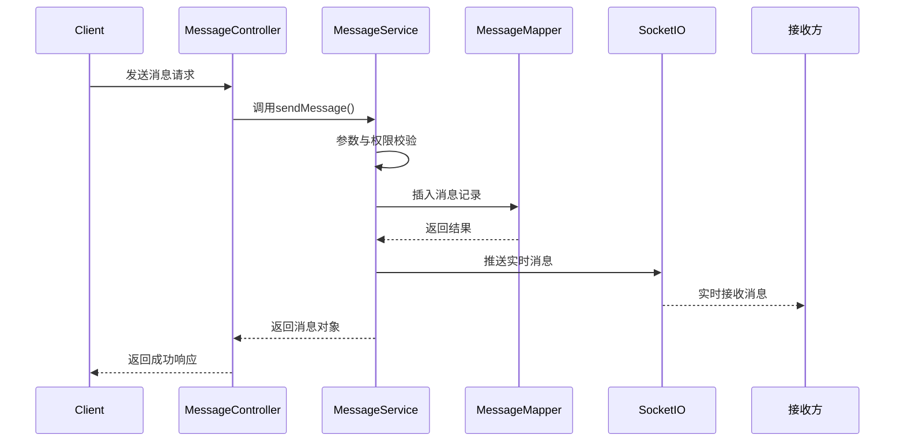
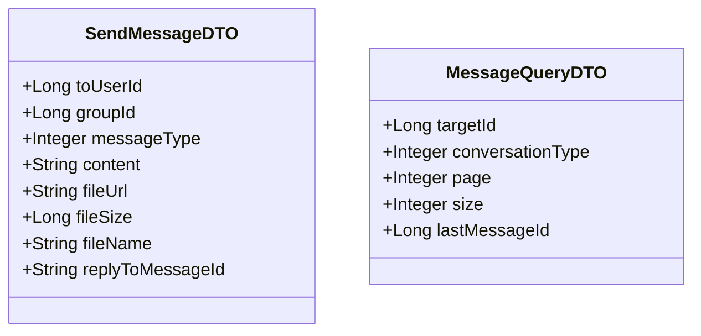
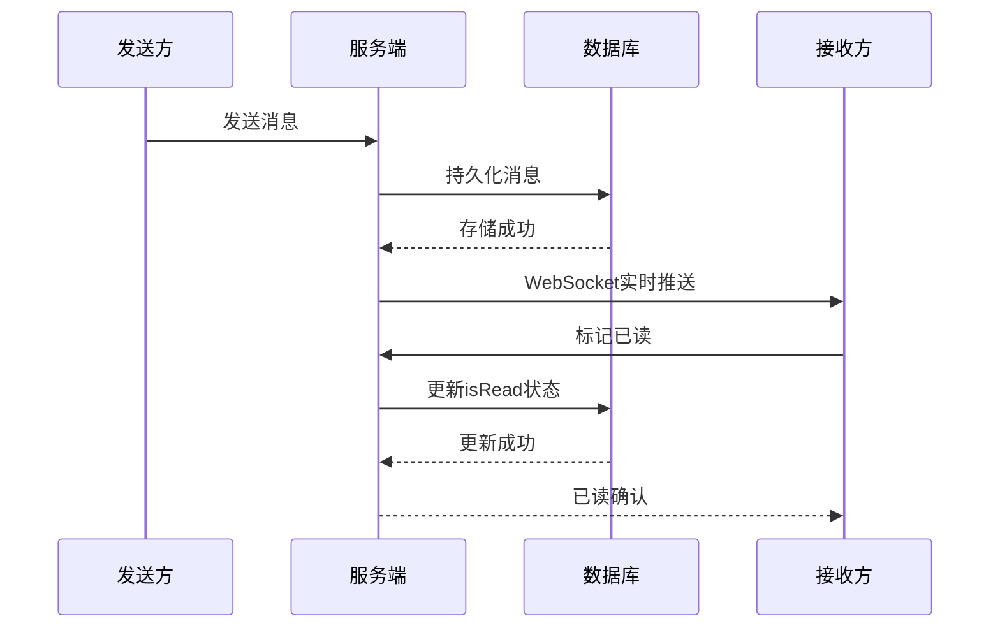
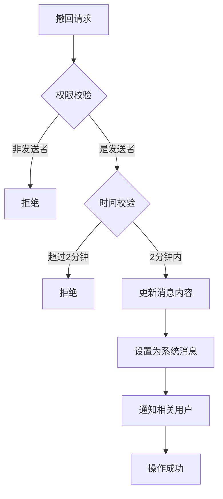

# 消息系统

<cite>
**本文档引用文件**  
- [Message.java](file://src/main/java/com/example/nettyim/entity/Message.java)
- [Conversation.java](file://src/main/java/com/example/nettyim/entity/Conversation.java)
- [SendMessageDTO.java](file://src/main/java/com/example/nettyim/dto/SendMessageDTO.java)
- [MessageQueryDTO.java](file://src/main/java/com/example/nettyim/dto/MessageQueryDTO.java)
- [MessageService.java](file://src/main/java/com/example/nettyim/service/MessageService.java)
- [MessageServiceImpl.java](file://src/main/java/com/example/nettyim/service/impl/MessageServiceImpl.java)
- [MessageController.java](file://src/main/java/com/example/nettyim/controller/MessageController.java)
</cite>

## 目录
1. [消息实体设计](#消息实体设计)
2. [会话管理机制](#会话管理机制)
3. [消息服务核心流程](#消息服务核心流程)
4. [REST API接口设计](#rest-api接口设计)
5. [数据传输对象（DTO）](#数据传输对象dto)
6. [消息生命周期与实时通信](#消息生命周期与实时通信)
7. [消息撤回与删除机制](#消息撤回与删除机制)

## 消息实体设计

`Message` 实体类定义了消息系统的核心数据结构，包含消息的完整元信息和内容。该实体映射到数据库表 `messages`，通过 MyBatis Plus 进行持久化操作。

关键字段解析：
- **messageId**: 消息唯一标识，使用 UUID 生成，确保全局唯一性
- **fromUserId/toUserId/groupId**: 区分私聊与群聊场景，私聊时 `toUserId` 有效，群聊时 `groupId` 有效
- **messageType**: 消息类型枚举，支持文本、图片、文件、语音、视频及系统消息（6）
- **content/fileUrl/fileSize/fileName**: 消息内容载体，文本消息使用 `content`，多媒体消息使用 URL 和元数据
- **replyToMessageId**: 支持消息回复功能，记录被回复的消息ID
- **isRead**: 已读状态标识，0表示未读，1表示已读
- **isDeleted**: 软删除标识，0表示正常，1表示已删除



**图示来源**  
- [Message.java](file://src/main/java/com/example/nettyim/entity/Message.java#L1-L186)

**本节来源**  
- [Message.java](file://src/main/java/com/example/nettyim/entity/Message.java#L1-L186)

## 会话管理机制

`Conversation` 实体用于管理用户会话列表，提升消息查询效率并维护会话状态。每个用户与好友或群组的会话关系都对应一条记录。

核心字段说明：
- **userId/targetId**: 用户ID与目标ID（好友或群组），构成会话唯一性
- **conversationType**: 会话类型，1为私聊，2为群聊
- **lastMessageId/lastMessageContent/lastMessageTime**: 缓存最后一条消息的摘要信息，避免频繁查询最新消息
- **unreadCount**: 未读消息计数，支持快速展示未读状态
- **isTop/isMuted/isDeleted**: 会话个性化设置，支持置顶、免打扰和逻辑删除

该表在消息发送时被更新，确保会话列表的实时性。当新消息到达时，系统会更新对应会话的最后消息信息和未读计数。



**图示来源**  
- [Conversation.java](file://src/main/java/com/example/nettyim/entity/Conversation.java#L1-L73)

**本节来源**  
- [Conversation.java](file://src/main/java/com/example/nettyim/entity/Conversation.java#L1-L73)

## 消息服务核心流程

`MessageService` 接口定义了消息系统的核心功能，`MessageServiceImpl` 提供具体实现，采用事务管理确保数据一致性。

### 消息发送流程
1. 参数验证：检查消息类型、内容非空，确保私聊或群聊参数唯一
2. 权限校验：私聊需为好友关系，群聊需为群成员
3. 消息创建：生成唯一 `messageId`，设置发送者、接收者、内容等信息
4. 数据库持久化：通过 `MessageMapper` 插入消息记录
5. 实时推送：使用 `SocketIOServerManager` 将消息推送给接收方

### 会话更新机制
消息发送后，系统会自动更新相关用户的会话记录：
- 更新 `lastMessageId`、`lastMessageContent`、`lastMessageTime`
- 私聊场景下，接收方的 `unreadCount` 自动加1
- 群聊场景下，除发送者外的所有成员未读数增加

### 分页查询性能优化
采用基于游标的分页策略（Cursor-based Pagination），通过 `lastMessageId` 实现高效分页：
- 避免传统 `OFFSET` 分页的性能问题
- 使用 `lt("id", lastMessageId)` 实现向前翻页
- 结合 `orderByDesc("created_at")` 确保时间顺序



**图示来源**  
- [MessageServiceImpl.java](file://src/main/java/com/example/nettyim/service/impl/MessageServiceImpl.java#L50-L100)
- [MessageMapper.java](file://src/main/java/com/example/nettyim/mapper/MessageMapper.java)

**本节来源**  
- [MessageService.java](file://src/main/java/com/example/nettyim/service/MessageService.java#L1-L58)
- [MessageServiceImpl.java](file://src/main/java/com/example/nettyim/service/impl/MessageServiceImpl.java#L1-L280)

## REST API接口设计

`MessageController` 提供了完整的RESTful API接口，采用统一的 `Result` 响应格式。

关键接口说明：
- **POST /message/send**: 发送消息，接收 `fromUserId` 参数和 `SendMessageDTO` 请求体
- **POST /message/private/history**: 查询私聊历史消息，使用 `MessageQueryDTO` 封装查询条件
- **POST /message/group/history**: 查询群聊历史消息
- **POST /message/read**: 标记单条消息为已读
- **DELETE /message/{messageId}**: 删除消息（仅限发送者）
- **POST /message/{messageId}/recall**: 撤回消息（仅限发送者，2分钟内）

所有接口均进行参数校验，使用 `@Valid` 注解触发 DTO 的约束验证。

```mermaid
flowchart TD
A[客户端请求] --> B{请求类型}
B --> |发送消息| C[/message/send POST]
B --> |查询私聊历史| D[/message/private/history POST]
B --> |查询群聊历史| E[/message/group/history POST]
B --> |标记已读| F[/message/read POST]
B --> |删除消息| G[/message/{id} DELETE]
B --> |撤回消息| H[/message/{id}/recall POST]
C --> I[MessageController]
D --> I
E --> I
F --> I
G --> I
H --> I
I --> J[MessageService]
J --> K[数据库操作]
J --> L[实时推送]
K --> M[(MySQL)]
L --> N[WebSocket]
```

**图示来源**  
- [MessageController.java](file://src/main/java/com/example/nettyim/controller/MessageController.java#L1-L114)

**本节来源**  
- [MessageController.java](file://src/main/java/com/example/nettyim/controller/MessageController.java#L1-L114)

## 数据传输对象（DTO）

DTO 用于封装接口参数，实现前后端数据解耦和输入验证。

### SendMessageDTO
用于消息发送请求，包含：
- **toUserId/groupId**: 接收方标识
- **messageType**: 消息类型，使用 `@NotNull` 校验
- **content**: 消息内容，使用 `@NotBlank` 和 `@Size(max=5000)` 限制
- **fileUrl/fileSize/fileName**: 文件相关元数据
- **replyToMessageId**: 回复消息ID

### MessageQueryDTO
用于消息查询请求，包含：
- **targetId**: 会话目标ID
- **conversationType**: 会话类型，1为私聊，2为群聊
- **page/size**: 分页参数，默认每页20条
- **lastMessageId**: 游标分页的起始ID

所有字段均进行有效性校验，确保接口输入的合法性。



**图示来源**  
- [SendMessageDTO.java](file://src/main/java/com/example/nettyim/dto/SendMessageDTO.java#L1-L121)
- [MessageQueryDTO.java](file://src/main/java/com/example/nettyim/dto/MessageQueryDTO.java#L1-L79)

**本节来源**  
- [SendMessageDTO.java](file://src/main/java/com/example/nettyim/dto/SendMessageDTO.java#L1-L121)
- [MessageQueryDTO.java](file://src/main/java/com/example/nettyim/dto/MessageQueryDTO.java#L1-L79)

## 消息生命周期与实时通信

一条消息的完整生命周期包括：发送 → 持久化 → 实时推送 → 接收 → 已读回执。

### 消息发送到存储流程
1. 客户端调用 `/message/send` 接口
2. 服务端验证参数和权限
3. 创建 `Message` 对象并持久化到数据库
4. 更新相关会话的最后消息信息
5. 通过 WebSocket 实时推送给接收方

### 已读回执实现
- 接收方打开聊天窗口时，调用 `/message/read` 接口
- 服务端验证权限后更新 `isRead` 状态为1
- 可通过 `/message/unread/count` 接口获取未读消息数量
- 群聊场景下，系统采用简化处理，未精确记录每个成员的阅读状态



**图示来源**  
- [MessageServiceImpl.java](file://src/main/java/com/example/nettyim/service/impl/MessageServiceImpl.java#L50-L100)
- [SocketIOEventHandler.java](file://src/main/java/com/example/nettyim/websocket/SocketIOEventHandler.java#L300-L341)

**本节来源**  
- [MessageServiceImpl.java](file://src/main/java/com/example/nettyim/service/impl/MessageServiceImpl.java#L50-L100)
- [MessageController.java](file://src/main/java/com/example/nettyim/controller/MessageController.java#L60-L75)

## 消息撤回与删除机制

### 消息撤回
- **权限控制**: 仅消息发送者可撤回
- **时间限制**: 仅允许撤回2分钟内的消息，通过 `createdAt.isBefore(now.minusMinutes(2))` 判断
- **实现方式**: 
  - 更新消息内容为"[此消息已被撤回]"
  - 修改消息类型为6（系统消息）
  - 通知相关用户消息已撤回

### 消息删除
- **权限控制**: 仅消息发送者可删除
- **实现方式**: 软删除，设置 `isDeleted=1`
- **通知机制**: 通过 WebSocket 通知相关用户消息已删除

两种操作均通过事务保证数据一致性，并实时通知相关用户。



**图示来源**  
- [MessageServiceImpl.java](file://src/main/java/com/example/nettyim/service/impl/MessageServiceImpl.java#L240-L271)

**本节来源**  
- [MessageServiceImpl.java](file://src/main/java/com/example/nettyim/service/impl/MessageServiceImpl.java#L240-L271)
- [MessageController.java](file://src/main/java/com/example/nettyim/controller/MessageController.java#100-L114)