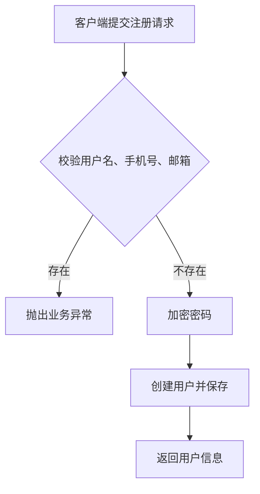
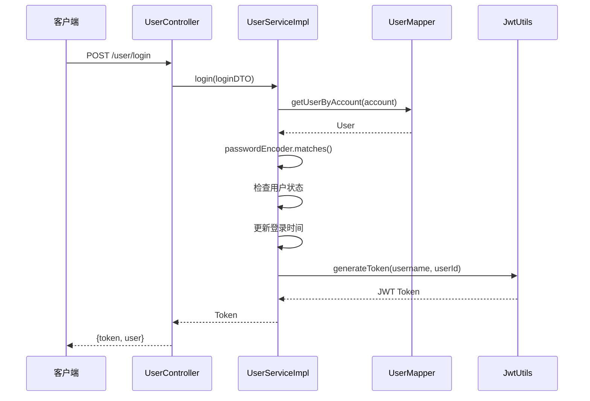
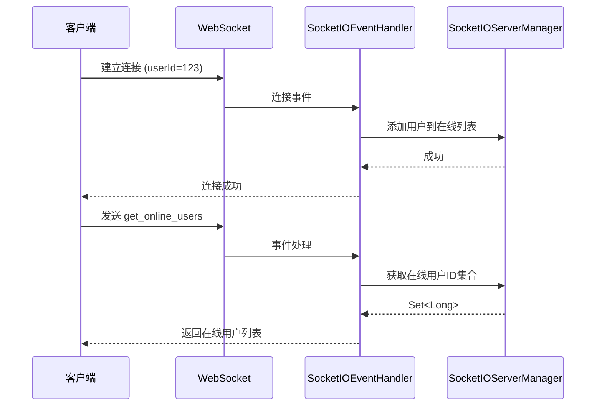

# 用户系统

<cite>
**本文档引用文件**  
- [UserService.java](file://src/main/java/com/example/nettyim/service/UserService.java)
- [UserServiceImpl.java](file://src/main/java/com/example/nettyim/service/impl/UserServiceImpl.java)
- [UserController.java](file://src/main/java/com/example/nettyim/controller/UserController.java)
- [User.java](file://src/main/java/com/example/nettyim/entity/User.java)
- [UserStatus.java](file://src/main/java/com/example/nettyim/entity/enums/UserStatus.java)
- [UserSession.java](file://src/main/java/com/example/nettyim/entity/UserSession.java)
- [PasswordConfig.java](file://src/main/java/com/example/nettyim/config/PasswordConfig.java)
- [JwtUtils.java](file://src/main/java/com/example/nettyim/utils/JwtUtils.java)
- [UserRegisterDTO.java](file://src/main/java/com/example/nettyim/dto/UserRegisterDTO.java)
- [UserLoginDTO.java](file://src/main/java/com/example/nettyim/dto/UserLoginDTO.java)
- [SocketIOEventHandler.java](file://src/main/java/com/example/nettyim/websocket/SocketIOEventHandler.java)
</cite>

## 目录
1. [简介](#简介)
2. [核心组件](#核心组件)
3. [用户注册与登录流程](#用户注册与登录流程)
4. [用户信息更新与状态管理](#用户信息更新与状态管理)
5. [数据传输对象（DTO）与校验规则](#数据传输对象dto与校验规则)
6. [用户实体与数据库映射](#用户实体与数据库映射)
7. [WebSocket 会话与在线状态同步](#websocket-会话与在线状态同步)
8. [安全机制：密码加密与 JWT 验证](#安全机制密码加密与-jwt-验证)
9. [模块交互与事件广播](#模块交互与事件广播)
10. [异常处理与返回格式](#异常处理与返回格式)

## 简介
本系统实现了完整的用户管理功能，涵盖用户注册、登录、信息更新、实名认证及在线状态管理。系统采用分层架构，通过 `UserService` 接口定义业务契约，`UserServiceImpl` 实现具体逻辑，`UserController` 提供 RESTful 接口。用户数据通过 MyBatis Plus 持久化至数据库，使用 BCrypt 加密密码，并通过 JWT 实现无状态认证。WebSocket 用于实时通信，用户登录后自动建立会话并同步在线状态。

## 核心组件

### UserService 接口
定义了用户系统的核心业务方法，包括注册、登录、信息查询、更新、状态变更和实名认证。

**Section sources**
- [UserService.java](file://src/main/java/com/example/nettyim/service/UserService.java#L11-L72)

### UserServiceImpl 实现类
实现了 `UserService` 接口，包含事务管理，依赖 `UserMapper` 进行数据库操作，`PasswordEncoder` 用于密码加密，`JwtUtils` 用于生成和验证 JWT。

**Section sources**
- [UserServiceImpl.java](file://src/main/java/com/example/nettyim/service/impl/UserServiceImpl.java#L22-L236)

### UserController 控制器
提供 REST API 接口，处理 HTTP 请求，调用 `UserService` 并返回标准化响应（`Result` 对象）。

**Section sources**
- [UserController.java](file://src/main/java/com/example/nettyim/controller/UserController.java#L19-L118)

## 用户注册与登录流程

### 注册流程
1. 客户端提交 `UserRegisterDTO` 数据
2. 系统校验用户名、手机号、邮箱是否已存在
3. 使用 `BCryptPasswordEncoder` 加密密码
4. 创建 `User` 实体并插入数据库
5. 返回用户信息（密码字段为空）



**Diagram sources**
- [UserServiceImpl.java](file://src/main/java/com/example/nettyim/service/impl/UserServiceImpl.java#L25-L50)
- [UserRegisterDTO.java](file://src/main/java/com/example/nettyim/dto/UserRegisterDTO.java#L12-L74)

### 登录流程
1. 客户端提交 `UserLoginDTO`（账号+密码）
2. 根据账号（用户名或手机号）查找用户
3. 验证密码是否匹配
4. 检查用户是否被禁用
5. 更新最后登录时间
6. 调用 `JwtUtils.generateToken()` 生成 JWT
7. 返回 Token 和用户信息



**Diagram sources**
- [UserServiceImpl.java](file://src/main/java/com/example/nettyim/service/impl/UserServiceImpl.java#L72-L97)
- [JwtUtils.java](file://src/main/java/com/example/nettyim/utils/JwtUtils.java#L15-L122)

## 用户信息更新与状态管理

### 信息更新
支持更新昵称、头像和在线状态。系统先查询用户，更新字段后持久化。

**Section sources**
- [UserServiceImpl.java](file://src/main/java/com/example/nettyim/service/impl/UserServiceImpl.java#L115-L140)

### 在线状态管理
通过 `updateOnlineStatus` 方法更新用户在线状态（0-离线，1-在线，2-忙碌，3-离开）。

**Section sources**
- [UserServiceImpl.java](file://src/main/java/com/example/nettyim/service/impl/UserServiceImpl.java#L142-L148)
- [UserController.java](file://src/main/java/com/example/nettyim/controller/UserController.java#L74-L82)

## 数据传输对象（DTO）与校验规则

### UserRegisterDTO
| 字段 | 校验规则 |
|------|----------|
| username | 非空，长度3-50 |
| email | 可选，格式正确 |
| phone | 非空，11位手机号格式 |
| password | 非空，长度6-20 |
| nickname | 非空，长度1-50 |

**Section sources**
- [UserRegisterDTO.java](file://src/main/java/com/example/nettyim/dto/UserRegisterDTO.java#L12-L74)

### UserLoginDTO
| 字段 | 校验规则 |
|------|----------|
| account | 非空（用户名或手机号） |
| password | 非空 |

**Section sources**
- [UserLoginDTO.java](file://src/main/java/com/example/nettyim/dto/UserLoginDTO.java#L9-L34)

## 用户实体与数据库映射

### User 实体字段说明
| 字段 | 类型 | 说明 |
|------|------|------|
| id | Long | 用户ID，主键自增 |
| username | String | 用户名，唯一 |
| email | String | 邮箱，可选 |
| phone | String | 手机号，唯一 |
| password | String | 加密后的密码 |
| nickname | String | 昵称 |
| avatar | String | 头像URL |
| status | Integer | 状态：0-禁用，1-启用 |
| onlineStatus | Integer | 在线状态：0-离线，1-在线，2-忙碌，3-离开 |
| lastLoginTime | LocalDateTime | 最后登录时间 |
| identityStatus | Integer | 实名认证状态：0-未认证，1-已认证 |
| idCardNumber | String | 身份证号码 |
| realName | String | 真实姓名 |

**Section sources**
- [User.java](file://src/main/java/com/example/nettyim/entity/User.java#L13-L227)

### 数据库映射
使用 MyBatis Plus `@TableName("users")` 注解映射到 `users` 表。

**Section sources**
- [User.java](file://src/main/java/com/example/nettyim/entity/User.java#L11-L11)

## WebSocket 会话与在线状态同步

### UserSession 实体
维护用户会话信息，包括：
- userId：用户ID
- sessionId：Socket会话ID
- deviceType：设备类型
- ipAddress：IP地址
- userAgent：用户代理
- loginTime：登录时间
- lastActiveTime：最后活跃时间
- status：会话状态（0-离线，1-在线）

**Section sources**
- [UserSession.java](file://src/main/java/com/example/nettyim/entity/UserSession.java#L13-L63)

### 在线状态同步
用户登录后，前端通过 WebSocket 连接，携带 `userId` 参数。`SocketIOEventHandler` 监听连接事件，将用户加入在线列表，并可通过 `get_online_users` 事件获取当前在线用户。



**Diagram sources**
- [SocketIOEventHandler.java](file://src/main/java/com/example/nettyim/websocket/SocketIOEventHandler.java#L320-L331)
- [SocketIOServerManager.java](file://src/main/java/com/example/nettyim/websocket/SocketIOServerManager.java)

## 安全机制：密码加密与 JWT 验证

### 密码加密
使用 `BCryptPasswordEncoder` 对密码进行哈希加密，配置在 `PasswordConfig` 中。

```java
@Bean
public PasswordEncoder passwordEncoder() {
    return new BCryptPasswordEncoder();
}
```

**Section sources**
- [PasswordConfig.java](file://src/main/java/com/example/nettyim/config/PasswordConfig.java#L10-L17)

### JWT 令牌
`JwtUtils` 负责生成和验证 JWT，包含：
- `generateToken()`：生成带用户ID和用户名的Token
- `validateToken()`：验证Token有效性
- `getUserIdFromToken()`：从Token提取用户ID

**Section sources**
- [JwtUtils.java](file://src/main/java/com/example/nettyim/utils/JwtUtils.java#L15-L122)

## 模块交互与事件广播

### 登录后 WebSocket 绑定
用户登录成功后，前端使用返回的 Token 和用户ID建立 WebSocket 连接，实现消息实时推送。

### 状态变更广播
当用户在线状态变更时，可通过 WebSocket 向好友或群组广播状态更新事件。

**Section sources**
- [UserController.java](file://src/main/java/com/example/nettyim/controller/UserController.java#L44-L52)
- [SocketIOEventHandler.java](file://src/main/java/com/example/nettyim/websocket/SocketIOEventHandler.java)

## 异常处理与返回格式

### 异常处理
系统使用 `BusinessException` 抛出业务异常，由 `GlobalExceptionHandler` 统一捕获并返回标准化错误信息。

### 返回格式
使用 `Result<T>` 包装返回数据，结构如下：
```json
{
  "success": true,
  "message": "登录成功",
  "data": {
    "token": "eyJhbGciOiJIUzI1Ni...",
    "user": { "id": 1, "username": "test", "nickname": "测试" }
  }
}
```

**Section sources**
- [Result.java](file://src/main/java/com/example/nettyim/dto/Result.java#L11-L11)
- [GlobalExceptionHandler.java](file://src/main/java/com/example/nettyim/exception/GlobalExceptionHandler.java)