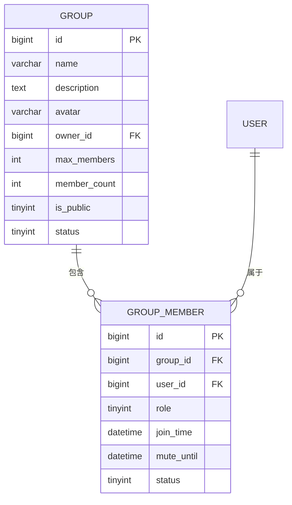
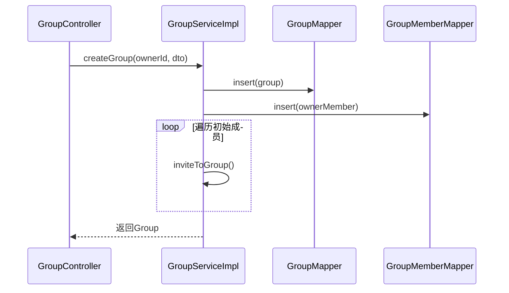
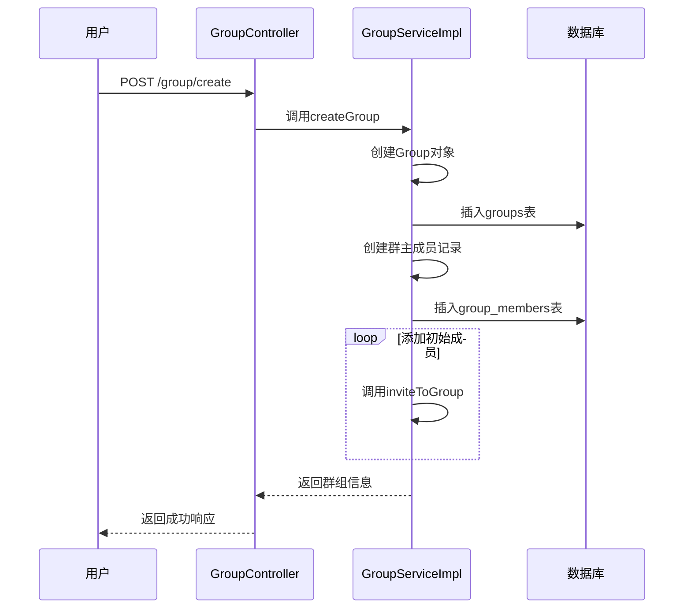
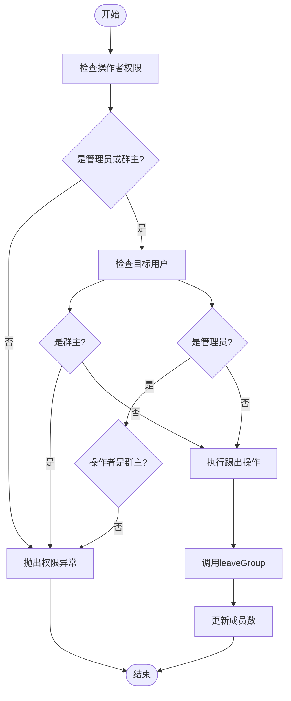

# 群组系统

<cite>
**本文档引用文件**  
- [Group.java](file://src/main/java/com/example/nettyim/entity/Group.java)
- [GroupMember.java](file://src/main/java/com/example/nettyim/entity/GroupMember.java)
- [GroupService.java](file://src/main/java/com/example/nettyim/service/GroupService.java)
- [GroupServiceImpl.java](file://src/main/java/com/example/nettyim/service/impl/GroupServiceImpl.java)
- [GroupController.java](file://src/main/java/com/example/nettyim/controller/GroupController.java)
- [CreateGroupDTO.java](file://src/main/java/com/example/nettyim/dto/CreateGroupDTO.java)
- [schema.sql](file://src/main/resources/schema.sql)
</cite>

## 目录
1. [简介](#简介)
2. [实体模型设计](#实体模型设计)
3. [核心服务实现](#核心服务实现)
4. [API接口设计](#api接口设计)
5. [数据传输对象与校验](#数据传输对象与校验)
6. [典型业务流程分析](#典型业务流程分析)
7. [权限控制机制](#权限控制机制)
8. [总结](#总结)

## 简介
本系统实现了完整的群组管理功能，涵盖群组创建、成员管理、权限分配、信息更新和群组解散等核心操作。系统通过`Group`和`GroupMember`两个实体构建群组与成员的关系模型，并结合`GroupService`和`GroupController`提供事务安全的服务层与RESTful接口。

## 实体模型设计

### 群组与成员关系模型
系统采用主从表结构设计群组与成员的多对多关系：

- `Group` 表存储群组基本信息
- `GroupMember` 表记录用户与群组的关联关系



**图示来源**  
- [Group.java](file://src/main/java/com/example/nettyim/entity/Group.java#L11-L134)
- [GroupMember.java](file://src/main/java/com/example/nettyim/entity/GroupMember.java#L13-L110)
- [schema.sql](file://src/main/resources/schema.sql#L100-L134)

### 群主标识与角色权限设计
#### 群主标识
通过 `Group` 实体中的 `ownerId` 字段明确指定群主，确保群主身份的唯一性和可追溯性。

#### 角色权限字段
`GroupMember` 中的 `role` 字段定义了三种角色：
- `0`: 普通成员
- `1`: 管理员
- `2`: 群主

该设计支持细粒度权限控制，便于在服务层进行权限校验。

**本节来源**  
- [Group.java](file://src/main/java/com/example/nettyim/entity/Group.java#L45-L50)
- [GroupMember.java](file://src/main/java/com/example/nettyim/entity/GroupMember.java#L35-L40)

## 核心服务实现

### 群组创建与事务处理
`GroupServiceImpl.createGroup` 方法实现群组创建逻辑，包含以下关键步骤：

1. 创建群组记录
2. 添加群主为初始成员
3. 批量邀请初始成员

该方法使用 `@Transactional` 注解保证操作的原子性，确保数据一致性。



**图示来源**  
- [GroupServiceImpl.java](file://src/main/java/com/example/nettyim/service/impl/GroupServiceImpl.java#L23-L65)

**本节来源**  
- [GroupServiceImpl.java](file://src/main/java/com/example/nettyim/service/impl/GroupServiceImpl.java#L23-L65)

### 成员初始化逻辑
创建群组时，自动将创建者（`ownerId`）作为群主加入群组，设置角色为 `2`，并初始化成员数为 `1`。

### 邀请成员通知机制
`inviteToGroup` 方法支持批量邀请，系统会逐个检查被邀请用户的存在性、成员状态和群组容量，确保邀请过程的安全性和健壮性。

## API接口设计

### 接口路径与参数处理
`GroupController` 提供RESTful API，路径参数与请求体处理方式如下：

| 方法 | 路径 | 参数类型 | 说明 |
|------|------|---------|------|
| POST | `/group/create` | @RequestBody | CreateGroupDTO |
| POST | `/group/invite` | @RequestBody | List<Long> userIds |
| GET | `/group/{groupId}` | @PathVariable | 群组ID |
| PUT | `/group/{groupId}` | @RequestParam | 可选更新字段 |

```mermaid
flowchart TD
A[HTTP请求] --> B{路径匹配}
B --> |/create| C[解析CreateGroupDTO]
B --> |/invite| D[解析用户ID列表]
B --> |/{groupId}| E[提取路径参数]
C --> F[调用GroupService]
D --> F
E --> F
F --> G[返回Result封装]
```

**图示来源**  
- [GroupController.java](file://src/main/java/com/example/nettyim/controller/GroupController.java#L16-L173)

**本节来源**  
- [GroupController.java](file://src/main/java/com/example/nettyim/controller/GroupController.java#L16-L173)

## 数据传输对象与校验

### CreateGroupDTO参数校验
`CreateGroupDTO` 使用JSR-303注解实现参数校验：

- `@NotBlank`: 确保群组名称非空
- `@Size`: 限制名称长度（1-100）和描述长度（≤500）
- 默认值设置：`maxMembers=500`, `isPublic=1`

```mermaid
classDiagram
class CreateGroupDTO {
+String name
+String description
+String avatar
+Integer maxMembers
+Integer isPublic
+List<Long> memberIds
}
note right of CreateGroupDTO
校验规则：
- name : 非空，1-100字符
- description : ≤500字符
- maxMembers : 默认500
- isPublic : 默认1(公开)
end note
```

**图示来源**  
- [CreateGroupDTO.java](file://src/main/java/com/example/nettyim/dto/CreateGroupDTO.java#L11-L80)

**本节来源**  
- [CreateGroupDTO.java](file://src/main/java/com/example/nettyim/dto/CreateGroupDTO.java#L11-L80)

### 群组成员查询分页实现
虽然当前实现未直接体现分页，但可通过扩展 `getGroupMembers` 方法实现分页查询：

```java
Page<User> getGroupMembers(Long groupId, Pageable pageable)
```

当前实现按角色降序、加入时间升序排序，确保群主和管理员优先显示。

**本节来源**  
- [GroupServiceImpl.java](file://src/main/java/com/example/nettyim/service/impl/GroupServiceImpl.java#L275-L295)

## 典型业务流程分析

### 用户发起群聊：群组创建全过程


**图示来源**  
- [GroupServiceImpl.java](file://src/main/java/com/example/nettyim/service/impl/GroupServiceImpl.java#L23-L65)
- [GroupController.java](file://src/main/java/com/example/nettyim/controller/GroupController.java#L25-L30)

### 管理员踢出成员：权限校验逻辑


**图示来源**  
- [GroupServiceImpl.java](file://src/main/java/com/example/nettyim/service/impl/GroupServiceImpl.java#L130-L150)

**本节来源**  
- [GroupServiceImpl.java](file://src/main/java/com/example/nettyim/service/impl/GroupServiceImpl.java#L130-L150)

## 权限控制机制
系统通过以下方式实现权限控制：

1. **角色判断方法**：
   - `isOwner()`: 检查是否为群主
   - `isAdmin()`: 检查是否为管理员
   - `isMember()`: 检查是否为成员

2. **操作权限校验**：
   - 只有群主可解散群组
   - 管理员只能由群主设置
   - 群主不能被踢出
   - 管理员只能被群主踢出

这些校验逻辑分布在各个服务方法中，确保操作的安全性。

**本节来源**  
- [GroupService.java](file://src/main/java/com/example/nettyim/service/GroupService.java#L12-L93)
- [GroupServiceImpl.java](file://src/main/java/com/example/nettyim/service/impl/GroupServiceImpl.java#L130-L150)

## 总结
本群组系统实现了完整的群组管理功能，具有以下特点：

- **清晰的实体关系**：通过`Group`和`GroupMember`实现灵活的群组成员管理
- **安全的权限控制**：基于角色的权限校验确保操作合法性
- **事务性操作**：关键操作使用事务保证数据一致性
- **规范的API设计**：RESTful接口配合DTO校验提升系统健壮性
- **可扩展的架构**：分层设计便于功能扩展和维护

系统已具备生产级群组管理能力，可支持即时通讯场景下的群聊需求。