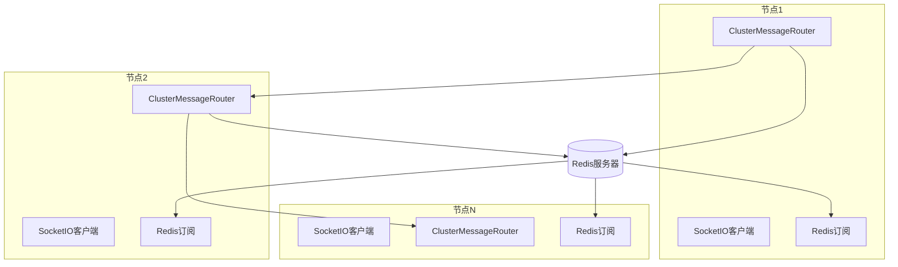
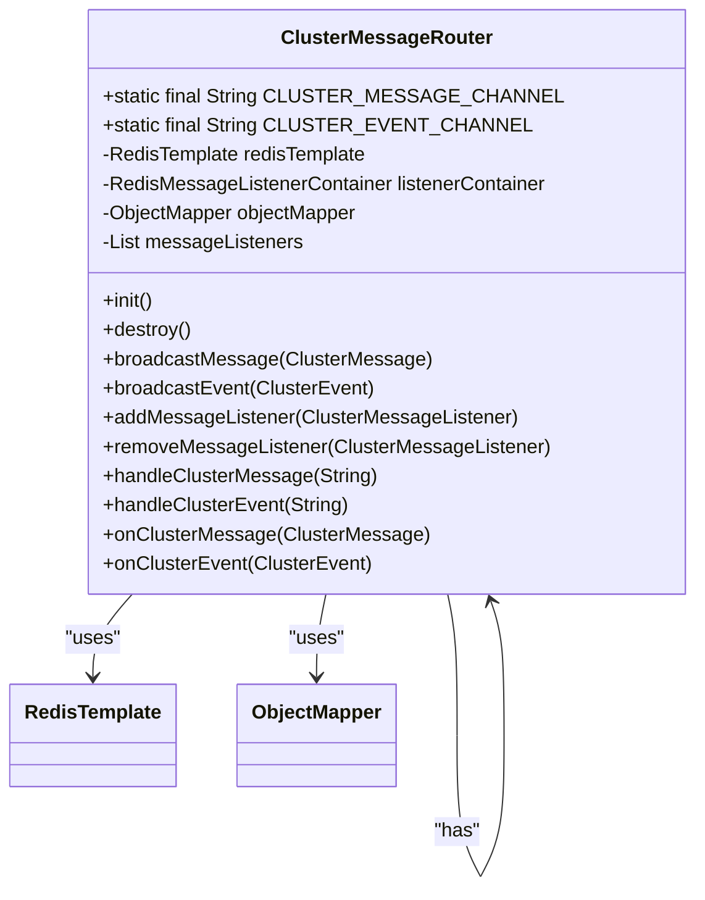
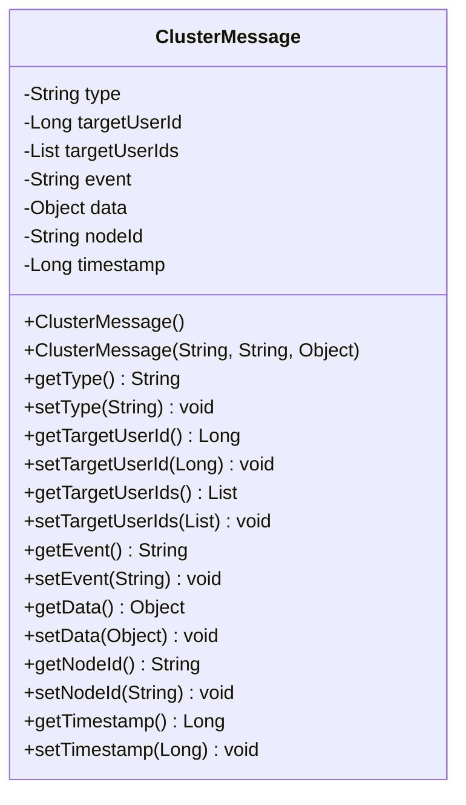
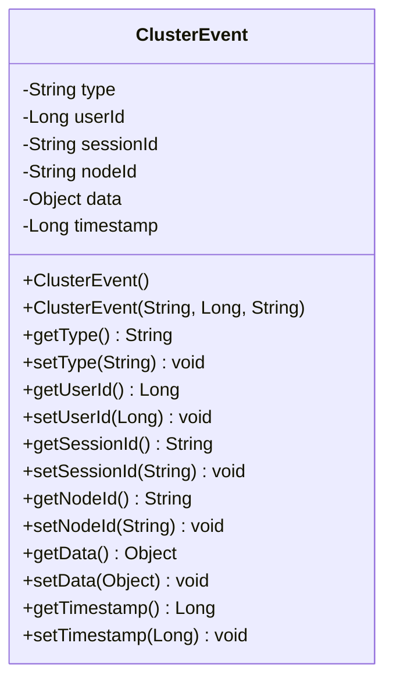
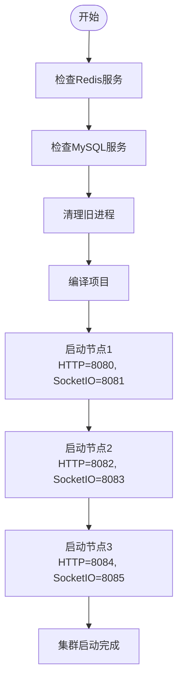
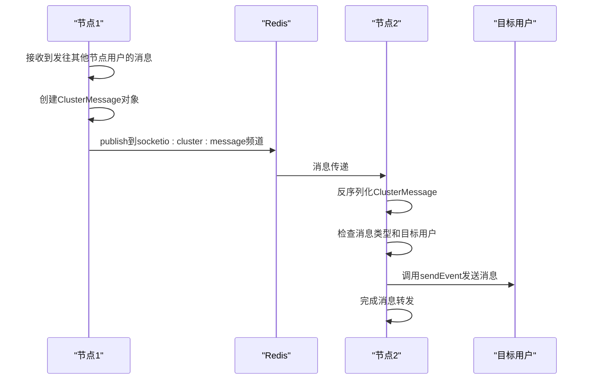

# 集群系统

<cite>
**本文档中引用的文件**   
- [ClusterMessageRouter.java](file://src/main/java/com/example/nettyim/cluster/ClusterMessageRouter.java)
- [ClusterMessage.java](file://src/main/java/com/example/nettyim/cluster/ClusterMessage.java)
- [ClusterEvent.java](file://src/main/java/com/example/nettyim/cluster/ClusterEvent.java)
- [application-cluster.yml](file://src/main/resources/application-cluster.yml)
- [CLUSTER_DEPLOYMENT.md](file://CLUSTER_DEPLOYMENT.md)
- [start-cluster.sh](file://start-cluster.sh)
</cite>

## 目录
1. [引言](#引言)
2. [集群通信架构概述](#集群通信架构概述)
3. [核心组件分析](#核心组件分析)
4. [消息结构与序列化机制](#消息结构与序列化机制)
5. [集群配置详解](#集群配置详解)
6. [多节点部署流程](#多节点部署流程)
7. [跨节点消息路由流程](#跨节点消息路由流程)
8. [水平扩展能力分析](#水平扩展能力分析)
9. [总结](#总结)

## 引言

本系统实现了基于Netty-SocketIO的分布式集群架构，支持多节点横向扩展和高可用性部署。通过Redis Pub/Sub机制，系统实现了跨节点的消息路由、会话共享和状态同步，确保在大规模并发场景下的稳定性和可靠性。本文档将深入解析系统的集群通信架构，重点说明消息路由机制、数据结构设计和部署流程。

## 集群通信架构概述

系统采用Redis作为核心的分布式消息中间件，通过Pub/Sub模式实现节点间的通信。每个SocketIO节点既是消息的发布者也是订阅者，形成一个去中心化的通信网络。当用户连接到任意节点时，其会话信息会被存储在Redis中，其他节点可以通过订阅特定频道获取这些信息。

集群架构的关键特点是实现了无状态的服务节点，所有节点通过Redis进行状态同步和消息传递。这种设计使得系统可以轻松地进行水平扩展，只需增加新的节点并配置正确的Redis连接信息即可。



**Diagram sources**
- [ClusterMessageRouter.java](file://src/main/java/com/example/nettyim/cluster/ClusterMessageRouter.java#L1-L150)
- [SocketIOServerManager.java](file://src/main/java/com/example/nettyim/websocket/SocketIOServerManager.java#L1-L295)

**Section sources**
- [ClusterMessageRouter.java](file://src/main/java/com/example/nettyim/cluster/ClusterMessageRouter.java#L1-L150)
- [SocketIOServerManager.java](file://src/main/java/com/example/nettyim/websocket/SocketIOServerManager.java#L1-L295)

## 核心组件分析

### ClusterMessageRouter

`ClusterMessageRouter`是集群通信的核心组件，负责在不同SocketIO节点之间路由消息。该组件通过Redis的Pub/Sub机制实现跨节点通信，使用两个独立的频道分别传输消息和事件。

组件在初始化时会订阅`socketio:cluster:message`和`socketio:cluster:event`两个频道，分别用于接收集群消息和集群事件。通过`broadcastMessage`和`broadcastEvent`方法，可以将消息广播到所有节点。组件还维护了一个监听器列表，当接收到消息时会通知所有注册的监听器。



**Diagram sources**
- [ClusterMessageRouter.java](file://src/main/java/com/example/nettyim/cluster/ClusterMessageRouter.java#L1-L150)

**Section sources**
- [ClusterMessageRouter.java](file://src/main/java/com/example/nettyim/cluster/ClusterMessageRouter.java#L1-L150)

### SocketIOServerManager

`SocketIOServerManager`是SocketIO服务器的管理器，实现了`ClusterMessageListener`接口，能够接收和处理来自其他节点的集群消息。该组件负责管理用户连接、处理消息路由和维护节点状态。

当用户连接或断开时，组件会广播相应的集群事件，通知其他节点用户状态的变化。在接收到集群消息时，会根据消息类型进行相应的处理，如向指定用户发送消息、向群组发送消息或广播消息。

## 消息结构与序列化机制

### ClusterMessage消息体结构

`ClusterMessage`类定义了集群消息的数据结构，包含以下关键字段：

- **type**: 消息类型，用于区分不同的消息操作
- **targetUserId**: 目标用户ID，用于私聊消息
- **targetUserIds**: 目标用户ID列表，用于群聊消息
- **event**: 事件名称，指定要触发的客户端事件
- **data**: 消息数据，可以是任意对象
- **nodeId**: 发送节点ID，用于避免消息回环
- **timestamp**: 时间戳，用于消息排序和过期处理



**Diagram sources**
- [ClusterMessage.java](file://src/main/java/com/example/nettyim/cluster/ClusterMessage.java#L1-L110)

**Section sources**
- [ClusterMessage.java](file://src/main/java/com/example/nettyim/cluster/ClusterMessage.java#L1-L110)

### 序列化机制

系统使用Jackson库进行消息的序列化和反序列化。`ClusterMessageRouter`在发送消息前会将`ClusterMessage`对象转换为JSON字符串，接收时再将JSON字符串反序列化为对象。这种机制确保了消息在不同节点间的正确传输和解析。

序列化过程中使用了`@JsonIgnoreProperties(ignoreUnknown = true)`注解，允许在反序列化时忽略未知字段，提高了系统的兼容性和健壮性。

### ClusterEvent枚举作用

`ClusterEvent`类用于定义集群事件，其主要作用是分类和标识不同类型的集群事件。目前系统支持两种主要事件类型：

- **USER_ONLINE**: 用户上线事件，当用户连接到某个节点时触发
- **USER_OFFLINE**: 用户下线事件，当用户断开连接时触发

这些事件通过集群广播机制通知所有节点，使各节点能够及时更新用户状态信息，实现跨节点的状态同步。



**Diagram sources**
- [ClusterEvent.java](file://src/main/java/com/example/nettyim/cluster/ClusterEvent.java#L1-L100)

**Section sources**
- [ClusterEvent.java](file://src/main/java/com/example/nettyim/cluster/ClusterEvent.java#L1-L100)

## 集群配置详解

### application-cluster.yml配置

`application-cluster.yml`文件定义了集群模式下的关键参数设置：

```yaml
spring:
  profiles:
    active: cluster
  
  data:
    redis:
      host: localhost
      port: 6379
      database: 0

socketio:
  cluster:
    enabled: true
    nodeId: ${NODE_ID:node-1}
```

关键配置项包括：

- **spring.profiles.active**: 激活集群配置文件
- **spring.data.redis**: Redis连接配置，指定主机、端口和数据库
- **socketio.cluster.enabled**: 启用集群模式
- **socketio.cluster.nodeId**: 节点ID，支持通过环境变量`NODE_ID`动态设置

### Redis通道名称

系统使用两个独立的Redis频道进行通信：

- **socketio:cluster:message**: 用于传输集群消息
- **socketio:cluster:event**: 用于传输集群事件

这种分离设计确保了不同类型的消息不会相互干扰，提高了系统的可维护性和调试便利性。

**Section sources**
- [application-cluster.yml](file://src/main/resources/application-cluster.yml#L1-L75)

## 多节点部署流程

### 部署准备

在部署集群之前，需要确保以下环境要求：

- JDK 21
- Maven 3.6+
- MySQL 8.0+
- Redis 6.0+

### 启动流程

系统提供了`start-cluster.sh`脚本用于启动三节点集群。脚本执行流程如下：

1. 检查Redis和MySQL服务是否运行
2. 清理之前的进程
3. 编译项目
4. 依次启动三个节点，每个节点使用不同的端口和节点ID



**Diagram sources**
- [start-cluster.sh](file://start-cluster.sh#L1-L85)
- [CLUSTER_DEPLOYMENT.md](file://CLUSTER_DEPLOYMENT.md#L1-L201)

**Section sources**
- [start-cluster.sh](file://start-cluster.sh#L1-L85)
- [CLUSTER_DEPLOYMENT.md](file://CLUSTER_DEPLOYMENT.md#L1-L201)

### 节点配置

三个节点的端口配置如下：

- **节点1**: HTTP端口8080，SocketIO端口8081
- **节点2**: HTTP端口8082，SocketIO端口8083
- **节点3**: HTTP端口8084，SocketIO端口8085

每个节点通过环境变量设置唯一的`NODE_ID`，确保在集群中的唯一性。

## 跨节点消息路由流程

### 私聊消息路由机制

当用户分布在不同服务节点时，私聊消息通过以下流程实现跨节点送达：

1. 发送方节点接收到消息请求
2. 检查目标用户是否在本地连接
3. 如果不在本地，创建`ClusterMessage`并广播到集群
4. 所有节点接收到消息，目标节点将消息转发给目标用户
5. 其他节点忽略该消息

### 消息路由示例

假设节点1接收到发往节点2用户的消息，`ClusterMessageRouter`的监听与转发流程如下：



**Diagram sources**
- [ClusterMessageRouter.java](file://src/main/java/com/example/nettyim/cluster/ClusterMessageRouter.java#L1-L150)
- [SocketIOServerManager.java](file://src/main/java/com/example/nettyim/websocket/SocketIOServerManager.java#L1-L295)

**Section sources**
- [ClusterMessageRouter.java](file://src/main/java/com/example/nettyim/cluster/ClusterMessageRouter.java#L1-L150)
- [SocketIOServerManager.java](file://src/main/java/com/example/nettyim/websocket/SocketIOServerManager.java#L1-L295)

### 路由流程说明

1. 节点1的`SocketIOServerManager`检测到目标用户不在本地
2. 创建`ClusterMessage`对象，设置类型为`SEND_TO_USER`，指定目标用户ID
3. 调用`ClusterMessageRouter`的`broadcastMessage`方法
4. `ClusterMessageRouter`将消息序列化为JSON并发布到Redis频道
5. 所有节点的`ClusterMessageRouter`接收到消息
6. 节点2的`SocketIOServerManager`作为监听器处理消息
7. 节点2检查目标用户是否在线，如果在线则发送消息

## 水平扩展能力分析

### 扩展机制

系统具有良好的水平扩展能力，主要体现在以下几个方面：

- **无状态设计**: 服务节点不存储会话状态，所有状态信息存储在Redis中
- **动态节点加入**: 新节点只需配置正确的Redis连接和节点ID即可加入集群
- **负载均衡**: 可以通过Nginx等负载均衡器将客户端请求分发到不同节点

### 扩展配置

可以通过修改`start-cluster.sh`脚本添加更多节点：

```bash
# 启动节点4
nohup java -jar target/netty-im-sample-0.0.1-SNAPSHOT.jar \
    --spring.profiles.active=cluster \
    --server.port=8086 \
    --socketio.port=8087 \
    --socketio.cluster.nodeId=node-4 \
    > logs/node4.log 2>&1 &
```

### 扩展优势

1. **高可用性**: 单个节点故障不会影响整体服务
2. **负载分担**: 客户端连接可以分散到多个节点
3. **弹性伸缩**: 可以根据负载情况动态增减节点数量
4. **维护便利**: 可以逐个节点进行升级维护，不影响整体服务

**Section sources**
- [CLUSTER_DEPLOYMENT.md](file://CLUSTER_DEPLOYMENT.md#L1-L201)
- [start-cluster.sh](file://start-cluster.sh#L1-L85)

## 总结

本系统通过Redis Pub/Sub机制实现了高效的集群通信架构，`ClusterMessageRouter`作为核心组件，利用`ClusterMessage`和`ClusterEvent`两类消息实现了跨节点的消息路由和状态同步。系统支持灵活的多节点部署，通过`application-cluster.yml`配置文件和启动脚本实现了简便的集群管理。

私聊消息的跨节点送达机制确保了用户无论连接到哪个节点都能正常通信，而基于Redis的广播机制为系统的水平扩展提供了坚实基础。整个架构设计充分考虑了高可用性、可扩展性和维护便利性，适用于大规模并发的生产环境部署。