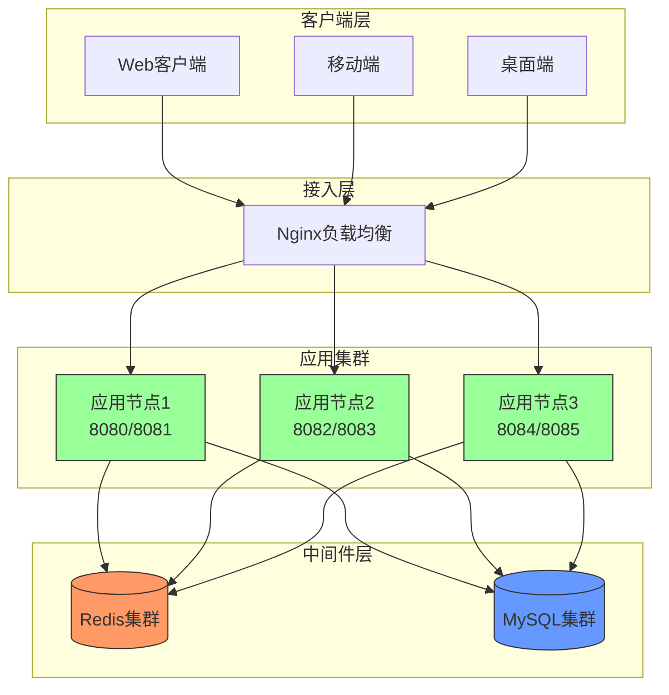
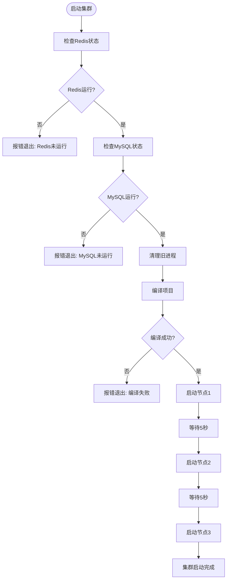
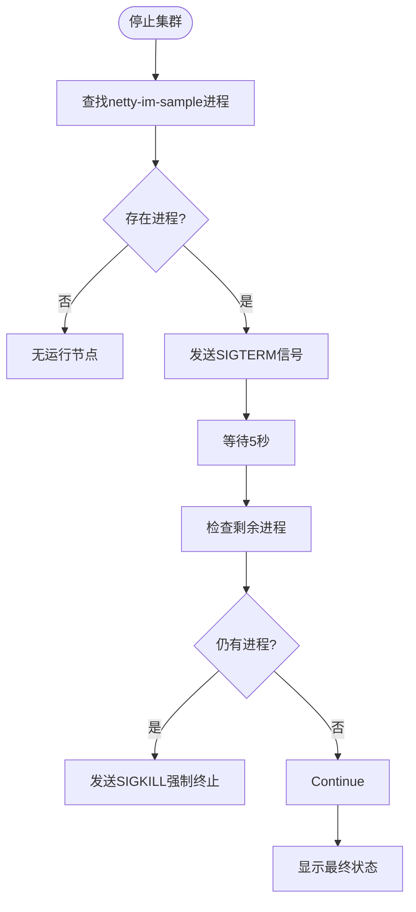

# 部署运维

<cite>
**本文档引用的文件**  
- [start-cluster.sh](file://start-cluster.sh)
- [stop-cluster.sh](file://stop-cluster.sh)
- [application-cluster.yml](file://src/main/resources/application-cluster.yml)
- [ClusterMessageRouter.java](file://src/main/java/com/example/nettyim/cluster/ClusterMessageRouter.java)
- [SocketIOConfig.java](file://src/main/java/com/example/nettyim/config/SocketIOConfig.java)
- [SocketIOServerManager.java](file://src/main/java/com/example/nettyim/websocket/SocketIOServerManager.java)
</cite>

## 目录
1. [生产环境部署步骤](#生产环境部署步骤)
2. [服务器资源配置建议](#服务器资源配置建议)
3. [多节点部署拓扑](#多节点部署拓扑)
4. [负载均衡配置](#负载均衡配置)
5. [自动化启停流程](#自动化启停流程)
6. [进程管理方案建议](#进程管理方案建议)
7. [集群健康检查方法](#集群健康检查方法)
8. [监控策略](#监控策略)
9. [故障排查指南](#故障排查指南)

## 生产环境部署步骤

本系统基于Netty-SocketIO实现即时通信功能，支持多节点集群部署。部署前需确保依赖服务已正常运行。

### 前置条件
- **Redis服务**：用于存储分布式会话及集群消息通信，端口6379
- **MySQL服务**：用于持久化用户、消息等数据，端口3306
- **Java环境**：JDK 8或以上版本
- **Maven构建工具**：用于项目编译打包

### 部署流程
1. 确保Redis和MySQL服务已启动并可访问
2. 执行`start-cluster.sh`脚本启动集群
3. 脚本将自动完成以下操作：
   - 检查Redis和MySQL服务状态
   - 清理旧进程
   - 编译项目（`mvn clean package`）
   - 启动三个独立节点，分别监听不同端口

**Section sources**
- [start-cluster.sh](file://start-cluster.sh#L1-L85)

## 服务器资源配置建议

根据系统架构和性能测试，推荐以下资源配置：

| 节点角色 | CPU核心数 | 内存 | 磁盘 | 适用场景 |
|---------|---------|------|------|---------|
| 应用节点 | 4核 | 8GB | 50GB SSD | 每个应用节点 |
| Redis主节点 | 4核 | 16GB | 100GB SSD | 缓存与会话存储 |
| MySQL主节点 | 8核 | 32GB | 500GB SSD | 数据持久化 |
| 负载均衡节点 | 2核 | 4GB | 20GB SSD | Nginx代理 |

**说明**：
- 应用节点内存建议不低于8GB，JVM堆内存可设置为4-6GB
- Redis内存需满足在线用户会话存储需求，建议每万用户预留2GB内存
- 生产环境建议启用Redis持久化（RDB+AOF）并配置主从复制

## 多节点部署拓扑

系统采用标准的微服务集群架构，拓扑结构如下：



**Diagram sources**
- [start-cluster.sh](file://start-cluster.sh#L50-L75)
- [application-cluster.yml](file://src/main/resources/application-cluster.yml#L1-L74)

**Section sources**
- [start-cluster.sh](file://start-cluster.sh#L1-L85)
- [application-cluster.yml](file://src/main/resources/application-cluster.yml#L1-L74)

## 负载均衡配置

### Nginx配置示例

```nginx
upstream socketio_nodes {
    ip_hash;  # 使用IP哈希确保同一用户连接到同一节点
    server 127.0.0.1:8081 weight=1 max_fails=3 fail_timeout=30s;
    server 127.0.0.1:8083 weight=1 max_fails=3 fail_timeout=30s;
    server 127.0.0.1:8085 weight=1 max_fails=3 fail_timeout=30s;
}

server {
    listen 80;
    server_name im.example.com;

    # WebSocket代理配置
    location /socket.io/ {
        proxy_pass http://socketio_nodes;
        proxy_http_version 1.1;
        proxy_set_header Upgrade $http_upgrade;
        proxy_set_header Connection "upgrade";
        proxy_set_header Host $host;
        proxy_set_header X-Real-IP $remote_addr;
        proxy_set_header X-Forwarded-For $proxy_add_x_forwarded_for;
        proxy_set_header X-Forwarded-Proto $scheme;
        
        # 超时设置
        proxy_connect_timeout 30s;
        proxy_send_timeout 60s;
        proxy_read_timeout 60s;
    }

    # HTTP API代理
    location /api/ {
        proxy_pass http://socketio_nodes;
        proxy_set_header Host $host;
        proxy_set_header X-Real-IP $remote_addr;
        proxy_set_header X-Forwarded-For $proxy_add_x_forwarded_for;
        proxy_set_header X-Forwarded-Proto $scheme;
    }
}
```

### 关键配置说明
- **ip_hash**：确保同一客户端始终连接到同一后端节点，避免会话不一致
- **Upgrade头**：必须传递`Upgrade`和`Connection`头以支持WebSocket协议升级
- **超时设置**：适当延长超时时间以适应长连接特性
- **健康检查**：Nginx会自动检测后端节点状态并剔除故障节点

**Section sources**
- [start-cluster.sh](file://start-cluster.sh#L50-L75)
- [application-cluster.yml](file://src/main/resources/application-cluster.yml#L1-L74)

## 自动化启停流程

系统提供`start-cluster.sh`和`stop-cluster.sh`脚本实现集群的自动化管理。

### 启动流程分析



**Diagram sources**
- [start-cluster.sh](file://start-cluster.sh#L1-L85)

**Section sources**
- [start-cluster.sh](file://start-cluster.sh#L1-L85)

### 停止流程分析



**Diagram sources**
- [stop-cluster.sh](file://stop-cluster.sh#L1-L35)

**Section sources**
- [stop-cluster.sh](file://stop-cluster.sh#L1-L35)

## 进程管理方案建议

虽然脚本提供了基本的启停功能，但生产环境建议采用更健壮的进程管理方案。

### systemd服务管理（推荐）

创建`/etc/systemd/system/netty-im.service`：

```ini
[Unit]
Description=Netty IM Service
After=network.target redis.service mysql.service

[Service]
Type=simple
User=appuser
WorkingDirectory=/opt/netty-im
ExecStart=/usr/bin/java -jar target/netty-im-sample-0.0.1-SNAPSHOT.jar --spring.profiles.active=cluster --server.port=8080 --socketio.port=8081
Restart=always
RestartSec=10
StandardOutput=journal
StandardError=journal
Environment=NODE_ID=node-1

[Install]
WantedBy=multi-user.target
```

**优势**：
- 系统启动时自动运行
- 进程崩溃后自动重启
- 集成系统日志（journalctl）
- 支持优雅启停

### Docker容器化部署

```dockerfile
FROM openjdk:8-jre-slim
COPY target/netty-im-sample-0.0.1-SNAPSHOT.jar /app.jar
EXPOSE 8080 8081
ENTRYPOINT ["java", "-jar", "/app.jar"]
```

**docker-compose.yml**：
```yaml
version: '3'
services:
  app1:
    build: .
    ports:
      - "8080:8080"
      - "8081:8081"
    environment:
      - SERVER_PORT=8080
      - SOCKETIO_PORT=8081
      - NODE_ID=node-1
      - SPRING_PROFILES_ACTIVE=cluster
    depends_on:
      - redis
      - mysql

  redis:
    image: redis:7-alpine
    ports:
      - "6379:6379"

  mysql:
    image: mysql:8
    environment:
      MYSQL_ROOT_PASSWORD: root
      MYSQL_DATABASE: netty_im
```

**优势**：
- 环境一致性
- 资源隔离
- 易于扩展和编排
- 与Kubernetes集成

**Section sources**
- [start-cluster.sh](file://start-cluster.sh#L1-L85)
- [stop-cluster.sh](file://stop-cluster.sh#L1-L35)
- [application-cluster.yml](file://src/main/resources/application-cluster.yml#L1-L74)

## 集群健康检查方法

### API健康检查

系统提供HTTP接口用于健康检查：

```http
GET /actuator/health
```

**预期响应**：
```json
{
  "status": "UP",
  "components": {
    "diskSpace": { "status": "UP" },
    "ping": { "status": "UP" },
    "redis": { "status": "UP" },
    "db": { "status": "UP" }
  }
}
```

### 日志监控

关键日志位置：
- **节点启动日志**：`logs/node1.log`, `logs/node2.log`, `logs/node3.log`
- **关键日志标识**：
  - `"集群消息路由器初始化完成"`：集群通信正常
  - `"SocketIO服务器启动成功"`：节点服务正常
  - `"用户 [ID] 已连接到节点"`：用户连接正常

### 代码级健康检查

通过`SocketIOServerManager`提供的方法获取运行时状态：

```java
// 获取在线用户数量
int onlineCount = socketIOServerManager.getOnlineUserCount();

// 获取所有在线用户ID
Set<Long> onlineUserIds = socketIOServerManager.getOnlineUserIds();

// 获取当前节点ID
String nodeId = socketIOServerManager.getNodeId();
```

**Section sources**
- [SocketIOServerManager.java](file://src/main/java/com/example/nettyim/websocket/SocketIOServerManager.java#L27-L295)
- [start-cluster.sh](file://start-cluster.sh#L1-L85)

## 监控策略

### 关键监控指标

| 指标类别 | 具体指标 | 采集方式 | 告警阈值 |
|---------|--------|---------|---------|
| JVM监控 | 堆内存使用率 | JMX/Micrometer | >80% |
| | GC频率 | GC日志分析 | Full GC >1次/分钟 |
| | 线程数 | JMX | >工作线程数的80% |
| Redis监控 | 连接数 | `INFO clients` | >最大连接数的80% |
| | 内存使用率 | `INFO memory` | >80% |
| | CPU使用率 | `INFO cpu` | >70% |
| 系统监控 | 消息延迟 | 日志分析 | 平均>500ms |
| | 在线用户数 | API调用 | 异常波动±20% |
| | 节点状态 | 健康检查API | DOWN状态 |

### 监控实现方案

1. **Prometheus + Grafana**：采集JVM、系统指标
2. **ELK Stack**：集中式日志收集与分析
3. **Zabbix**：基础设施监控
4. **自定义监控脚本**：定期调用健康检查API

### 代码监控点

```java
// 集群消息广播
clusterMessageRouter.broadcastMessage(clusterMessage);
// 日志记录可用于监控消息吞吐量

// 用户连接事件
log.info("用户 {} 已连接到节点 {}", userId, nodeId);
// 可用于统计在线用户数

// 集群事件广播
clusterMessageRouter.broadcastEvent(event);
// 可用于监控集群通信状态
```

**Section sources**
- [ClusterMessageRouter.java](file://src/main/java/com/example/nettyim/cluster/ClusterMessageRouter.java#L22-L150)
- [SocketIOServerManager.java](file://src/main/java/com/example/nettyim/websocket/SocketIOServerManager.java#L27-L295)

## 故障排查指南

### 常见问题及解决方案

#### 1. 消息丢失

**可能原因**：
- Redis连接异常
- 集群消息广播失败
- 客户端未正确处理消息

**诊断步骤**：
1. 检查Redis服务状态：`redis-cli ping`
2. 查看应用日志中是否有"广播集群消息失败"记录
3. 确认客户端是否正确监听对应事件

**解决方案**：
- 重启Redis服务
- 检查网络连通性
- 验证消息序列化配置

#### 2. 连接频繁断开

**可能原因**：
- 网络不稳定
- 心跳配置不当
- 服务器资源不足

**诊断步骤**：
1. 检查`application-cluster.yml`中的心跳配置：
   ```yaml
   socketio:
     pingTimeout: 6000000  # 60秒
     pingInterval: 25000   # 25秒
   ```
2. 查看日志中是否有大量"客户端断开连接"记录
3. 监控服务器CPU和内存使用率

**解决方案**：
- 优化网络环境
- 调整心跳间隔
- 升级服务器配置

#### 3. 集群脑裂

**可能原因**：
- 网络分区导致节点间通信中断
- Redis单点故障

**诊断步骤**：
1. 检查各节点日志中的集群事件记录
2. 验证Redis是否可被所有节点访问
3. 使用`ps aux | grep netty-im-sample`确认节点进程状态

**解决方案**：
- 部署Redis集群而非单实例
- 优化网络架构，减少单点故障
- 实现集群状态一致性检查

### 通用诊断命令

```bash
# 检查Redis状态
redis-cli ping

# 检查MySQL状态
mysql -h localhost -u root -proot -e "SELECT 1"

# 查看应用进程
ps aux | grep netty-im-sample

# 实时查看日志
tail -f logs/node1.log

# 检查端口监听
netstat -tlnp | grep :8080
```

**Section sources**
- [start-cluster.sh](file://start-cluster.sh#L1-L85)
- [stop-cluster.sh](file://stop-cluster.sh#L1-L35)
- [application-cluster.yml](file://src/main/resources/application-cluster.yml#L1-L74)
- [ClusterMessageRouter.java](file://src/main/java/com/example/nettyim/cluster/ClusterMessageRouter.java#L22-L150)
- [SocketIOServerManager.java](file://src/main/java/com/example/nettyim/websocket/SocketIOServerManager.java#L27-L295)