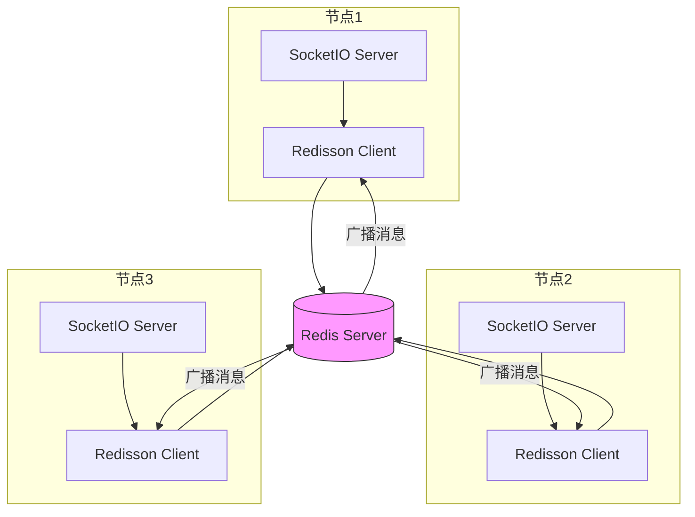
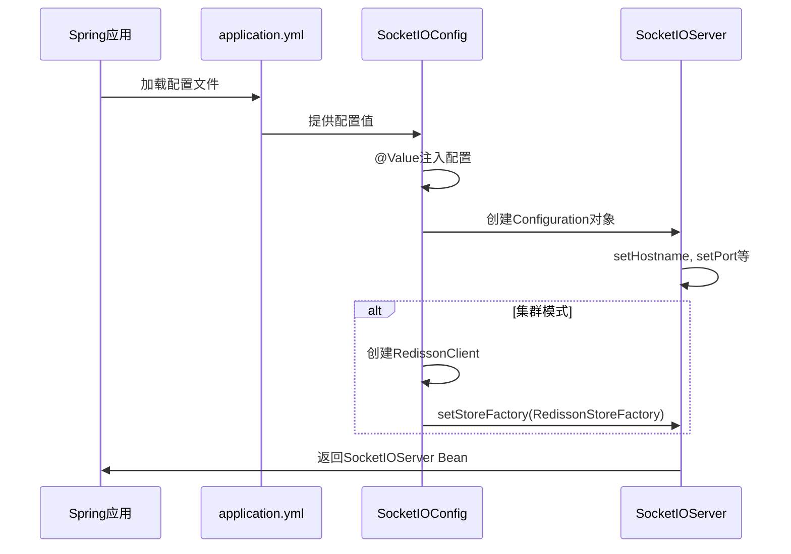

# 配置说明

<cite>
**本文档中引用的文件**  
- [application.yml](file://src/main/resources/application.yml)
- [application-cluster.yml](file://src/main/resources/application-cluster.yml)
- [SocketIOConfig.java](file://src/main/java/com/example/nettyim/config/SocketIOConfig.java)
- [RedisConfig.java](file://src/main/java/com/example/nettyim/config/RedisConfig.java)
- [CLUSTER_DEPLOYMENT.md](file://CLUSTER_DEPLOYMENT.md)
</cite>

## 目录
1. [简介](#简介)
2. [核心配置项详解](#核心配置项详解)
3. [集群模式配置](#集群模式配置)
4. [配置加载机制](#配置加载机制)
5. [最佳实践与常见错误](#最佳实践与常见错误)
6. [总结](#总结)

## 简介
本配置说明文档旨在为用户提供详尽的系统运行参数设置指南。文档将深入解析 `application.yml` 和 `application-cluster.yml` 中的关键配置项，涵盖服务器端口、数据库连接、Redis连接以及SocketIO服务器配置等核心内容。同时，结合 `SocketIOConfig.java` 和 `RedisConfig.java` 配置类，阐明YAML配置如何被Spring框架加载并转化为实际的Bean配置。通过本文档，用户将能够正确配置单机与集群模式下的系统参数，并掌握生产环境中的配置优化策略。

## 核心配置项详解

### 服务器配置
`server.port` 指定Spring Boot应用的HTTP服务监听端口。在 `application.yml` 中默认设置为8080，用于处理REST API请求。该配置直接影响客户端通过HTTP访问后端服务的端点。

**Section sources**
- [application.yml](file://src/main/resources/application.yml#L70-L72)

### 数据库配置
`spring.datasource.*` 配置项定义了与MySQL数据库的连接信息：
- **url**: 数据库连接URL，包含时区（Asia/Shanghai）和字符编码（utf8）设置
- **username/password**: 数据库认证凭据
- **driver-class-name**: 指定MySQL JDBC驱动类

这些配置被Spring Boot的`DataSource`自动配置机制读取，用于创建数据库连接池。

**Section sources**
- [application.yml](file://src/main/resources/application.yml#L6-L11)

### Redis配置
`spring.data.redis.*` 配置项管理Redis连接：
- **host/port**: Redis服务器地址和端口
- **database**: 使用的Redis数据库索引
- **timeout**: 连接超时时间
- **lettuce.pool**: Lettuce客户端连接池配置，包括最大活跃连接数、最大空闲连接数等

这些参数确保应用能高效、稳定地与Redis进行通信，特别是在集群模式下用于会话共享和消息广播。

**Section sources**
- [application.yml](file://src/main/resources/application.yml#L13-L20)

### SocketIO服务器配置
`socketio.*` 配置项控制Netty-SocketIO服务器的行为：
- **host/port**: SocketIO服务监听的主机和端口（默认8081）
- **maxFramePayloadLength/maxHttpContentLength**: 最大帧和HTTP内容长度，影响消息大小限制
- **bossCount/workCount**: Netty事件循环组的Boss和Worker线程数，`workCount`建议根据CPU核心数调整
- **allowCustomRequests**: 是否允许自定义请求
- **upgradeTimeout**: WebSocket升级超时时间
- **pingTimeout/pingInterval**: 心跳检测的超时时间和间隔，对保持长连接稳定性至关重要

**Section sources**
- [application.yml](file://src/main/resources/application.yml#L50-L60)

## 集群模式配置

### 集群启用与节点标识
在 `application-cluster.yml` 中，`socketio.cluster.enabled` 设置为 `true` 以启用集群模式。每个节点必须配置唯一的 `socketio.cluster.nodeId`，可通过环境变量 `NODE_ID` 动态设置，确保集群中各节点的唯一性。

### 环境变量驱动的动态配置
`application-cluster.yml` 大量使用环境变量实现动态配置：
- **SOCKETIO_PORT**: 通过 `${SOCKETIO_PORT:8081}` 设置SocketIO服务端口
- **SERVER_PORT**: 通过 `${SERVER_PORT:8080}` 设置HTTP服务端口
- **NODE_ID**: 通过 `${NODE_ID:node-1}` 设置节点ID

这种设计使得 `start-cluster.sh` 脚本能通过命令行参数启动多个实例，每个实例拥有不同的端口和节点ID，从而构建多节点集群。

### 集群通信机制
集群模式下，系统通过Redis作为消息中间件实现节点间通信：
- **RedissonStoreFactory**: 在 `SocketIOConfig.java` 中，当 `clusterEnabled` 为 `true` 时，使用Redisson作为SocketIO的会话存储，实现分布式会话管理
- **集群消息频道**: `ClusterMessageRouter` 类定义了 `socketio:cluster:message` 和 `socketio:cluster:event` 两个Redis频道，用于广播集群消息和事件

**Diagram sources**
- [application-cluster.yml](file://src/main/resources/application-cluster.yml#L60-L65)
- [SocketIOConfig.java](file://src/main/java/com/example/nettyim/config/SocketIOConfig.java#L80-L85)
- [ClusterMessageRouter.java](file://src/main/java/com/example/nettyim/cluster/ClusterMessageRouter.java#L18-L20)

**Section sources**
- [application-cluster.yml](file://src/main/resources/application-cluster.yml#L60-L65)
- [start-cluster.sh](file://start-cluster.sh#L20-L50)

## 配置加载机制

### YAML到Java Bean的映射
`SocketIOConfig.java` 类通过 `@Value` 注解将YAML配置注入到Java字段中。例如，`@Value("${socketio.port:8081}")` 将 `socketio.port` 的值注入到 `port` 字段，若配置缺失则使用默认值8081。这种方式实现了外部化配置与代码逻辑的解耦。

### 条件化Bean创建
`RedisConfig.java` 使用 `@ConditionalOnProperty(name = "socketio.cluster.enabled", havingValue = "true")` 注解，确保仅在集群模式启用时才创建 `RedisTemplate` 和 `RedisMessageListenerContainer` Bean。这避免了单机模式下不必要的Redis资源消耗。

### Redisson客户端配置
在 `SocketIOConfig.java` 中，`redissonClient()` 方法使用 `spring.data.redis.*` 配置创建Redisson客户端，包括连接地址、数据库、连接池大小等。该客户端被注入到 `SocketIOServer` 的 `RedissonStoreFactory` 中，实现分布式会话存储。

**Diagram sources**
- [SocketIOConfig.java](file://src/main/java/com/example/nettyim/config/SocketIOConfig.java#L12-L92)
- [RedisConfig.java](file://src/main/java/com/example/nettyim/config/RedisConfig.java#L16-L65)

**Section sources**
- [SocketIOConfig.java](file://src/main/java/com/example/nettyim/config/SocketIOConfig.java#L12-L92)
- [RedisConfig.java](file://src/main/java/com/example/nettyim/config/RedisConfig.java#L16-L65)

## 最佳实践与常见错误

### 生产环境配置建议
- **线程池大小**: `workCount` 应设置为CPU核心数的2-4倍，避免过多线程导致上下文切换开销
- **心跳间隔**: `pingInterval` 建议设置为25-30秒，`pingTimeout` 应为 `pingInterval` 的2-3倍，平衡连接检测效率与网络波动容忍度
- **连接超时**: `upgradeTimeout` 和 `timeout` 应根据网络状况适当调整，避免因短暂网络延迟导致连接失败
- **Redis连接池**: `max-active` 和 `max-idle` 应根据并发连接数合理设置，避免资源耗尽

### 常见配置错误警告
- **节点ID冲突**: 集群中多个节点使用相同 `nodeId` 会导致消息路由混乱，必须确保唯一性
- **端口冲突**: 启动多个实例时未修改 `SERVER_PORT` 或 `SOCKETIO_PORT` 会导致端口占用错误
- **Redis未运行**: 集群模式依赖Redis，若Redis服务未启动，应用将无法正常启动
- **配置文件未激活**: 忘记通过 `--spring.profiles.active=cluster` 激活 `application-cluster.yml`，导致集群功能未启用

**Section sources**
- [CLUSTER_DEPLOYMENT.md](file://CLUSTER_DEPLOYMENT.md#L0-L201)
- [start-cluster.sh](file://start-cluster.sh#L0-L85)
- [stop-cluster.sh](file://stop-cluster.sh#L0-L35)

## 总结
本文档全面解析了系统的配置体系，从单机到集群模式的演进。通过 `application.yml` 和 `application-cluster.yml` 的分层配置，结合 `SocketIOConfig.java` 和 `RedisConfig.java` 的编程式配置，系统实现了灵活、可扩展的部署能力。用户应根据部署环境选择合适的配置文件，并遵循最佳实践进行参数调优，以确保系统在生产环境中的稳定性和高性能。