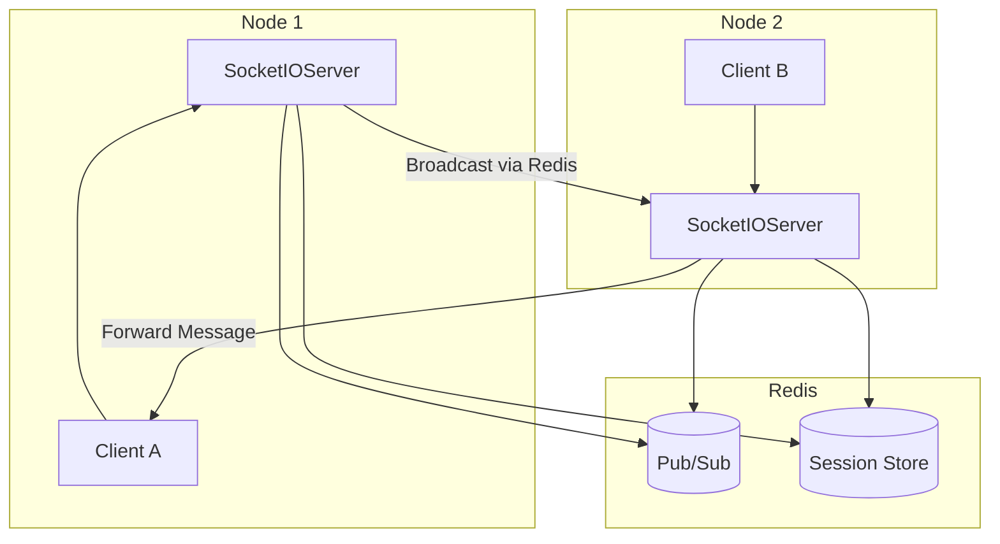

# 项目概述

<cite>
**本文档引用的文件**  
- [NettyImApplication.java](file://src/main/java/com/example/nettyim/NettyImApplication.java)
- [pom.xml](file://pom.xml)
- [SocketIOConfig.java](file://src/main/java/com/example/nettyim/config/SocketIOConfig.java)
- [RedisConfig.java](file://src/main/java/com/example/nettyim/config/RedisConfig.java)
- [SocketIOServerManager.java](file://src/main/java/com/example/nettyim/websocket/SocketIOServerManager.java)
- [ClusterMessageRouter.java](file://src/main/java/com/example/nettyim/cluster/ClusterMessageRouter.java)
- [application.yml](file://src/main/resources/application.yml)
- [application-cluster.yml](file://src/main/resources/application-cluster.yml)
</cite>

## 目录
1. [项目简介](#项目简介)
2. [核心功能与架构设计](#核心功能与架构设计)
3. [技术栈与设计愿景](#技术栈与设计愿景)
4. [集群部署能力](#集群部署能力)
5. [应用启动流程分析](#应用启动流程分析)
6. [核心依赖解析](#核心依赖解析)
7. [配置文件详解](#配置文件详解)
8. [关键设计决策](#关键设计决策)

## 项目简介

`netty-im-sample` 是一个基于 Spring Boot 与 Netty-SocketIO 构建的即时通讯（IM）后端系统，旨在为开发者提供一个功能完整、可扩展性强的实时通信解决方案。该项目不仅支持私聊、群聊、好友管理、群组管理等核心社交功能，还实现了消息持久化、在线状态同步以及原生多节点集群部署能力。系统通过 WebSocket 协议实现低延迟实时通信，结合 Redis 实现会话共享与跨节点消息路由，使用 MyBatis-Plus 进行高效数据库操作，并通过 JWT 实现安全的身份认证机制。

该系统适用于构建聊天应用、协同办公平台、实时通知系统等需要高并发、低延迟通信能力的场景。无论是初学者还是高级开发者，均可通过本项目深入理解现代即时通讯系统的架构设计与实现原理。

## 核心功能与架构设计

### 功能模块概览

本系统围绕用户交互与消息传递构建了完整的功能体系，主要包括：

- **私聊与群聊**：支持点对点消息发送与群组广播，具备消息类型识别（文本、图片、文件等）。
- **好友管理**：实现好友申请、同意、拒绝、删除等完整生命周期管理。
- **群组管理**：支持创建群组、添加成员、设置管理员、转让群主等操作。
- **消息持久化**：所有消息均存储于 MySQL 数据库，确保数据可追溯。
- **在线状态同步**：实时感知用户上下线状态，并通过事件广播通知相关方。
- **已读状态标记**：支持消息已读回执功能，提升用户体验。

### 系统架构设计目标

系统采用典型的分层架构设计，分为以下层次：

- **表现层**：通过 Netty-SocketIO 提供 WebSocket 接口，处理客户端连接与事件监听。
- **控制层**：Spring MVC 控制器处理 RESTful API 请求，如用户注册、登录、好友操作等。
- **服务层**：业务逻辑封装，协调数据访问与 WebSocket 通信。
- **数据访问层**：基于 MyBatis-Plus 实现数据库操作，支持逻辑删除、自动分页等特性。
- **基础设施层**：集成 Redis、JWT、日志等通用组件。

整体架构强调松耦合、高内聚，便于功能扩展与维护。

**Section sources**
- [UserController.java](file://src/main/java/com/example/nettyim/controller/UserController.java)
- [MessageController.java](file://src/main/java/com/example/nettyim/controller/MessageController.java)
- [GroupController.java](file://src/main/java/com/example/nettyim/controller/GroupController.java)
- [FriendshipController.java](file://src/main/java/com/example/nettyim/controller/FriendshipController.java)

## 技术栈与设计愿景

### 技术选型与愿景

| 技术组件 | 作用 | 设计愿景 |
|--------|------|---------|
| **Spring Boot** | 快速构建微服务应用 | 提供自动配置、内嵌服务器、健康检查等企业级能力 |
| **Netty-SocketIO** | 实时通信引擎 | 支持 WebSocket 长连接，兼容 Socket.IO 协议 |
| **Redis** | 分布式缓存与消息中间件 | 实现会话共享、集群状态同步、跨节点消息路由 |
| **MyBatis-Plus** | ORM 框架 | 简化数据库操作，提升开发效率 |
| **JWT** | 身份认证 | 无状态认证，支持跨服务调用 |
| **MySQL** | 持久化存储 | 存储用户、消息、群组等结构化数据 |

系统设计愿景是构建一个**高可用、可扩展、易维护**的即时通讯后端平台，能够在微服务架构中作为独立的 IM 服务模块，支持横向扩展以应对高并发场景。

**Section sources**
- [pom.xml](file://pom.xml)
- [JwtUtils.java](file://src/main/java/com/example/nettyim/utils/JwtUtils.java)
- [MybatisPlusConfig.java](file://src/main/java/com/example/nettyim/config/MybatisPlusConfig.java)

## 集群部署能力

### 集群模式支持

本系统原生支持多节点集群部署，通过 `application-cluster.yml` 配置文件启用集群模式。核心机制如下：

- **Redis 作为共享存储**：使用 Redisson 实现 Socket.IO 的分布式会话管理，确保用户连接可在任意节点被识别。
- **集群消息路由**：通过 `ClusterMessageRouter` 组件，利用 Redis 的发布/订阅机制在节点间广播消息与事件。
- **节点标识与通信**：每个节点拥有唯一 `nodeId`，通过环境变量配置，避免冲突。
- **跨节点消息转发**：当目标用户连接在其他节点时，通过集群消息通道进行转发，确保消息可达。



**Diagram sources**
- [SocketIOConfig.java](file://src/main/java/com/example/nettyim/config/SocketIOConfig.java)
- [ClusterMessageRouter.java](file://src/main/java/com/example/nettyim/cluster/ClusterMessageRouter.java)
- [SocketIOServerManager.java](file://src/main/java/com/example/nettyim/websocket/SocketIOServerManager.java)

**Section sources**
- [application-cluster.yml](file://src/main/resources/application-cluster.yml)
- [start-cluster.sh](file://start-cluster.sh)
- [stop-cluster.sh](file://stop-cluster.sh)

## 应用启动流程分析

### 启动类解析

`NettyImApplication` 是系统的入口类，负责初始化 Spring 容器与 Netty-SocketIO 服务。

```java
@SpringBootApplication(exclude = {SecurityAutoConfiguration.class, RedisAutoConfiguration.class})
@MapperScan("com.example.nettyim.mapper